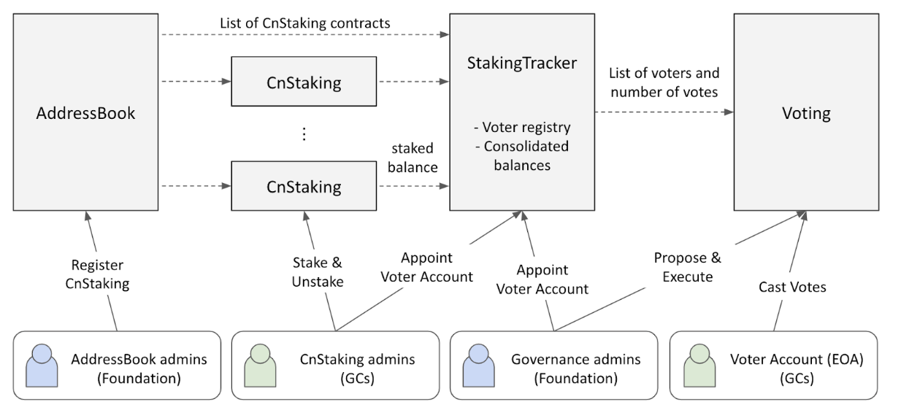

## Simple Summary
Introducing a new governance voting method based on the staking amount and implementation of the governance portal, Klaytn Square 
 
## Abstract
Klaytn introduces a stake-based governance model that provides voting power to governance participants. Currently, one vote per Governance Council(GC) member was cast. The new method will introduce the voting right that will be exercised based on the staking amount with the maximum cap to prevent an entity from making an arbitrary decision. This model ultimately enables each member to gather support from Klaytn communities in line with their preference. The new system aims to provide responsibility and obligation of voting to Governance Councils. 

## Motivation
To enhance individual voting power and promote ultimate decentralization, we aim to accomplish an equal proposer selection structure. The change of voting method provides more power and influence to GC members who share the same interest and values as that of Klaytn by staking and locking up more KLAYs.

## Specification

The Klaytn governance voting system is designed based on the following fundamental premises. 
- We believe Klaytn’s major decision-making process should reflect the opinions of as many participants as possible from the ecosystem. 
- We assumed that participants will be more likely to make a decision that is beneficial to the Klaytn ecosystem if they hold more KLAY. This is based on the premise that the growth of Klaytn’s ecosystem is correlated to the rise in the value of KLAY. 
- The governance system should be able to manage the situations in which a particular entity makes an arbitrary decision. This is because the entity may weaken the sustainability of the entire network. 
- The act of voting and the gain of voting power is different. 

The Governance Council can exercise the right to vote based on the staking amount. Currently, each GC member receives at least 1 voting right regardless of the number of KLAY they hold. Recognizing a tendency that the member with more KLAY makes a decision that benefits the Klaytn ecosystem in the long run, we are granting a higher voting power to members with more KLAY. Yet, to prevent a particular subject from making an arbitrary decision, we are placing a cap on the voting power one can receive. 
Therefore, the GC will receive 1 vote per a certain amount of staked KLAY (initial configuration: 500 million KLAY). The maximum number of votes a governance council can own is one less than the total number of governance council members. In other words, [Maximum Voting Power =  Total number of GC members - 1]. For example, if there are 35 GC members, one can own a maximum of 34 voting power. The 1 KLAY: 1 vote structure prevents the tragedy of the commons and prevents potential monopolies by limiting the maximum number of votes cast. 
The foundation will provide `votingDelay` (initial configuration: 7 days)  of the notice period and ‘votingPeriod’ of the voting period (initial configuration: 7 days). The list of eligible voters is finalized at the start of the notice period. The qualified electors and voting power of those will be counted at the start of the voting period. The foundation or GC can freely propose and discuss on the forum. Once the discussion is held on the forum, the foundation will put the topic to a vote on the governance portal. 
The newly implemented governance portal includes the following functions: 
- Ability to propose and vote on a variety of opinions
- Information about Governance Councils who are working together for the Klaytn ecosystem

The Klaytn governance voting system will be conducted on smart contracts. The contract design is influenced by Compound Finance and OpenZeppelin. The accounts interacting with the contracts can have proposer, voter, or executor roles.
A proposer submits and initiates governance proposals. The voting timeline starts with the submission of proposals to the voting contract. A proposal describes the changes to be made on the Klaytn blockchain.
A proposal not only contains textual descriptions of the change, but it may also include  specifications of attached transactions, or actions. The actions are executed on behalf of a voting contract after the proposal passes. The actions extend the impact of proposals from simply gathering opinions to automatically implementing changes on the blockchain.
A voter casts votes on the proposal during the voting period. A voter can vote for yes, no, or abstain with all the votes assigned to the voter. The list of voters for each proposal is determined at the proposal submission. The number of votes is determined by the amount of staked KLAYs at the start of the voting period.
An executor triggers the execution of attached transactions in passed proposals. The execution is subdivided into two steps. First, the executor queues the transactions. After a set amount of delay, the executor can send the transactions. Execution delay here gives enough time for the community to recognize the upcoming change and perform a final check about the transaction.
A proposal is in one of the following states.
- Pending: Proposer submitted the proposal but voting has not started. The pending state lasts for votingDelay, or 7 days. This state is also called the notice period.
- Active: Ongoing voting. Voters can cast their votes. The active state lasts for votingPeriod, or 7 days. This state is also called the voting period.
- Canceled: Proposer has canceled the proposal before execution. Any further interaction is prohibited.
- Passed: Voting finalized and quorum reached. Executor shall queue the actions before a set timeout of queueTimeout, or 7 days. If the proposal contains no actions, any further interaction is prohibited. Otherwise, the proposal can proceed to Queued and Executed states.
- Failed: Voting finalized but has not reached quorum. Any further interaction is prohibited.
- Queued: An executor has queued the actions. An executor cannot trigger the actions while a certain duration of execDelay, or 2 days.
- Executed: An executor has triggered the actions after the execution delay. The executor shall trigger the actions before a set timeout of execTimeout, or 7 days. The execTimeout starts at the end of execDelay.
- Expired: Executor has not queued or executed within respective timeouts.


For a proposal to pass, two quorum conditions must be satisfied. The first condition is the turnout. Either the number of voters exceeds 1/3 of all voters, or the sum of casted votes exceeds 1/3 of all eligible votes. The second condition is supported. The yes votes must exceed the half of casted votes.
The amounts of votes are calculated from the amounts of stakes KLAY. GC members stake their KLAY by locking in a special smart contract called CnStakingContract. Each GC must deploy at least one CnStakingContract and deposit KLAY there. The official addresses of CnStakingContract are managed in another special smart contract called AddressBook.
Each GC member can appoint a voter account that will cast votes on behalf of the KLAYs in its CnStakingContracts. The voter account is necessary because CnStakingContract itself cannot send transactions to cast votes.


  
Staked balances and voter accounts are tracked in a new special smart contract named StakingTracker. StakingTracker stores the voter list and their voting powers for each voting period. CnStakingContract must notify StakingTracker to recognize any balance changes. Below is an example of StakingTracker contract interface.
```solidity
interface IStakingTracker {

  struct Tracker {
    // this struct is updated only if trackStart <= block.number <= trackEnd.
    uint64 trackStart;
    uint64 trackEnd;

    // List of eligible nodes and their staking contracts.
    // Determined at createTracker() and won’t change.
    address[] nodeIds;
    mapping(address => address) stakingToNodeId;


    // Balances and voting powers of each nodes.
    // Updated by notifyStake() and notifyWithdraw().
    mapping(address => uint256) nodeBalances;
    mapping(address => uint256) votingPowers;
    uint256 totalVotes;


    // Appointed voters list
    // Updated by appointVoter().
    mapping(address => address) nodeIdToVoter;
    mapping(address => address) voterToNodeId;
  }

  // Called by Voting at proposal submission, to finalize voter list.
  function createTracker(uint256 trackEnd) public returns (uint trackerId);


  // Called by CnStakingContract whenever its balance changes.
  function notifyStake(uint256 amount) public;
  function notifyWithdraw(uint256 amount) public;

  /// Called by Governance admin or CnStaking admins to change voter account.
  function appointVoter(address nodeId, address voter) public;

  /// Called by Voting to calculate voting outcome.
  function getVotingPower(uint trackerId, address voter)
    public view returns(uint256);
  function quorums(uint trackerId)
    public view returns(uint quorumCount, uint quorumPower); 
}
```

## Expected Effect
The proposed GC Voting method is expected to produce the following changes:
- All members in Klaytn ecosystem grow together with credibility 
- Providing obligation and authority to GC motivates active participation in governance voting activities and the KLAY staking 
- Anyone can easily view the proposals and voting status through the governance portal. It encourages holders to participate and give responsibility and authority to GCs.
- The Klaytn network can take a step closer to transparency and decentralized networks.
 
## Backward Compatibility
n/a
  
## Reference
n/a 
  
## Copyright 
n/a
