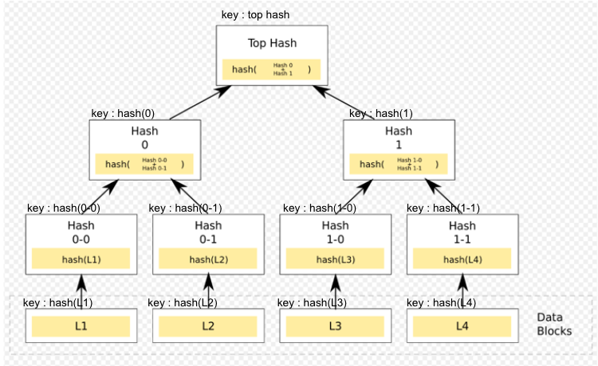
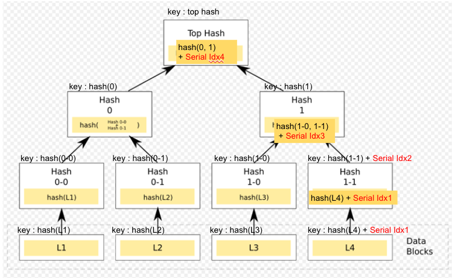

<!--You can leave these HTML comments in your merged KIP and delete the visible duplicate text guides, they will not appear and may be helpful to refer to if you edit it again. This is the suggested template for new KIPs. Note that a KIP number will be assigned by an editor. When opening a pull request to submit your KIP, please use an abbreviated title in the filename, `kip-draft_title_abbrev.md`. The title should be 44 characters or less.-->

## Simple Summary
<!--"If you can't explain it simply, you don't understand it well enough." Provide a simplified and layman-accessible explanation of the KIP.-->
StateDB Pruning is a technology to optimize storage by deleting nodes that have become historical data in StateDB (state trie, storage trie) and leaving only the latest data in StateDB. StateDB Migration uses the technology of StateDB pruning in Hot Storage to move the data to be deleted to another Cold Storage space, which allows you to manage data efficiently with Hot / Cold storage. In other words, StateDB Pruning is a process of deleting old data from the StateDB, while StateDB Migration is a process of moving the deleted data to a Cold Storage space. This can help to optimize storage and improve the performance of the blockchain.

## Abstract
<!--A short (~200 word) description of the technical issue being addressed.-->
Each node in the State Trie defines the 32-byte hash of the value as the key, and stores the data in the key-value storage. In this case, the same value can be generated at the leaf node, so a single node can be referenced by multiple nodes inside the trie. To solve this problem, we propose a new ExtHash (Extended Hash) structure, and we want to make data management easier by creating a 1:1 linked trie node structure without the problem of multiple references.

## Motivation
<!--The motivation is critical for KIPs that want to change the Klaytn protocol. It should clearly explain why the existing protocol specification is inadequate to address the problem that the KIP solves. KIP submissions without sufficient motivation may be rejected outright.-->

아래 그림은 Account 175의 잔고가 27에서 45로 변경될때 state tire와 block간의 연결관계를 그림으로 나타낸 것이다.

위 그림에서 붉은 노드는 새로운 데이터로 변경되었다. 붉은 노드를 삭제해도 current block의 정보를 처리하는데는 아무런 문제를 일으키지 않는다. 하지만 기존의 Hash를 사용할 경우 어느 노드에서 붉은 노드를 참조하고 있는지 알수 없어 삭제할 수가 없었다. reference count 정보를 추가하고 관리할 수도 있겠지만 여러가지 이유(multi thread, 엄청난 노드수)로 쉽지 않다.
 A new ExtHash is used in the State trie to remove the problem of multiple trie-nodes referencing a single trie-node. ExtHash is a Hash type that is created by adding a 6-byte serial number to the legacy hash. As a result, no trie-node with the same ExtHash can exist. Data is increased because data redundancy is eliminated, but it is judged to be at a manageable level as a result of the experiment.
 The biggest reason for introducing ExtHash is to eliminate multiple references. Many of the pruning methods that have been tried so far have had to stop the system or be accompanied by a lot of IO load due to multiple reference problems. The slight data overhead added to ExtHash allows pruning to proceed without system downtime and without worrying about IO load. 


## Specification

### Terminology

Some borrowing of terminology, etc. - Beigepaper : An Ethereum Technical Specification. Author : Micah Daemeron

a. Root Node - The Top (first) node in a tree

b. Child Node - A node Directly connected to an-other node when moving away from the Root.

c. Leaf Node - A node with no children

d. Server Node - It means a server in charge of each role such as Consensus, Governance, Verification, and API in the klaytn network. CN, PN, and EN, which will be described later, are sub-concepts.

e. CN - Consensus Node - Block을 생성하고 합의하고 검증하는 역할을 담당한다. CN노드는 CN노드들 끼리만 연결하며, 외부와의 연결을 PN노드가 대행한다.

f. PN - Proxy Node - CN노드가 CN노드끼리의 통신에 집중할 수 있도록 외부와의 통신을 대행해주고 CN의 백업서버 역할을 담당한다.

g. EN - End Node - 여러 형태의 외부 API요청을 처리하여 CN, PN의 부하를 감소시킬 목적의 서버

h. MPT - Merkle Patrica Trie


### Trie 구조 정의
State Trie Node를 다음과 같이 표현할 수 있다.
* 모든 Server Node에서 statedb pruning을 사용하는 것은 아니다.
* 기존과 동일하게 동작하는 Server Node에서는 32byte Hash를 사용한다.
* statedb pruning을 사용하는 Server Node에서는 38byte Hash를 사용한다.
```go
Ref       = byte32(Hash) or byte38(ExtHash)
Leaf      = [ path, val ]
Extension = [ path, Ref ]
Branch    = [ Ref, Ref, ..., Ref, val ]
Account   = [ balance, nonce, storageRoot Ref, codeHash H ]
```

### Get the same MPT Root Hash from ExtHash

ExtHash is a hash with 6 bytes added to the original hash. This changes the Root Hash value when calculating the hash of MPT (Merkle Patricia Trie). This can cause a collision with nodes (servers) or past versions of the hash that do not use ExtHash. To solve this problem, when calculating the hash of MPT, you can get the same result as before by removing the last 6 bytes from ExtHash and calculating it. In this section, we will describe the process of getting the MPT Root Hash using the original Hash by changing ExtHash to Hash.

#### Merkle Patricia Trie
아래 그림은 기존 MPT에서 value에서 Hash를 구하고 서로를 참조하는 Root Node, Child Node, Leaf Node간의 연결 관계를 나타낸 그림이다.


아래 그림은 ExtHash를 사용한 MPT의 연결 관계를 나타낸 그림이다.
* Root Node에서 Child Node, Leaf Node를 참조할때는 ExtHash를 사용해서 연결된다.
* 노드의 정합성을 검증하기 위한 Hash를 구할때는 ExtHash의 마지막 6자리를 제외하고 Hash를 계산해서 기존 MPT와 동일한 Hash를 얻을 수 있다.


#### ExtHash Filter
The ExtHashFilter function works as follows.
All trie-nodes in MPT are of type fullNode or shorNode.
If you convert the ExtHash of the two node types to Hash and RLP-encode it, you can get the same value as the RLP encoding of the legacy Hash.
As shown in the code below, the ExtHash is converted to Hash using the LegacyRLP() function for fullNode and shorNode.
And if you RLP-encode the result, you will get the same encoding result as the RLP encoding result of the legacy hash.

```go
func ExtHashFilter(n node) (reData []byte) {
	if 'n' type is fullNode {
		tmpData = fullNodeFilter(n)
	} else if 'n' type is shotNode {
		tmpData = shortNodeFilater(n)
	} else {
		tmpData = rlp.encode(n)	
	} 

	return tmpData
}

func fullNodeFilter(n node) (rlpResult []byte) {

	for i = 0 -> 15 {
		if n[i] == ExtHash Type {
			rlpResult = rlpResult + rlp.encode( n[i][:HashLength] )
		} else {
			rlpResult = rlpResult + rlp.encode( n[i] )
		}
	}
	return rlpResult
}

func shortNodeFilter(n node) (rlpResult []byte) {
	if 'n' is smart contract type {
		rlpResult = rlp.encode( n.storageRoot[:HashLength] ) 
                          + rlp.encode( n.codeHash )
			  + rlp.encode( n.codeinfo )
	} else {
		rlpResult = rlp.encode( n )
	}
	return rlpResult
}
```

#### Calculate Hash 
ExtHash was converted to legay Hash using ExtHashFilter, and RLP encoding result of legacy Hash was obtained. Use this to calculate the hash for hash trie-node verification.
```go

// not use ExtHash process
func storeByHash( n node ) error {
	data = ExtHashFilter(n)
	hash = keccak256(data)

	err = db.put(hash, data)
	return err
}

// use ExtHash process
func storeByExtHash( n node ) error {
	data = rlp.encode(n)
	hash = keccak256(data) + 6 byte random count

	err = db.put(hashm data)
	return errr
}

```

## Expected Effect

Expect the following effects through StateDB Pruning / Migration.
* Storage where hot data is stored is reduced to 500GB, which can be configured as high-performance storage
* Storage where cold data is stored is composed of high-capacity storage to increase storage cost efficiency for each purpose
* The cache hit ratio increases as the size of Hot Data decreases. As a result, IO performance increases

But it may give rise to the following changes:
* Various configuration options increase the complexity of the structure,
* As Hash is used in various places in blockchain, there is a problem that many internal sources need to be modified.
* There is a problem that snap sync cannot be used when using ExtHash.

## Backwards Compatibility
* In the case of ExtHash, Archive Sync, Full Sync, and Fast Sync are possible, but Snapshot Sync is not possible.
* If ExtHash is not used, backward compatibility is possible as it operates the same as before.

## Reference

## Copyright
Copyright and related rights waived via [CC0](https://creativecommons.org/publicdomain/zero/1.0/).
