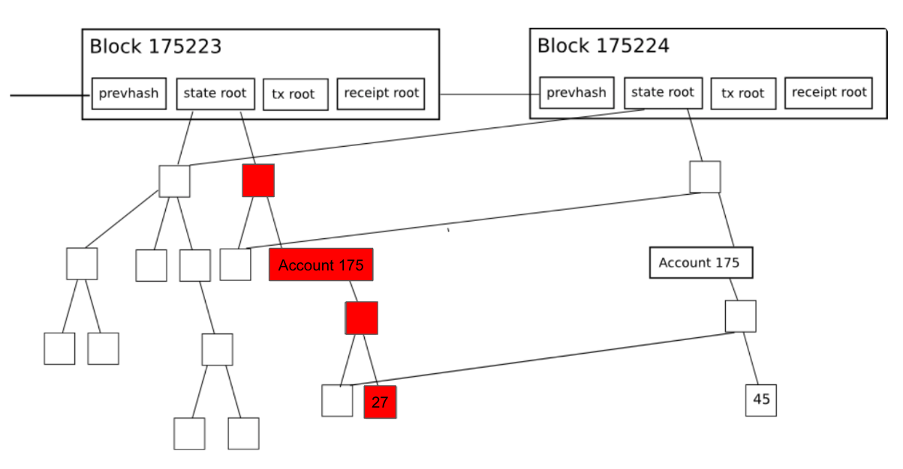
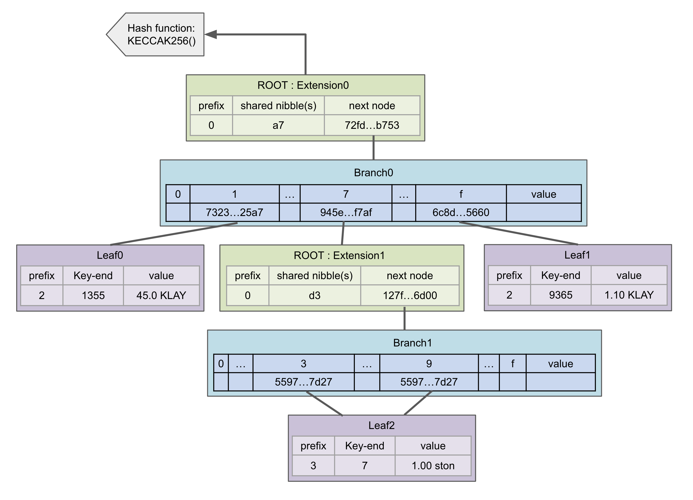
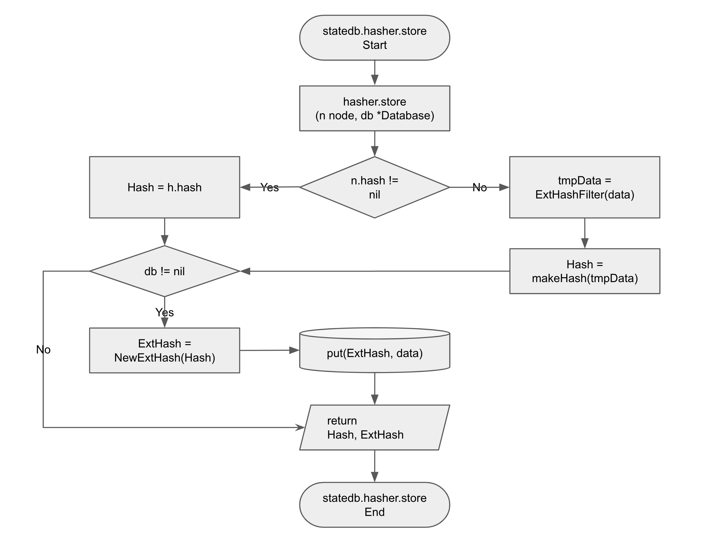

<!--You can leave these HTML comments in your merged KIP and delete the visible duplicate text guides, they will not appear and may be helpful to refer to if you edit it again. This is the suggested template for new KIPs. Note that a KIP number will be assigned by an editor. When opening a pull request to submit your KIP, please use an abbreviated title in the filename, `kip-draft_title_abbrev.md`. The title should be 44 characters or less.-->

## Simple Summary
<!--"If you can't explain it simply, you don't understand it well enough." Provide a simplified and layman-accessible explanation of the KIP.-->
StateDB Pruning is a technology to optimize storage by deleting nodes that have become historical data in StateDB (state trie, storage trie) and leaving only the latest data in StateDB. StateDB Migration uses the technology of StateDB pruning in Hot Storage to move the data to be deleted to another Cold Storage space, which allows you to manage data efficiently with Hot / Cold storage. In other words, StateDB Pruning is a process of deleting old data from the StateDB, while StateDB Migration is a process of moving the deleted data to a Cold Storage space. This can help to optimize storage and improve the performance of the blockchain.

## Abstract
<!--A short (~200 word) description of the technical issue being addressed.-->
Each node in the State Trie defines the 32-byte hash of the value as the key, and stores the data in the key-value storage. In this case, the same value can be generated at the leaf node, so a single node can be referenced by multiple nodes inside the trie. To solve this problem, we propose a new ExtHash (Extended Hash) structure, and we want to make data management easier by creating a 1:1 linked trie node structure without the problem of multiple references.

## Motivation
<!--The motivation is critical for KIPs that want to change the Klaytn protocol. It should clearly explain why the existing protocol specification is inadequate to address the problem that the KIP solves. KIP submissions without sufficient motivation may be rejected outright.-->

The following figure shows the relationship between the state tire and block when the balance of Account 175 is changed from 27 to 45.

In the given illustration, the red node has been replaced with new data. From the perspective of pruning, deleting the red node would not cause any issues in processing the information of the current block. However, legacy hashes have multiple reference problems.. As a result, it is not possible to delete the red node since it is unknown how many nodes are referencing it. Although it could be possible to add and manage reference count information, it is not easy due to various reasons such as multi-threading and a substantial number of nodes. Reference: https://blog.ethereum.org/2015/06/26/state-tree-pruning
 A new ExtHash is used in the State trie to remove the problem of multiple trie-nodes referencing a single trie-node. ExtHash is a Hash type that is created by adding a 7-byte serial number to the legacy hash. As a result, no trie-node with the same ExtHash can exist. Data is increased because data redundancy is eliminated, but it is judged to be at a manageable level as a result of the experiment.  
 The biggest reason for introducing ExtHash is to eliminate multiple references. Many of the pruning methods that have been tried so far have had to stop the system or be accompanied by a lot of IO load due to multiple reference problems. The slight data overhead added to ExtHash allows pruning to proceed without system downtime and without worrying about IO load. 


## Specification

### The reason for adding 7 bytes
The added 7 bytes are defined as ExtHashNonce. It is derived from the name 'nonce,' which increments the count whenever the account information changes.  
The reason for adding ExtHashNonce to the hash is to eliminate hash duplication and resolve the issue of multiple referencing. Even if the hash is the same, the added 7 bytes prevent any duplication, ensuring that ExtHash cannot have duplicated values.  

If it were just a counter, it could have been 4 bytes or 8 bytes, for example. So why specifically 7 bytes? The reason is that ExtHash primarily occupies a significant portion of the data in the state trie and storage trie. The increased byte ratio directly affects the increase in the size of the database. Therefore, it is necessary to find the smallest value that avoids duplication while considering the increased byte ratio.  

#### How often does it update per second?
Currently, Klaytn is capable of processing 4,000 TPS. Smart contracts have the ability to update multiple accounts at once, potentially resulting in the update of a significant amount of node information. Therefore, ExtHashNonce needs to be defined with a number much larger than 4,000 TPS. As a result, it was assumed that the number of nodes changing in a trie node per block would be less than one million.  
How should ExtHashNonce be managed? Storing it in the database every time it updates would create a significant amount of overhead. Therefore, the decision was made to utilize the nano timestamp of the system. By obtaining the nano timestamp when the server node starts, we can avoid duplicated initial values. However, when all 8 bytes of the nano timestamp are used, the resulting number becomes large enough to accommodate processing 10 billion nodes per second. In order to conserve space, let's calculate the number of bytes required to accommodate 1 million nodes by right-shifting one byte at a time.  
```
 nano timestamp            : 1000,000,000 = 10 billion
 1 byte shift right        : 1000,000,000 / 256 = 3906250 ( 7 byte )
 1 byte shift right 1 more : 1000,000,000 / 256 / 256 = 15258 ( 6 byte )
```
If ExtHashNonce is set to 6 bytes, count inversion may occur if more than 15,000 trie nodes are updated per second, and there could be collisions if the system is rebooted. With ExtHashNonce being 7 bytes, it provides a sufficient number as it allows for updating over 3.9 million trie nodes per second.  

### Terminology

Some borrowing of terminology, etc. - Beigepaper : An Ethereum Technical Specification. Author : Micah Daemeron

a. Root Node - The Top (first) node in a tree

b. Child Node - A node Directly connected to an-other node when moving away from the Root.

c. Leaf Node - A node with no children

d. Server Node - It means a server in charge of each role such as Consensus, Governance, Verification, and API in the klaytn network. CN, PN, and EN, which will be described later, are sub-concepts.

e. CN - Consensus Node - Responsible for creating, agreeing and verifying blocks. The CN node only connects CN nodes, and the PN node acts as an agent for connecting to the outside world.

f. PN - Proxy Node - Acts as a proxy for communication with the outside so that CN nodes can focus on communication between CN nodes and serves as a backup server for CN.

g. EN - End Node - Server for the purpose of reducing the load of CN and PN by processing various types of external API requests

h. MPT - Merkle Patrica Trie

### Define the tri structure:
ExtHash is only used by State Trie Nodes. Components that do not cause duplicate issues, such as Header, Body, Transaction, and Receipt, use 32-byte hashes.  

* State Trie Nodes use either a 32-byte hash or a 39-byte ExtHash, but not both.  
* Server nodes, which work the same as previous versions, use 32-byte hashes.  
* Server nodes utilizing stateb pruning use a 39-byte hash.  


```
ref_32    = 32 byte - Hash
ref_39    = 39 byte - ExtHash
Ref       = ref_32 or ref_39
Leaf      = [ path, val ]
Extension = [ path, Ref ]
Branch    = [ Ref, Ref, ..., Ref, val ]
Account   = [ balance, nonce, storageRoot Ref, codeHash H ]
```

### Merkel Patricia Trie - 32 byte Hash

Based on the above definition, Merkel Patricia trie can be expressed as follows using 32 byte hash.  
Account information is as follows.  
Reference :(https://ethereum.stackexchange.com/questions/39915/ethereum-merkle-patricia-trie-extension-node - Slightly modified to cause multiple references
a711355 : 45.0 KLAY  
a77d337 : 1.00 ston  
a7f9363 : 1.10 KLAY  
a77d397 : 1.00 ston  



### Merkel Patricia Trie - 39 byte ExtHash
If you simply express the Merkel Patricia trie using the above 32 byte Hash and 39 byte ExtHash, you can express it as follows.
Account information is the same as above.  
For convenience, it means 7 bytes of ExtHashNonce with the expressions xxx1 and xxx2 displayed in red. Due to the addition of ExtHashNonce, you can see that the duplicate reference problem of the leaf node at the bottom has disappeared.


### Get the same MPT Root Hash from ExtHash

ExtHash is a hash with ExtHashNonce added to the original hash. This changes the Root Hash value when calculating the hash of MPT (Merkle Patricia Trie). This can cause a collision with nodes (servers) or past versions of the hash that do not use ExtHash. To solve this problem, when calculating the hash of MPT, you can get the same result as before by removing the last ExtHashNonce from ExtHash and calculating it. In this section, we will describe the process of getting the MPT Root Hash using the original Hash by changing ExtHash to Hash.

#### Get existingHash from ExtHash flowchart


The statedb.hasher.store function calculates the hash of each node (Branch Node, Extension Node, Leaf Node) and, if a database is specified, stores the hash key and the RLP-encoded value in the database. It is responsible for obtaining the hash used to calculate the RootHash of the Merkel Patricia Trie and obtaining the key and value to be stored in the database.

* When calculating the RootHash, the existing hash is obtained by converting ExtHash to Hash using the ExtHashFilter and performing RLP encoding to obtain the hash.
* When storing in the database, the NewExtHash is obtained by appending ExtHashNonce to the hash, and the ExtHash is used as the key to store in the database.
* Through these two processes, when calculating the RootHash, the ExtHashNonce is removed to obtain the hash, which allows obtaining the same RootHash as before. When storing, it is stored using ExtHash.

#### ExtHash Filter
The ExtHashFilter function works as follows.
All trie-nodes in MPT are of type fullNode or shorNode.
If you convert the ExtHash of the two node types to Hash and RLP-encode it, you can get the same value as the RLP encoding of the legacy Hash.
As shown in the code below, the ExtHash is converted to Hash using the LegacyRLP() function for fullNode and shorNode.
And if you RLP-encode the result, you will get the same encoding result as the RLP encoding result of the legacy hash.

```go
func ExtHashFilter(n node) (reData []byte) {
        if 'n' type is fullNode {
                tmpData = fullNodeFilter(n)
        } else if 'n' type is shotNode {
                tmpData = shortNodeFilater(n)
        } else {
                tmpData = rlp.encode(n)
        }

        return tmpData
}

func fullNodeFilter(n node) (rlpResult []byte) {

        for i = 0 -> 15 {
                if n[i] == ExtHash Type {
                        rlpResult = rlpResult + rlp.encode( n[i][:HashLength] )
                } else {
                        rlpResult = rlpResult + rlp.encode( n[i] )
                }
        }
        return rlpResult
}

func shortNodeFilter(n node) (rlpResult []byte) {
        if 'n' is smart contract type {
                rlpResult = rlp.encode( n.storageRoot[:HashLength] )
                          + rlp.encode( n.codeHash )
                          + rlp.encode( n.codeinfo )
        } else {
                rlpResult = rlp.encode( n )
        }
        return rlpResult
}
```

result  
before : f85d808080808080a6d051a632f6884719eeae97ab49d4f9d9c69bf91db0f5b7b5641e702503aecf9f**176a6ee19b45c6**a64525702728b35600894136297c5e831e989457eaefb1987b7e21fc40665a15cc**176a6ee18645bb**808080808080808080  
after  : f851808080808080a0d051a632f6884719eeae97ab49d4f9d9c69bf91db0f5b7b5641e702503aecf9fa04525702728b35600894136297c5e831e989457eaefb1987b7e21fc40665a15cc808080808080808080  


### Pruning

#### Try Pruning on an Legacy Hash
If Diagram-1 is expressed in Key : Value format, it is as follows.
```
KeyValue - 1
Extension0 - acec...e3c5 : [ "a7", "72fd...b753" ]
Branch0    - 72fd...b753 : [ 0:N, 1:"7323...25a7", 2:N, ..., 7:"945e...f7af", 8:N, ..., f:"6c8d...5660", val ]
Leaf0      - 7323...25a7 : [ "1355", 45.0 KLAY ]
Extension1 - 945e...f7af : [ "d3", "127f...6d00" ]
Leaf1      - 6c8d...5660 : [ "9365", 1.10 KLAY ]
Branch1    - 127f...6d00 : [ 0:N, ..., 3:"5597...7d27", ..., 9:"5597...7d27", ..., f:N, val ]
Leaf2      - 5597...7d27 : [ "7", 1.00 ston ]
``` 
* If the balance of the a77d397 account is changed from 1.00 ston to 2.00 ston and the value is reflected in "KeyValue-1", the change will be as follows.

```
KeyValue - 2
Extension0 - acec...e3c5 : [ "a7", "72fd...b753" ]
Branch0    - 72fd...b753 : [ 0:N, 1:"7323...25a7", 2:N, ..., 7:"945e...f7af", 8:N, ..., f:"6c8d...5660", val ]
Leaf0      - 7323...25a7 : [ "1355", 45.0 KLAY ]
Extension1 - 945e...f7af : [ "d3", "127f...6d00" ]
Leaf1      - 6c8d...5660 : [ "9365", 1.10 KLAY ]
Branch1    - 127f...6d00 : [ 0:N, ..., 3:"5597...7d27", ..., 9:"5597...7d27", ..., f:N, val ]
Leaf2      - 5597...7d27 : [ "7", 1.00 ston ]
--- ADD NODE ---
Leaf2'     - 9755...277d : [ "7", 2.00 ston ]
Branch1'   - 7f12...006d : [ 0:N, ..., 3:"5597...7d27", ..., 9:"REDD...7d27", ..., f:N, val ]
Extension1'- 5394...aff7 : [ "d3", "REDD...6d00" ]
Branch0'   - fd72...53b7 : [ 0:N, 1:"7323...25a7", 2:N, ..., 7:"REDD...f7af", 8:N, ..., f:"6c8d...5660", val ]
Extension0'- ecac...c5e3 : [ "a7", "REDD...b753" ]
``` 
From the perspective of pruning, '(Prime) nodes are updated nodes, so we want to remove the previous nodes. However, if we remove the original node, Leaf2, which is referenced duplicate by Branch1, data loss occurs. Although this is a simplified example, in an MPT with billions of nodes connected, it is difficult to determine which nodes can be deleted when a node is updated. Therefore, live pruning cannot be performed.

#### Try Pruning on an ExtHash

If Diagram-2 is expressed in Key : Value format, it is as follows.
```
KeyValue - 3
Extension0 - acec...e3c5     : [ "a7", "72fd...b753xxx1" ]
Branch0    - 72fd...b753xxx7 : [ 0:N, 1:"7323...25a7xxx2", 2:N, ..., 7:"945e...f7afxxx3", 8:N, ..., f:"6c8d...5660xxx4", val ]
Leaf0      - 7323...25a7xxx5 : [ "1355", 45.0 KLAY ]
Extension1 - 945e...f7afxxx6 : [ "d3", "127f...6d00xxx5" ]
Leaf1      - 6c8d...5660xxx4 : [ "9365", 1.10 KLAY ]
Branch1    - 127f...6d00xxx3 : [ 0:N, ..., 3:"5597...7d27xxx6", ..., 9:"5597...7d27xxx7", ..., f:N, val ]
Leaf2      - 5597...7d27xxx2 : [ "7", 1.00 ston ]
Leaf3      - 5597...7d27xxx1 : [ "7", 1.00 ston ]
``` 

* If the balance of the a77d397 account is changed from 1.00 ston to 2.00 ston and the value is reflected in "KeyValue-3", the change will be as follows.
```
KeyValue - 4
--- OLD NODE ---
Extension0 - acec...e3c5     : [ "a7", "72fd...b753xxx1" ]
Branch0    - 72fd...b753xxx7 : [ 0:N, 1:"7323...25a7xxx2", 2:N, ..., 7:"945e...f7afxxx3", 8:N, ..., f:"6c8d...5660xxx4", val ]
Leaf0      - 7323...25a7xxx5 : [ "1355", 45.0 KLAY ]
Extension1 - 945e...f7afxxx6 : [ "d3", "127f...6d00xxx5" ]
Leaf1      - 6c8d...5660xxx4 : [ "9365", 1.10 KLAY ]
Branch1    - 127f...6d00xxx3 : [ 0:N, ..., 3:"5597...7d27xxx6", ..., 9:"5597...7d27xxx7", ..., f:N, val ]
Leaf2      - 5597...7d27xxx2 : [ "7", 1.00 ston ]
Leaf3      - 5597...7d27xxx1 : [ "7", 1.00 ston ]
--- ADD NODE ---
Leaf3'     - 9755...277dxxx8 : [ "7", 2.00 ston ]
Branch1'   - 7f12...006dxxx9 : [ 0:N, ..., 3:"5597...7d27xxx2", ..., 9:"9755...277dxxx8", ..., f:N, val ]
Extension1'- 5e94...aff7xxxa : [ "d3", "7f12...006dxxx9" ]
Branch0'   - fd72...53b7xxxb : [ 0:N, 1:"7323...25a7xxx5", 2:N, ..., 7:"5e94...aff7xxxa", 8:N, ..., f:"6c8d...5660xxx4", val ]
Extension0'- ecac...c5e3     : [ "a7", "fd72...53b7xxxb" ]
``` 

* Due to the change in the balance of Leaf3, it was updated to Leaf3', and consequently, Branch1' Extension1', Branch0', and Extension0' were also updated. If we aim to prune and keep only the latest data, we can simply remove Leaf3, Branch1, Extension1, Branch0, and Extension0 that were present in the "OLD NODE".
* This is possible because the additional 7-byte ExtHashNonce ensures that there are no nodes with multiple references.
* Therefore "5597...7d27<span style="color:red">xxx1</span>", "127f...6d00<span style="color:red">xxx3</span>", "945e...f7af<span style="color:red">xxx6</span>", "72fd...b753<span style="color:red">xxx7</span>", "acec...e3c5" can be deleted.  
 
#### Changes caused by the introduction of ExtHash for Pruning

* To analyze from a data perspective, let's compare KeyValue-1,3 again.
```
KeyValue - 1
Extension0 - acec...e3c5 : [ "a7", "72fd...b753" ]
Branch0    - 72fd...b753 : [ 0:N, 1:"7323...25a7", 2:N, ..., 7:"945e...f7af", 8:N, ..., f:"6c8d...5660", val ]
Leaf0      - 7323...25a7 : [ "1355", 45.0 KLAY ]
Extension1 - 945e...f7af : [ "d3", "127f...6d00" ]
Leaf1      - 6c8d...5660 : [ "9365", 1.10 KLAY ]
Branch1    - 127f...6d00 : [ 0:N, ..., 3:"5597...7d27", ..., 9:"5597...7d27", ..., f:N, val ]
Leaf2      - 5597...7d27 : [ "7", 1.00 ston ]
``` 

```
KeyValue - 3
Extension0 - acec...e3c5     : [ "a7", "72fd...b753xxx1" ]
Branch0    - 72fd...b753xxx7 : [ 0:N, 1:"7323...25a7xxx2", 2:N, ..., 7:"945e...f7afxxx3", 8:N, ..., f:"6c8d...5660xxx4", val ]
Leaf0      - 7323...25a7xxx5 : [ "1355", 45.0 KLAY ]
Extension1 - 945e...f7afxxx6 : [ "d3", "127f...6d00xxx5" ]
Leaf1      - 6c8d...5660xxx4 : [ "9365", 1.10 KLAY ]
Branch1    - 127f...6d00xxx3 : [ 0:N, ..., 3:"5597...7d27xxx6", ..., 9:"5597...7d27xxx7", ..., f:N, val ]
Leaf2      - 5597...7d27xxx2 : [ "7", 1.00 ston ]
Leaf3      - 5597...7d27xxx1 : [ "7", 1.00 ston ]
``` 

* KeyValue-1,3 represent the same data.
* However, there are two changes due to the additional 7 bytes.
* All hashes in the MPT have increased from 32 bytes to 39 bytes, affecting both keys and values. This can result in an increase in storage capacity of up to approximately 21.8%.
* KeyValue-3 includes Leaf3, which is not present in KeyValue-1. Due to the duplicate reference, data cannot be efficiently utilized. While this can vary depending on each blockchain's situation, internal investigations within Klaytn have indicated an increase of less than 2%.
* With the introduction of ExtHash, the current state trie's capacity is expected to increase by approximately 23% in terms of data.

#### Predicted change in State Trie DB capacity with live pruning enabled
* The total capacity of the current State Trie DB in Klaytn's mainnet, Cypress, slightly exceeds 4TB.
* Assuming that the capacity of State Trie DB immediately after Snapshot-Sync is the capacity of cypress "current State Trie DB" - 130GB
* With the introduction of ExtHash, the expected increase in capacity is estimated to be 23%.
* If live pruning is implemented, the calculated capacity of the State Trie DB would be - 130GB * 1.23 = 159.9GB.
* Consequently, the State Trie DB, which had been steadily accumulating up to 4TB, is expected to decrease to 160GB.
* It is predicted that the growth rate of the State Trie DB will significantly slow down due to live pruning.


## Expected Effect

### Considerations when using ExtHash
* While it is possible to switch from ExtHash to Hash, it can be challenging as it requires changing all the data. There are no current plans to develop a tool for migrating from ExtHash to Hash.
* There is no tool available for migrating nodes operating with Hash to ExtHash. Instead, the Klaytn Foundation plans to periodically update the DB created with ExtHash using snapshots.
* When using ExtHash, SnapSync cannot be used. However, there is little reason to use SnapSync since optimized snapshots with ExtHash, which offer optimal capacity, are already available.
* State migration is not possible when using ExtHash. ExtHash operates only with the latest data, making State Migration unnecessary.

Expect the following effects through StateDB Pruning / Migration.
* Storage where hot data is stored is reduced to 200GB, which can be configured as high-performance storage
* Storage where cold data is stored is composed of high-capacity storage to increase storage cost efficiency for each purpose
* The cache hit ratio increases as the size of Hot Data decreases. As a result, IO performance increases

But it may give rise to the following changes:
* Various configuration options increase the complexity of the structure,
* As Hash is used in various places in blockchain, there is a problem that many internal sources need to be modified.
* There is a problem that snap sync cannot be used when using ExtHash.

## Backwards Compatibility
* In the case of ExtHash, Archive Sync, Full Sync, and Fast Sync are possible, but Snapshot Sync is not possible.
* If ExtHash is not used, backward compatibility is possible as it operates the same as before.

## Reference

## Copyright
Copyright and related rights waived via [CC0](https://creativecommons.org/publicdomain/zero/1.0/).
