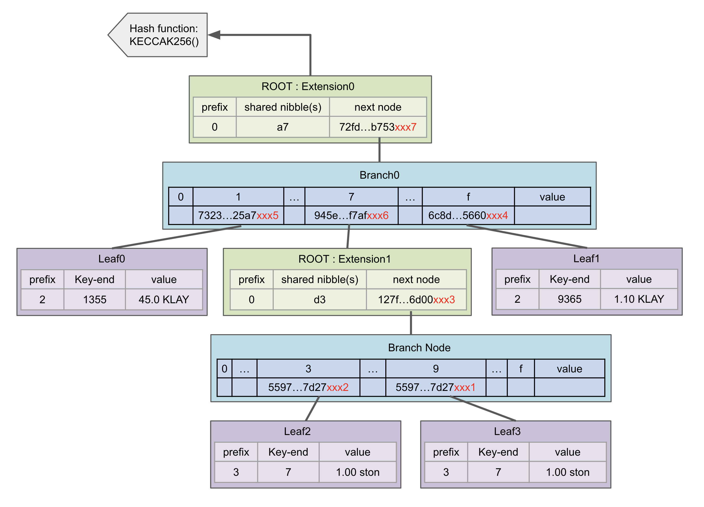

<!--You can leave these HTML comments in your merged KIP and delete the visible duplicate text guides, they will not appear and may be helpful to refer to if you edit it again. This is the suggested template for new KIPs. Note that a KIP number will be assigned by an editor. When opening a pull request to submit your KIP, please use an abbreviated title in the filename, `kip-draft_title_abbrev.md`. The title should be 44 characters or less.-->

## Simple Summary
<!--"If you can't explain it simply, you don't understand it well enough." Provide a simplified and layman-accessible explanation of the KIP.-->
StateDB Pruning is a technology to optimize storage by deleting nodes that have become historical data in StateDB (state trie, storage trie) and leaving only the latest data in StateDB. StateDB Migration uses the technology of StateDB pruning in Hot Storage to move the data to be deleted to another Cold Storage space, which allows you to manage data efficiently with Hot / Cold storage. In other words, StateDB Pruning is a process of deleting old data from the StateDB, while StateDB Migration is a process of moving the deleted data to a Cold Storage space. This can help to optimize storage and improve the performance of the blockchain.

## Abstract
<!--A short (~200 word) description of the technical issue being addressed.-->
Each node in the State Trie defines the 32-byte hash of the value as the key, and stores the data in the key-value storage. In this case, the same value can be generated at the leaf node, so a single node can be referenced by multiple nodes inside the trie. To solve this problem, we propose a new ExtHash (Extended Hash) structure, and we want to make data management easier by creating a 1:1 linked trie node structure without the problem of multiple references.

## Motivation
<!--The motivation is critical for KIPs that want to change the Klaytn protocol. It should clearly explain why the existing protocol specification is inadequate to address the problem that the KIP solves. KIP submissions without sufficient motivation may be rejected outright.-->

아래 그림은 Account 175의 잔고가 27에서 45로 변경될때 state tire와 block간의 연결관계를 그림으로 나타낸 것이다.

위 그림에서 붉은 노드는 새로운 데이터로 변경되었다. pruning의 관점에서 봤을때 붉은 노드를 삭제해도 current block의 정보를 처리하는데는 아무런 문제를 일으키지 않는다. 하지만 기존의 Hash은 중복 referenctr가 발생하기 때문에 어느 노드에서 붉은 노드를 참조하고 있는지 알수 없어 삭제할 수가 없었다. reference count 정보를 추가하고 관리할 수도 있겠지만 여러가지 이유(multi thread, 엄청난 노드수)로 쉽지 않다. 참조 : https://blog.ethereum.org/2015/06/26/state-tree-pruning  
 A new ExtHash is used in the State trie to remove the problem of multiple trie-nodes referencing a single trie-node. ExtHash is a Hash type that is created by adding a 7-byte serial number to the legacy hash. As a result, no trie-node with the same ExtHash can exist. Data is increased because data redundancy is eliminated, but it is judged to be at a manageable level as a result of the experiment.  
 The biggest reason for introducing ExtHash is to eliminate multiple references. Many of the pruning methods that have been tried so far have had to stop the system or be accompanied by a lot of IO load due to multiple reference problems. The slight data overhead added to ExtHash allows pruning to proceed without system downtime and without worrying about IO load. 


## Specification

### 7바이트를 추가한 이유
추가된 7바이트는 ExtHashNonce라고 정의 한다. account 정보가 변경될 때 마다 count가 증가하는 nonce의 이름에서 따온 것이다.
Hash에 ExtHashNonce를 추가한 이유는 Hash중복을 제거해서 중복 참조 문제를 제거하기 위함이다. Hash가 동일해도 추가된 7바이트는 중복이 일어날수 없어 ExtHash는 중복된 값이 나올 수 없다.  
그저 카운터라면 4바이트이거나 8바이트등이 될 수도 있었을 텐데 왜 유독 7바이트가 되었을까? 그 이유는 ExtHash는 state trie, storage trie의 데이터에서 대부분의 데이터를 차지 하기 때문이다. 증가된 바이트 비율만큼 DB사이즈가 증가한다. 따라서 중복이 일어나지 않으면서 제일 작은 값을 찾아야 한다.  

#### 1초에 업데이트 되는 얼마나 될까?
현재 klaytn은 초당 4000 TPS를 처리할 수 있다. smart contract는 1번에 여러 구좌를 업데이트 시켜서 많은 노드 정보를 업데이트 시킬 수도 있다. 따라서 현실적으로 일어나기 어려울 정도로 큰 숫자로 정의해야 한다. 그래서 정한 숫자는 1블럭당 trie node에서 변경되는 노드수는 100만개 이하라고 가정했다.  
ExtHashNonce는 어떻게 관리를 해야할까? 매번 업데이트 될때마다 DB에 넣는 것은 좋은 선택이 아니라고 생각했다. 그래서 시스템의 nano timestamp를 이용하기로 했다. 서버노드가 시작 될때 nano timestamp를 얻고 1바이트만큼 오르쪽으로 shift 연산을 한 값을 ExtHashNonce의 초기 값으로 잡고 새로운 노드가 생성될 때 마다 1씩 증가 시키기로 했다. 이러면 ExtHashNonce의 초기값이 중복될 일은 없다. nano timestamp를 이용한 ExtHashNonce는 1초 동안 몇개의 블록을 담을 수 있는지 계산해 보면
```
 nano timestamp의 1초는    : 1000,000,000
 1 byte shift right        : 1000,000,000 / 256 = 3906250 ( 7 byte )
 1 byte shift right 1 more : 1000,000,000 / 256 / 256 = 15258 ( 6 byte )
```
ExtHashNonce를 6 byte로 정할 경우 초당 15000개 이상의 trie-node가 업데이트되면 count 역전현상이 일어날 수 있고, 시스템이 재부팅 되면 ExtHashNonce는 충돌이 날 수 있다. ExtHashNonce가 7 byte 가 되면 초당 390만개 이상의 trie-node가 업데이트 되어야 하기때문에 충분히 여유로운 숫자이다.

<!--OR

그럼 100년 동안 중복이 일어나지 않으려먼 몇 바이트가 필요할지 계산해 보자.
```
 1 초   : 1000000
 1 시간 : 1000000 * 3600 ( 1시간은 3600초 )
 하루   : 1000000 * 3600 * 24 ( 하루는 24시간 )
 1년    : 1000000 * 3600 * 24 * 365 ( 1년은 365일 )
 100년  : 1000000 * 3600 * 24 * 365 * 100 ( 100년 )
 결과는 = 3153600000000000
 6 byte : 281474976710656
 7 byte : 72057594037927936
```
6바이트로는 부족하고 7바이트로는 충분하다.

초당 생성되는 trie의 노드수는 얼마정도로 봐야 할까? 현재 klaytn은 4000TPS를 처리할 수 있다. 한 구좌의 정보가 바뀌면 평균적으로 7~8개의 노드 정보가 업데이트 된다. smart contrcat는 동시에 여러 구좌의 정보가 업데이트될 수 있기 때문에 더 많은 노드의 정보가 업데이트 된다.  
그럼 1 블럭이 생성될때 업데이트 되는 노드수는 어떠헥 잡아야 할까? 현실적으로-->

### Terminology

Some borrowing of terminology, etc. - Beigepaper : An Ethereum Technical Specification. Author : Micah Daemeron

a. Root Node - The Top (first) node in a tree

b. Child Node - A node Directly connected to an-other node when moving away from the Root.

c. Leaf Node - A node with no children

d. Server Node - It means a server in charge of each role such as Consensus, Governance, Verification, and API in the klaytn network. CN, PN, and EN, which will be described later, are sub-concepts.

e. CN - Consensus Node - Block을 생성하고 합의하고 검증하는 역할을 담당한다. CN노드는 CN노드들 끼리만 연결하며, 외부와의 연결을 PN노드가 대행한다.

f. PN - Proxy Node - CN노드가 CN노드끼리의 통신에 집중할 수 있도록 외부와의 통신을 대행해주고 CN의 백업서버 역할을 담당한다.

g. EN - End Node - 여러 형태의 외부 API요청을 처리하여 CN, PN의 부하를 감소시킬 목적의 서버

h. MPT - Merkle Patrica Trie


### Trie 구조 정의
ExtHash는 State Trie Node에서만 사용한다. Header, Body, Transaction, Reciept등은 중복문제가 발생하지 않기 때문에 32byte hash를 사용한다.
* State Trie Node는 32byte Hash와 39byte ExtHash 중 1가지만 사용된다.
* 기존과 동일하게 동작하는 Server Node에서는 32byte Hash를 사용한다.
* statedb pruning을 사용하는 Server Node에서는 39byte Hash를 사용한다.
```
ref_32    = 32 byte - Hash
ref_39    = 39 byte - ExtHash
Ref       = ref_32 or ref_39
Leaf      = [ path, val ]
Extension = [ path, Ref ]
Branch    = [ Ref, Ref, ..., Ref, val ]
Account   = [ balance, nonce, storageRoot Ref, codeHash H ]
```

### Merkel Patricia Trie - 32 byte Hash
위에서 정의를 바탕으로 32 byte Hash를 사용해서 Merkel Patricia trie를 간단히 표현해 보면 아래와 같이 표현할 수 있다.
Account 정보는 다음과 같다. ( 참조(https://ethereum.stackexchange.com/questions/39915/ethereum-merkle-patricia-trie-extension-node) 문서에서 중복 참조가 일어나도록 약간만 수정 )  
a711355 : 45.0 KLAY  
a77d337 : 1.00 ston  
a7f9363 : 1.10 KLAY  
a77d397 : 1.00 ston  


### Merkel Patricia Trie - 39 byte ExtHash
위 32 byte Hash를 39 byte ExtHash 사용해서 Merkel Patricia trie를 간단히 표현해 보면 아래와 같이 표현할 수 있다.
Account 정보는 위와 동일하다.  
편의상 붉은색으로 표시한 xxx1, xxx2식의 표현이 추가된 ExtHashNonce 7바이트를 의미한다. ExtHashNonce가 추가됨으로 인해 맨아래 Leaf Node의 중복참조 문제가 사라진것을 확인할 수 있다.



### Get the same MPT Root Hash from ExtHash

ExtHash is a hash with ExtHashNonce added to the original hash. This changes the Root Hash value when calculating the hash of MPT (Merkle Patricia Trie). This can cause a collision with nodes (servers) or past versions of the hash that do not use ExtHash. To solve this problem, when calculating the hash of MPT, you can get the same result as before by removing the last ExtHashNonce from ExtHash and calculating it. In this section, we will describe the process of getting the MPT Root Hash using the original Hash by changing ExtHash to Hash.

#### ExtHash에서 기존Hash 얻기 flowchart


statedb.hasher.store 함수는 각 노드(Branch Node, Extension Node, Leaf Node)의 Hash를 계산하고, db가 지정되면 db에 Hash key와 RLP인코딩된 value를 저장하는 함수이다. 여기서 얻은 Hash로 MPT의 RootHash를 구하고, DB에 저장할 Key, Value를 얻는 함수 이다. 
* RootHash를 계산할때는 기존 Hash를 얻기위해 ExtHashFilter로 ExtHash를 Hash로 변환하고 RLP인코딩을 해서 Hash를 얻는다.
* DB에 저장할때는 NewExtHash로 Hash에 ExtHashNonce를 붙여서 ExtHash를 얻고, ExtHash를 키로 DB에 저장한다.
* 위 2과정을 통해서 RootHash를 구할 때는 ExtHashNonce를 제거해서 Hash를 얻고 이를 통해서 기존과 동일한 RootHash를 얻고, 저장할때는 ExtHash로 저장을 한다.

#### ExtHash Filter
The ExtHashFilter function works as follows.
All trie-nodes in MPT are of type fullNode or shorNode.
If you convert the ExtHash of the two node types to Hash and RLP-encode it, you can get the same value as the RLP encoding of the legacy Hash.
As shown in the code below, the ExtHash is converted to Hash using the LegacyRLP() function for fullNode and shorNode.
And if you RLP-encode the result, you will get the same encoding result as the RLP encoding result of the legacy hash.

```go
func ExtHashFilter(n node) (reData []byte) {
        if 'n' type is fullNode {
                tmpData = fullNodeFilter(n)
        } else if 'n' type is shotNode {
                tmpData = shortNodeFilater(n)
        } else {
                tmpData = rlp.encode(n)
        }

        return tmpData
}

func fullNodeFilter(n node) (rlpResult []byte) {

        for i = 0 -> 15 {
                if n[i] == ExtHash Type {
                        rlpResult = rlpResult + rlp.encode( n[i][:HashLength] )
                } else {
                        rlpResult = rlpResult + rlp.encode( n[i] )
                }
        }
        return rlpResult
}

func shortNodeFilter(n node) (rlpResult []byte) {
        if 'n' is smart contract type {
                rlpResult = rlp.encode( n.storageRoot[:HashLength] )
                          + rlp.encode( n.codeHash )
                          + rlp.encode( n.codeinfo )
        } else {
                rlpResult = rlp.encode( n )
        }
        return rlpResult
}
```

result  
before : f85d808080808080a6d051a632f6884719eeae97ab49d4f9d9c69bf91db0f5b7b5641e702503aecf9f**176a6ee19b45c6**a64525702728b35600894136297c5e831e989457eaefb1987b7e21fc40665a15cc**176a6ee18645bb**808080808080808080  
after  : f851808080808080a0d051a632f6884719eeae97ab49d4f9d9c69bf91db0f5b7b5641e702503aecf9fa04525702728b35600894136297c5e831e989457eaefb1987b7e21fc40665a15cc808080808080808080  


### Pruning
이제는 삭제로직을 설명합니다.

#### 기존 Hash에서의 Pruning 시도
Diagram-1을 Key : Value 형식으로 표현하면 아래와 같습니다.
```
KeyValue - 1
Extension0 - acec...e3c5 : [ "a7", "72fd...b753" ]
Branch0    - 72fd...b753 : [ 0:N, 1:"7323...25a7", 2:N, ..., 7:"945e...f7af", 8:N, ..., f:"6c8d...5660", val ]
Leaf0      - 7323...25a7 : [ "1355", 45.0 KLAY ]
Extension1 - 945e...f7af : [ "d3", "127f...6d00" ]
Leaf1      - 6c8d...5660 : [ "9365", 1.10 KLAY ]
Branch1    - 127f...6d00 : [ 0:N, ..., 3:"5597...7d27", ..., 9:"5597...7d27", ..., f:N, val ]
Leaf2      - 5597...7d27 : [ "7", 1.00 ston ]
``` 
* a77d397 account의 잔고가 1.00 ston에서 2.00 ston로 변경하고 그 값을 "KeyValue - 1"에 반영하면 아래와 같이 변경됩니다.

```
KeyValue - 2
Extension0 - acec...e3c5 : [ "a7", "72fd...b753" ]
Branch0    - 72fd...b753 : [ 0:N, 1:"7323...25a7", 2:N, ..., 7:"945e...f7af", 8:N, ..., f:"6c8d...5660", val ]
Leaf0      - 7323...25a7 : [ "1355", 45.0 KLAY ]
Extension1 - 945e...f7af : [ "d3", "127f...6d00" ]
Leaf1      - 6c8d...5660 : [ "9365", 1.10 KLAY ]
Branch1    - 127f...6d00 : [ 0:N, ..., 3:"5597...7d27", ..., 9:"5597...7d27", ..., f:N, val ]
Leaf2      - 5597...7d27 : [ "7", 1.00 ston ]
--- ADD NODE ---
Leaf2'     - 9755...277d : [ "7", 2.00 ston ]
Branch1'   - 7f12...006d : [ 0:N, ..., 3:"5597...7d27", ..., 9:"REDD...7d27", ..., f:N, val ]
Extension1'- 5394...aff7 : [ "d3", "REDD...6d00" ]
Branch0'   - fd72...53b7 : [ 0:N, 1:"7323...25a7", 2:N, ..., 7:"REDD...f7af", 8:N, ..., f:"6c8d...5660", val ]
Extension0'- ecac...c5e3 : [ "a7", "REDD...b753" ]
``` 
Pruning의 관점에서보면 '(프라임)이 붙은 노드들은 업데이트된 노드이기 때문에 변경전의 노드를 지우고 싶습니다. 그런데 Leaf2'의 원본노드인 Leaf2를 지우면 데이터 유실이 됩니다. 왜냐하면 Branch1에서 Leaf2를 중복으로 참조하고 있었기 때문입니다. 지금은 예제이기 때문에 간단히 표현되었지만, 수십억 노드로 연결되어 있는 MPT에서는 어떤 노드가 새롭게 업데이트 되었을때 과거 노드를 지울수 있는지 판단할 수가 없습니다. 그래서 online puning을 진행할 수 없습니다. 

#### ExtHash에서의 Pruning 시도

Diagram-2를 Key : Value 형식으로 표현하면 아래와 같습니다.
```
KeyValue - 3
Extension0 - acec...e3c5     : [ "a7", "72fd...b753xxx1" ]
Branch0    - 72fd...b753xxx7 : [ 0:N, 1:"7323...25a7xxx2", 2:N, ..., 7:"945e...f7afxxx3", 8:N, ..., f:"6c8d...5660xxx4", val ]
Leaf0      - 7323...25a7xxx5 : [ "1355", 45.0 KLAY ]
Extension1 - 945e...f7afxxx6 : [ "d3", "127f...6d00xxx5" ]
Leaf1      - 6c8d...5660xxx4 : [ "9365", 1.10 KLAY ]
Branch1    - 127f...6d00xxx3 : [ 0:N, ..., 3:"5597...7d27xxx6", ..., 9:"5597...7d27xxx7", ..., f:N, val ]
Leaf2      - 5597...7d27xxx2 : [ "7", 1.00 ston ]
Leaf3      - 5597...7d27xxx1 : [ "7", 1.00 ston ]
``` 

* a77d397 account의 잔고가 1.00 ston에서 2.00 ston로 변경하고 그 값을 "KeyValue - 3"에 반영하면 아래와 같이 변경됩니다.
```
KeyValue - 4
--- OLD NODE ---
Extension0 - acec...e3c5     : [ "a7", "72fd...b753xxx1" ]
Branch0    - 72fd...b753xxx7 : [ 0:N, 1:"7323...25a7xxx2", 2:N, ..., 7:"945e...f7afxxx3", 8:N, ..., f:"6c8d...5660xxx4", val ]
Leaf0      - 7323...25a7xxx5 : [ "1355", 45.0 KLAY ]
Extension1 - 945e...f7afxxx6 : [ "d3", "127f...6d00xxx5" ]
Leaf1      - 6c8d...5660xxx4 : [ "9365", 1.10 KLAY ]
Branch1    - 127f...6d00xxx3 : [ 0:N, ..., 3:"5597...7d27xxx6", ..., 9:"5597...7d27xxx7", ..., f:N, val ]
Leaf2      - 5597...7d27xxx2 : [ "7", 1.00 ston ]
Leaf3      - 5597...7d27xxx1 : [ "7", 1.00 ston ]
--- ADD NODE ---
Leaf3'     - 9755...277dxxx8 : [ "7", 2.00 ston ]
Branch1'   - 7f12...006dxxx9 : [ 0:N, ..., 3:"5597...7d27xxx2", ..., 9:"9755...277dxxx8", ..., f:N, val ]
Extension1'- 5e94...aff7xxxa : [ "d3", "7f12...006dxxx9" ]
Branch0'   - fd72...53b7xxxb : [ 0:N, 1:"7323...25a7xxx5", 2:N, ..., 7:"5e94...aff7xxxa", 8:N, ..., f:"6c8d...5660xxx4", val ]
Extension0'- ecac...c5e3     : [ "a7", "fd72...53b7xxxb" ]
``` 

* Leaf3의 Balance가 변경됨으로 인해 Leaf3', Branch1' Extention1', Branch0', Extension0'으로 새롭게 업데이트 되었고, Pruning의 목적처럼 최신데이터만 유지 한다면 "OLD NODE"에 있던 Leaf3, Branch1, Extention1, Branch0, Extension0를 삭제하면 됩니다.
* 추가된 7바이트 ExtHashNonce로 인해 중복 참조하는 노드가 존재할 수 없기 때문입니다.
* 따라서 "5597...7d27<span style="color:red">xxx1</span>", "127f...6d00<span style="color:red">xxx3</span>", "945e...f7af<span style="color:red">xxx6</span>", "72fd...b753<span style="color:red">xxx7</span>", "acec...e3c5"를 삭제할 수 있습니다.
 
#### Pruning을 위해 도입한 ExtHash로 인한 변화

* 데이터 관점에서 보기 위해 KeyValue-1과 KeyValue-3을 이곳에서 다시 보고 비교해봅니다.
```
KeyValue - 1
Extension0 - acec...e3c5 : [ "a7", "72fd...b753" ]
Branch0    - 72fd...b753 : [ 0:N, 1:"7323...25a7", 2:N, ..., 7:"945e...f7af", 8:N, ..., f:"6c8d...5660", val ]
Leaf0      - 7323...25a7 : [ "1355", 45.0 KLAY ]
Extension1 - 945e...f7af : [ "d3", "127f...6d00" ]
Leaf1      - 6c8d...5660 : [ "9365", 1.10 KLAY ]
Branch1    - 127f...6d00 : [ 0:N, ..., 3:"5597...7d27", ..., 9:"5597...7d27", ..., f:N, val ]
Leaf2      - 5597...7d27 : [ "7", 1.00 ston ]
``` 

```
KeyValue - 3
Extension0 - acec...e3c5     : [ "a7", "72fd...b753xxx1" ]
Branch0    - 72fd...b753xxx7 : [ 0:N, 1:"7323...25a7xxx2", 2:N, ..., 7:"945e...f7afxxx3", 8:N, ..., f:"6c8d...5660xxx4", val ]
Leaf0      - 7323...25a7xxx5 : [ "1355", 45.0 KLAY ]
Extension1 - 945e...f7afxxx6 : [ "d3", "127f...6d00xxx5" ]
Leaf1      - 6c8d...5660xxx4 : [ "9365", 1.10 KLAY ]
Branch1    - 127f...6d00xxx3 : [ 0:N, ..., 3:"5597...7d27xxx6", ..., 9:"5597...7d27xxx7", ..., f:N, val ]
Leaf2      - 5597...7d27xxx2 : [ "7", 1.00 ston ]
Leaf3      - 5597...7d27xxx1 : [ "7", 1.00 ston ]
``` 

* KeyValue - 1, 3은 같은 데이터를 표현하고 있습니다.
* 하지만 추가된 7바이트로 인해 2가지 변화가 있습니다.
* MPT의 모든 Hash가 32 byte에서 39 byte로 증가했으며, Key, Value모두에 적용됩니다. 이로 인해 39/32 만큼 증가해서 최대 21.8%정도의 용량이 증가될 수 있습니다.
* KeyValue - 3에는 KeyValue - 1에 없던 Leaf3이 추가되었습니다. 중복 참조로 인해 데이터를 효율적으로 사용할 수 없게 되었습니다. 이는 각 블록체인의 상황에따라 많이 다를 수 있으나, 클레이튼 내부 조사 결과는 2% 이하로 증가되는 것으로 조사되었습니다.
* ExtHash를 도입함으로 인해 current state trie의 용량은 23% 정도의 데이터가 증가할 것으로 예상됩니다.

#### 최종적으로 online Pruning을 동작시킬 경우 State Trie DB의 용량 변화 예측
* 현재 klaytn의 메인넷인 cypress의 State Trie DB의 총 용량은 4TB를 약간 상회.  
* cypress의 current State Trie DB의 용량을 추측해 보면 Snapshot-Sync 직후 State Trie DB용량은 130GB.  
* ExtHash를 도입하면서 증가될 용량은 23%로 추측.  
* online pruning을 동작시킬 경우 State Trie DB의 용량을 계산하면 - 130GB * 1.23 = 159.9GB  
* 결과적으로 4TB에서 꾸준히 누적되던 State Trie DB는 160GB로 줄어들 것으로 예상되며, 
* online pruning으로 인해 State Trie DB 증가 속도가 많이 더뎌 질것으로 예측된다.  


## Expected Effect

### ExtHash를 도입하기 전에 알아야 할 내용들
* ExtHash를 사용하다 Hash로 변경할 순 있지만, 모든 데이터를 변경해야 하기 때문에 어려움이 있고, ExtHash에서 Hash로 마이그레이션할 툴의 개발 계획은 없다.
* Hash방식으로 운영하던 노드를 ExtHash로 마이그레이션 하는 툴도 존재하지 않는다. 대신 klaytn 재단에서 ExtHash로 만들어진 DB를 snapshot으로 주기적으로 업데이트할 예정이다.
* ExtHash를 사용할 경우 Snapsync를 사용할 수 없다. 반대로 사용할 이유도 많이 부족하다. 이미 최적화된 용량의 ExtHash로된 snapshot을 제공하기 때문이다.
* ExtHash를 사용할 경우 State Migration을 할 수 없다. ExtHash는 이미 최신 데이터로만 동작되기 때문에 State Migration이 불필요하다.

Expect the following effects through StateDB Pruning / Migration.
* Storage where hot data is stored is reduced to 500GB, which can be configured as high-performance storage
* Storage where cold data is stored is composed of high-capacity storage to increase storage cost efficiency for each purpose
* The cache hit ratio increases as the size of Hot Data decreases. As a result, IO performance increases

But it may give rise to the following changes:
* Various configuration options increase the complexity of the structure,
* As Hash is used in various places in blockchain, there is a problem that many internal sources need to be modified.
* There is a problem that snap sync cannot be used when using ExtHash.

## Backwards Compatibility
* In the case of ExtHash, Archive Sync, Full Sync, and Fast Sync are possible, but Snapshot Sync is not possible.
* If ExtHash is not used, backward compatibility is possible as it operates the same as before.

## Reference

## Copyright
Copyright and related rights waived via [CC0](https://creativecommons.org/publicdomain/zero/1.0/).
