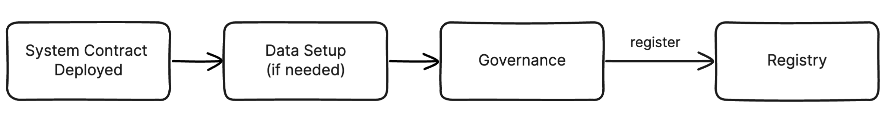
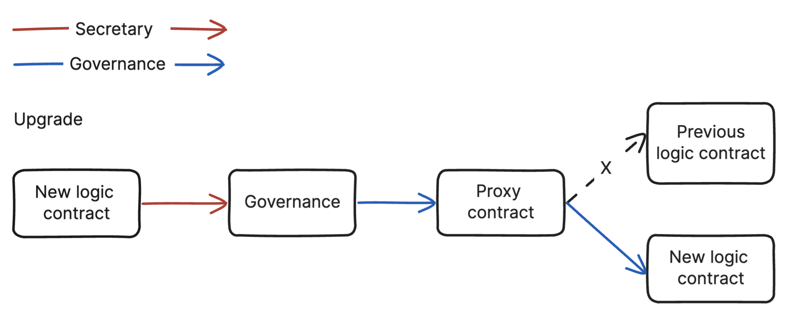
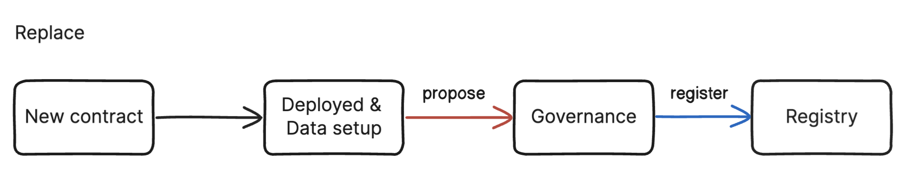

## Simple Summary

A unified deployment and management process for system contracts.

## Abstract

This standard defines a unified deployment and management process for system contracts. To effectively manage system contracts, it also introduces a Registry contract that manages all system contracts.

## Motivation

Currently, Klaytn has multiple [system contracts](#definitions), but they are deployed and managed without any defined standards. For example, the `AddressBook` contract was deployed by a bytecode injection at the genesis block with a reserved address. In contrast, an EOA deployed `TreasuryRebalance`, and its address is set in the chain config. As more system contracts will be deployed in the future, it’s essential to have a standard way to deploy and manage system contracts.

## Specification

The key words “MUST”, “MUST NOT”, “REQUIRED”, “SHALL”, “SHALL NOT”, “SHOULD”, “SHOULD NOT”, “RECOMMENDED”, “MAY”, and “OPTIONAL” in this document are to be interpreted as described in RFC 2119.

This standard defines the separation of data and logic contracts in system contracts, and every system contract should be developed and deployed under this standard. This method, often called the proxy pattern, allows the change of the logic contract while keeping the data, which can greatly reduce the cost of contract updates. Upgrading a logic contract will not affect the Registry since the Registry only holds the address of the proxy(data) contract. Delegating ownership of a proxy contract to a governance contract can solve the centralized and potential private key loss issues.

Between the popular proxy patterns `Transparent` and `UUPS`, all system contracts must be developed and validated based on the [`UUPS`](https://eips.ethereum.org/EIPS/eip-1822) proxy pattern.

### Definitions

- System contract: A contract that is read by the Klaytn core protocol or directly affect the protocol. The currently deployed system contracts are as follows: [**AddressBook**](https://github.com/klaytn/klaytn/blob/dev/contracts/reward/contract/AddressBook.sol), [**GovParam**](https://github.com/klaytn/klaytn/blob/dev/contracts/gov/GovParam.sol), **Voting**([KIP-81](https://github.com/klaytn/kips/blob/main/KIPs/kip-81.md)), **TreasuryRebalance**([KIP-103](https://github.com/klaytn/kips/blob/main/KIPs/kip-103.md))

- System contract upgrade: The process of updating an existing logic contract while maintaining a proxy contract. The upgraded logic contract must be compatible with the previous interface and its storage layout.

- System contract replacement: The deployment of a new system contract that is then registered to the Registry using the same name as its predecessor. The new contract effectively deprecates the previous system contract.

### Smart Contracts Overview

The proposed smart contract will be implemented in Solidity and compatible with the Ethereum Virtual Machine (EVM).

The smart contract will have the following features:

1. Registry

    - Register a new system contract with an activation block.

    - Return the state of the system contracts.

2. Proxy

    - Delegate a call to logic contract.

    - Upgrade a logic contract.

#### 1. Registry

The registry must have data for system contracts at a specific block. It will be done by state injection, which injects data into the Registry directly using the `state.SetState`. A reference implementation is introduced in [Implementation](#implementation). Note that it only records system contracts developed based on KIP-149.

#### Interface of Registry

```solidity
pragma solidity ^0.8.0;

abstract contract IRegistry {
    /* ========== VARIABLES ========== */
    /// The following variables are baked in the interface because their storage layout matters in protocol consensus 
    /// when inject initial states (system contracts, owner) of the Registry.
    /// @dev Mapping of system contracts
    mapping(string => Record[]) public records;

    /// @dev Array of system contract names
    string[] public names;

    /// @dev Owner of contract
    address internal _owner;

    /* ========== TYPES ========== */
    /// @dev Struct of system contracts
    struct Record {
        address addr;
        uint256 activation;
    }

    /* ========== EVENTS ========== */
    /// @dev Emitted when the contract owner is updated by `transferOwnership`.
    event OwnershipTransferred(address indexed previousOwner, address indexed newOwner);
    
    /// @dev Emitted when a new system contract is registered.
    event Registered(string name, address indexed addr, uint256 indexed activation);

    /* ========== MUTATORS ========== */
    /// @dev Registers a new system contract.
    function register(string memory name, address addr, uint256 activation) external virtual;
    
    /// @dev Transfers ownership to newOwner.
    function transferOwnership(address newOwner) external virtual;

    /* ========== GETTERS ========== */
    /// @dev Returns an address for active system contracts registered as name if exists.
    ///  It returns a zero address when there's no active system contract with name.
    function getActiveAddr(string memory name) external virtual view returns (address);
  
    /// @dev Returns all system contracts registered as name.
    function getAllRecords(string memory name) external virtual view returns (Record[] memory);
    
    /// @dev Returns all names of registered system contracts.
    function getAllNames() external virtual view returns (string[] memory);
    
    /// @dev Returns owner of contract.
    function owner() external virtual view returns (address);
}
```

#### Methods

```solidity
function register(string memory name, address addr, uint256 activation)
```

Registers a new system contract. It will be activated at `activation`. It overwrites the predecessor if a predecessor system contract exists and is not yet active. Passing `addr == address(0)` is an implicit deprecation for the `name`, meaning the `name` will no longer be used.

The function validates the following requirements:

- The function caller MUST be an owner address.

- The function MUST revert if a `name` is an empty string.

- The function MUST revert if `activation < block.number`.

The function emits a `Registered` event.

```solidity
function getActiveAddr(string memory name) view returns (address)
```

Returns the address of the active system contract with the `name`. It returns a zero address if there’s no registered system contract with the `name` or the `name` has been deprecated by registering a zero address.

#### 2. Proxy

The implementation of the proxy contract will come from [OZ's UUPS implementation](https://github.com/OpenZeppelin/openzeppelin-contracts/blob/v4.9.3/contracts/proxy/ERC1967/ERC1967Proxy.sol), which follows [EIP-1967](https://eips.ethereum.org/EIPS/eip-1967) and [EIP-1822](https://eips.ethereum.org/EIPS/eip-1822). 

### System Contracts Life Cycle

The Registry contract manages system contracts based on the current block number. Its state will be managed implicitly, which means there’s no explicit state variable(e.g., enum State). It has three implicit states and cannot be reversed to the previous state:

- Registered: It has been registered but has not been activated yet.

- Active: The registered address isn't a zero address and current block number exceeds its activation. Also, no active successor system contract exists.

- Deprecated: It's registered with a zero address or there’s an active successor system contract.



#### Upgrade System Contracts

When upgrading a system contract, its logic contract will be changed by governance proposal. The Registry will not be updated since it only manages the address of the proxy contract.



#### Replace System Contracts

If current system contract updates can’t be done by upgrading the logic contract, it must be replaced with the newly deployed system contract. The predecessor doesn’t need to be explicitly deprecated since a new system contract will implicitly replace and deprecate it. The replacement process is the same as the initial registration for the system contract except for having a predecessor.



### Core Logic Overview

After a target block number, a Klaytn node should read all the active addresses of system contracts through the Registry. A Klaytn node deploys the Registry at the configured block number at the reserved address by bytecode injection. Note that the Registry will be replaced by bytecode injection if necessary since it's deployed by bytecode injection.

#### Chain Configuration

In the Chain Config, the following fields are newly introduced. All node operators in a network must update `genesis.json` configuration with the same value. The configuration values for Baobab and Cypress networks are hard-coded on the client source code.

- `RegistryAddress`: the reserved address for the Registry contract, which is `0x0000000000000000000000000000000000000401`.

- `Kip149CompatibleBlock`: the target block number that the Registry will be deployed.

- `RegistryInit`: the initial data config for the Registry. Tye type of this field is defined as `RegistryConfig` as shown below. It is used when injecting the initial state after deploying the Registry contract.
  
```go
// In klaytn/params/config.go
type RegistryConfig struct {
	Records  map[string]common.Address // Map for system contracts
	Owner   common.Address // Address for initial owner of Registry
}

var ChainConfig = &ChainConfig{
    ...
    Kip149CompatibleBlock: TBD,
    // RegistryInit will be used when injecting initial state for the Registry
    // Note that the registry only records the system contracts based on the KIP-149, which is currently only KIP-113
    // The activation block deployed by state injection will be 0
    RegistryInit: &RegistryConfig{
		Records: map[string]common.Address{
			"KIP113": Kip113Address,
		},
		Owner: OwnerAddress,
    },
}
```


#### Execution

The Registry deployment is executed at the `engine.Finalize` function, which means the end of the block generation. It reads the reserved address and runtime bytecode and deploys the Registry by the bytecode injection. Also, it injects the initial state provided by `RegistryConfig` for the Registry here. When `kip149CompatibleBlock == 0`, the Registry will be allocated at the genesis block.

```go
if chain.Config().IsKIP149ForkBlock(header.Number) {
	// Inject the bytecode and states for the Registry
	err := registry.InstallRegistry(state, chain.Config().RegistryInit)
	if err != nil {
		logger.Error("failed to set the registry contract code", "err", err)
	} else {
		logger.Info("successfully set the registry contract code", "block", header.Number.Uint64())
	}
}
```

#### Resolver

A Klaytn node will have a resolver to read the active addresses of system contracts from the Registry. But the system contracts deployed by state injection (e.g., `KIP113`) will be directly read from `chain.Config().RegistryInit` at the `Kip149CompatibleBlock` since the Registry will be deployed in the `engine.Finalize` function, which is the last part of the block generation. In other words, the resolver will be used starting in the `Kip149CompatibleBlock + 1`.

```go
// Note that it will be activated in the next of KIP-149 fork block
func ReadRegistryActiveAddr(backend bind.ContractCaller, name string, num *big.Int) (common.Address, error) {
	code, err := backend.CodeAt(context.Background(), RegistryAddr, num)
	if err != nil {
		return common.Address{}, err
	}
	if code == nil {
		return common.Address{}, ErrRegistryNotInstalled
	}

	caller, err := contracts.NewRegistryCaller(RegistryAddr, backend)
	if err != nil {
		return common.Address{}, err
	}

	opts := &bind.CallOpts{BlockNumber: num}
	return caller.GetActiveAddr(opts, name)
}
```

## Rationale

### Bytecode Injection for Registry Deployment

In the future, all system contracts will be registered in the Registry, and a Klaytn node will read the active addresses of system contracts from the Registry. Not only for a Klaytn node but also for other ecosystem participants who will use the registry to read the system contracts they need, meaning the registry should be registered at an easily accessible reserved address.

### Delegating Ownership of Registry and System Contracts to Governance

The Registry holds all system contracts for Klaytn, affecting the protocol directly. This means its registration and deprecation process must be very careful and not centralized. The same goes for the system contract. As mentioned in [specification](#specification), making the EOA the owner of system contracts can cause centralization and potential private key loss issues. By delegating ownership of the Registry and system contracts to Governance, all registry and system contract changes will only be applied after full discussion and consensus of the GCs and Validators. Validators have the right to accept or reject the proposal depending on whether or not the hard fork proceeds.

### State Injection for System Contracts

The Registry must hold data for system contracts at a specific block. To handle this, there are three main approaches:

1. Send multiple register transactions after deploying the Registry.

2. Use a fallback logic in the getter to return the state of system contracts.

3. Use state injection, which injects state for system contracts by the `state.SetState`.

The first approach seems straightforward. However, the Registry will be set in the `engine.Finalize`, which is the last part of the block generation. It means the transaction cannot be processed in the same block and must be entered in the first order of the next block. This requires additional implementation and can't be applied when `KIP149CompatibleBlock == 0`. In the second approach, the Registry contract should have different codes by the network, requiring direct code modification in the getter(e.g., add/remove hard-coded system contracts and modify if-else statements). It can cause potential security vulnerabilities and increase costs for getter calls permanently. On the other hand, the last approach is much safer because it's more structured and doesn't require modifying any code. It can also set the necessary configuration without working with the additional contract's constructor. Note that the state injection for system contracts will follow the [solidity layout rule](https://docs.soliditylang.org/en/v0.8.20/internals/layout_in_storage.html).

### Separate Data and Logic Contract

This proxy pattern simplifies the process of system contract update because the existing data can be used even if the logic contract is changed. The main issue of the proxy pattern is the centralization and potential private key loss. But delegating ownership to upgrade a logic contract to Governance can solve those problems. Choosing `UUPS` as the proxy pattern is because it's lighter and more secure than `Transparent` proxy pattern. For example, `Transparent` requires additional logic to prevent `proxy selector clashing`. However, with `UUPS`, the proxy functionality is managed in a logic contract, eliminating the need for additional work. For more details, please refer to [OZ's article](https://docs.openzeppelin.com/contracts/4.x/api/proxy#transparent-vs-uups)

## Backward Compatibility

### Deployed System Contracts

The existing system contracts will not be registered in the Registry, since they are not developed based on KIP-149. They will be used in a Klaytn node same way as before.

## Implementation

- A reference implementation for the Registry contract: [Implementation](https://github.com/klaytn/klaytn/blob/dev/contracts/system_contracts/registry/Registry.sol)
- A reference implementation for core logic: [Implementation](https://github.com/klaytn/klaytn/blob/dev/blockchain/system/registry.go)

## References

- Binance Smart Chain: https://github.com/bnb-chain/bsc/tree/master/core/systemcontracts

- Celo: https://docs.celo.org/community/release-process/smart-contracts

## Copyright

Copyright and related rights waived via [CC0](https://creativecommons.org/publicdomain/zero/1.0/).
