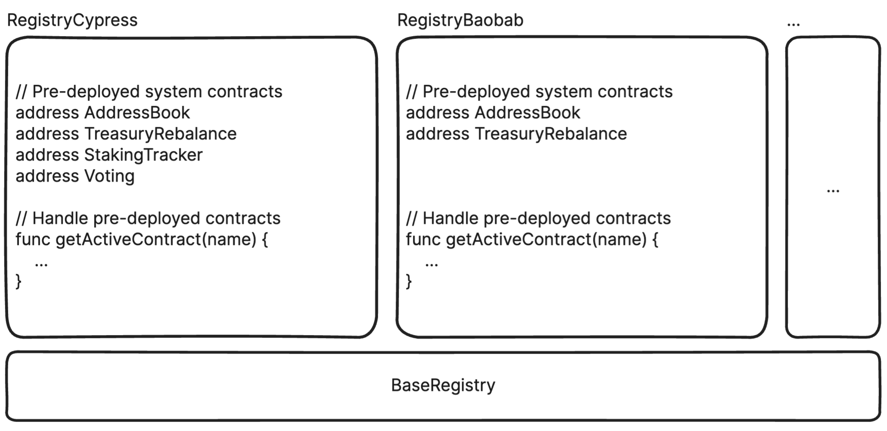

## Simple Summary

A unified deployment and management process for system contracts.

## Abstract

This standard defines a unified deployment and management process for system contracts. To effectively manage system contracts, it also introduces a Registry contract that manages all system contracts.

## Motivation

Currently, system contracts are deployed and managed without any defined standards. For example, the `AddressBook` contract was deployed by a bytecode injection at the genesis block with a reserved address, while EOA deployed `TreasuryRebalance`, and its address is set in the chain config. As more system contracts will be deployed in the future, it’s essential to have a standard way to deploy and manage system contracts.

## Specification

The key words “MUST”, “MUST NOT”, “REQUIRED”, “SHALL”, “SHALL NOT”, “SHOULD”, “SHOULD NOT”, “RECOMMENDED”, “MAY”, and “OPTIONAL” in this document are to be interpreted as described in RFC 2119.

This standard defines the separation of data and logic contracts in system contracts. This method, often called the proxy pattern, allows the change of the logic contract while keeping the data, which can greatly reduce the cost of contract updates. Upgrading a logic contract will not affect the Registry since the Registry only holds the address of the proxy(data) contract. Delegating ownership of a proxy contract to a governance contract can solve the centralized issue and potential private key loss.

### Definitions

- System contract: A contract that affects protocol. The currently deployed system contracts are as follows: **AddressBook**, **Governance**([KIP-81](https://github.com/klaytn/kips/blob/main/KIPs/kip-81.md)), **StakingTracker**, **TreasuryRebalance**([KIP-103](https://github.com/klaytn/kips/blob/main/KIPs/kip-103.md))

- System contract upgrade: Upgrade a logic contract while maintaining a proxy contract. The upgraded logic contract must maintain the previous interface.

- System contract replacement: Deploy a new system contract and register it to the Registry with the same name. It will deprecate predecessor system contract.

### Smart Contracts Overview

The proposed smart contract will be implemented in Solidity and compatible with the Ethereum Virtual Machine (EVM).

The smart contract will have the following features:

1. Registry

    - Register a new system contract with an activation block.

    - Return the information of system contracts.

2. Proxy

    - Delegate a call to logic contract.

    - Upgrade a logic contract.

#### 1. Registry

Since it needs data for pre-deployed system contracts right after deployment, all addresses for pre-deployed system contracts must be hard-coded in the Registry and need logic in the `getActiveContract` function to return them properly. The Registry is divided into base and network-specific parts to implement this. The `BaseRegistry` handles common logic for all networks, and each network-specific implementation has to manage pre-deployed system contracts, as shown in the following figure.



#### Interface of BaseRegistry

```solidity
pragma solidity ^0.8.0;

interface IBaseRegistry {
    /* ========== TYPES ========== */
    /// @dev Struct of system contracts
    struct Record {
        address addr;
        uint256 activation;
    }

    /* ========== EVENTS ========== */
    /// @dev Emitted when the Registry is constructed by `constructContract`.
    event ConstructContract(address indexed owner);
    
    /// @dev Emitted when the contract owner is updated by `transferOwnership`.
    event OwnershipTransferred(address indexed previousOwner, address indexed newOwner);
    
    /// @dev Emitted when a new system contract is registered.
    event Registered(string name, address indexed addr, uint256 indexed activation);
    /* ========== CONSTRUCTOR ========== */
    /// @dev Constructs the Registry after deployment.
    function constructContract(address governance) external;

    /* ========== MUTATORS ========== */
    /// @dev Registers a new system contract.
    function register(string memory name, address addr, uint256 activation) external;
    
    /// @dev Transfers ownership to newOwner.
    function transferOwnership(address newOwner) external;
    /* ========== GETTERS ========== */
    /// @dev Getter for a public state variable: records.
    function records(string memory name, uint256 index) external returns (address, uint256, uint256);
    
    /// @dev Getter for a public state variable: contractNames.
    function contractNames(uint256 index) external returns (string memory);
    
    /// @dev Returns an address for active system contracts registered as name if exists.
    ///  It returns a zero address when there's no active system contract with name.
    function getActiveAddr(string memory name) external returns (address);
  
    /// @dev Returns all system contracts registered as name.
    function getAllContracts(string memory name) external view returns (Record[] memory);
    
    /// @dev Returns all names of registered system contracts.
    function getAllContractNames() external view returns (string[] memory);
    
    /// @dev Returns owner of contract.
    function owner() external view returns (address);
}
```

#### Methods

```solidity
function register(string memory name, address addr, uint256 activation)
```

Registers a new system contract. It will be activated at `activation`. It overwrites the predecessor if a predecessor system contract exists and is not yet active. Passing `addr == address(0)` means deprecation for the name since `getActiveAddr` function will return a zero address after its activation.

The function validates the following requirements:

- The function caller MUST be a governance contract.

- The function MUST revert if a `name` is an empty string.

- The function MUST revert if `activation < block.number`.

The function emits a `Registered` event.

```solidity
function getActiveAddr(string memory name) view returns (address)
```

Returns the address of the active system contract with the `name`. It returns a zero address if no active contract with a name exists.

#### 2. Proxy

The implementation of the proxy contract comes from [EIP-1967](https://eips.ethereum.org/EIPS/eip-1967).

### System Contracts Life Cycle

The Registry contract manages system contracts based on the current block number. Its state will be managed implicitly, which means there’s no explicit state variable(e.g., enum State). It has three implicit states and cannot be reversed to the previous state:

- Registered: It has been registered but has not been activated yet.

- Active: The current block number exceeds its activation, and no active successor system contract exists.

- Deprecated: There’s an active successor system contract.


#### Upgrade System Contracts

When upgrading system contracts, its logic contract will be changed by governance proposal. The Registry will not be updated since it only manages the address of the proxy contract.


#### Replace System Contracts

If current system contract updates can’t be done by upgrading the logic contract, it must be replaced with the newly deployed system contract. The predecessor doesn’t need to be explicitly deprecated since it will be implicitly replaced and deprecated by a new system contract.


### Core Logic Overview

After a target block number, a Klaytn node should read all the active addresses of system contracts through the Registry. A Klaytn node deploys the Registry at the configured block number at the reserved address by bytecode injection.

#### Chain Configuration

In the Chain Config, the following field is introduced. All node operators in a network must update `genesis.json` configuration with the same value. The configuration values for Baobab and Cypress networks are hard-coded on the client source code.

- `kip149CompatibleBlock`: the target block number that a Klaytn node deploys Registry.

#### Execution

The Registry deployment is executed at the `Finalize` function, which means the end of the block processing process. It reads the reserved address and runtime bytecode and deploys the Registry by the bytecode injection.

```go
// Deploy the registry contract if the block is the kip-149 fork block
if chain.Config().IsKIP149ForkBlock(header.Number) {
	// Set the registry contract code to the stateDB
	err := registry.InstallRegistry(state)
	if err != nil {
		logger.Error("failed to set the registry contract code", "err", err)
	} else {
		logger.Info("successfully set the registry contract code", "block", header.Number.Uint64())
	}
}
```

#### Resolver

A Klaytn node will have a resolver to read the active addresses of system contracts from the Registry.

## Rationale

### Bytecode Injection For Registry Deployment

In the future, all system contracts will be registered in the Registry, and a Klaytn node will read the active addresses of system contracts from the Registry. Not only for a Klaytn node but also for other ecosystem participants who will use the registry to read the system contracts they need, meaning the registry should be registered at an easily accessible reserved address.

### Separate Data And Logic Contract

This proxy pattern simplifies the process of system contract update because the existing data can be used even if the logic contract is changed. The main issue of the proxy pattern is the centralization and potential private key loss. But delegating ownership to upgrade a logic contract to Governance can solve those problems.

## Backward Compatibility

### Deployed System Contracts

As explained in [Registry](#1-registry) section, it consists of base and network-specific registries. The below code is an example of `RegistryCypress`.

```solidity
// Pre-deployed system contracts
address public constant ADDRESS_BOOK = 0x0000000000000000000000000000000000000400;
address public constant VOTING = 0xcA4Ef926634A530f12e55A0aEE87F195A7B22Aa3;
address public constant TREASURY_REBALANCE = 0xD5ad6D61Dd87EdabE2332607C328f5cc96aeCB95;
address public constant STAKING_TRACKER = 0x9b8688d616D3D5180d29520c6a0E28582E82BF4d;

bytes32 public constant ADDRESS_BOOK_KEY = keccak256(abi.encodePacked("AddressBook"));
bytes32 public constant VOTING_KEY = keccak256(abi.encodePacked("Voting"));
bytes32 public constant TREASURY_REBALANCE_KEY = keccak256(abi.encodePacked("TreasuryRebalance"));
bytes32 public constant STAKING_TRACKER_KEY = keccak256(abi.encodePacked("StakingTracker"));

/**
  * @dev Returns the address of contract if active at current block including pre-deployed system contract.
  * @param name Name of the system contract.
  */
function getActiveContract(string memory name) public view override returns (address) {
    bytes32 key = keccak256(abi.encodePacked(name));

    uint256 activation;
    uint256 length = records[name].length;
    if (length > 0) {
        activation = records[name][length - 1].activation;
    }

    address addr = super.getActiveAddr(name);

    if (addr != address(0)) {
        return addr;
    } else {
        if (key == ADDRESS_BOOK_KEY) {
            return activation != 0 && activation <= block.number ? address(0) : ADDRESS_BOOK;
        } else if (key == VOTING_KEY) {
            return activation != 0 && activation <= block.number ? address(0) : VOTING;
        } else if (key == TREASURY_REBALANCE_KEY) {
            return activation != 0 && activation <= block.number ? address(0) : TREASURY_REBALANCE;
        } else if (key == STAKING_TRACKER_KEY) {
            return activation != 0 && activation <= block.number ? address(0) : STAKING_TRACKER;
        } else {
            return addr;
        }
    }
}
```

Since pre-deployed system contracts are different by the network (Baobab, ServiceChains), each implementation for the network-specific registry is different by the network. If there's no pre-deployed system contract, using `BaseRegistry` is enough.

## Implementation

A reference implementation and its test code for KIP-149: [Implementation](https://github.com/klaytn/system-contracts/tree/registry)

## References

- Binance Smart Chain: https://github.com/bnb-chain/bsc/tree/master/core/systemcontracts

- Celo: https://docs.celo.org/community/release-process/smart-contracts

## Copyright

Copyright and related rights waived via [CC0](https://creativecommons.org/publicdomain/zero/1.0/).
