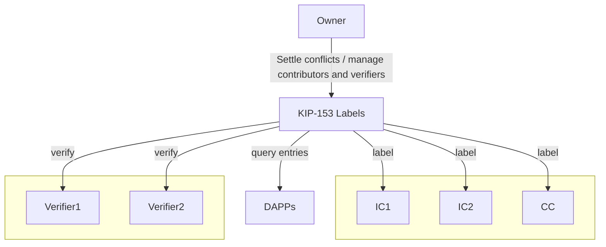

## Simple Summary
This document suggests an on-chain database linking addresses to readable labels for easier understanding in interfaces. It enables direct access to label data and supports community-driven, decentralized label management.

## Abstract
This document proposes an on-chain label database storing a mapping between addresses and human-readable labels. It aims to enhance comprehensibility of accounts in user interfaces. By implementing as an on-chain contract, it allows users and service providers to access label information without the need for a separate API. Additionally, it allows decentralized contribution through community-based label administration and verification.

## Motivation
Having a shared label database would allow various ecosystem services to display human-readable labels in their UIs instead of the 40-character hexadecimal address, thus reducing the obscurity of blockchain and advancing towards more user-friendly IT services.
<br />
Services such as wallets displaying recipient addresses, analytics presenting top-ranked accounts, and block explorers showing transactions, would all benefit from this standard.

<br />

There are several approaches to query contract labels, each with its own limitations.
- Token standards such as ERC-20 and ERC-721 does support the `name()` function, but they are obviously not universal. There is no standard for names of contracts in general.
- Name services such as ENS and KNS provide address labels, but they are paid service and are generally used for identifying individuals (mainly EOAs).
- Services like Klaytn Scope, Finder, and Square each offer their own contract labels, but there are issues with accessibility and fragmentation. Their labels are not provided via an API, and there's no reason for them to do so, leading to reduced accessibility. Additionally, the label databases are fragmented because these services may have inconsistent labels for the same address, or some labels are absent in certain providers.

<br />

By providing the database as an on-chain contract, we gain the following advantages over an off-chain database:
- Blockchain services inherently query the chain, allowing for seamless integration of the label database without the need for a separate API. The on-chain contract itself essentially functions as an API.
- We can also populate the data using on-chain data. Possible scenarios include recognizing the token contracts or falling back to name services.
- Implementing the database on-chain allows for open contributions, such as reporting misuse cases and community proposals.


## Specification
The key words “MUST”, “MUST NOT”, “REQUIRED”, “SHALL”, “SHALL NOT”, “SHOULD”, “SHOULD NOT”, “RECOMMENDED”, “NOT RECOMMENDED”, “MAY”, and “OPTIONAL” in this document are to be interpreted as described in RFC 2119 and RFC 8174.

### Terms
- Label: A unique and human-readable name attached to an address. A string of ASCII characters no longer than NNN characters. The account can be either EOA (Externally Owned Account) or SCA (Smart Contract Account).
- Verified Label: A legitimate label that went through proper due-diligence or authentication. Verified labels are more credible like how EV-SSL certificates or verified accounts on social media are trusted.
- Owner: The subject who manages the Contributors and Verifiers.
- Contributor: The subject who can assign labels.
- Verifier: The subject who can verify labels. They may be the same as the Contributor, but it is not necessarily so.

### Overview


### Interfaces
#### IPublicLabels
```solidity
interface IPublicLabels {
  // types

  enum Status {
    NONE,
    LABELED,
    VERIFIED
  }

  struct Entry {
    string label;
    Status state;
  }

  // events

  event AddContributor(address indexed contributor);
  event RemoveContributor(address indexed contributor);
  event AddVerifier(address indexed verifier);
  event RemoveVerifier(address indexed verifier);
  event EntryChange(address indexed addr, string label, Status state);
  event PendingChange(uint indexed changeId);

  // setters

  /// @dev Adds a new Contributor.
  ///      Can only be called by the Owner.
  ///      Fails if the address is already a Contributor.
  ///      Emits an AddContributor event.
  /// @param addr Address of the new Contributor.
  /// @return None.
  function addContributor(address addr) external;

  /// @dev Removes an existing Contributor.
  ///      Can only be called by the Owner.
  ///      Fails if the address is not a Contributor.
  ///      Emits a RemoveContributor event.
  /// @param addr Address of the Contributor to remove.
  /// @return None.
  function removeContributor(address addr) external;

  /// @dev Adds a new Verifier.
  ///      Can only be called by the Owner.
  ///      Fails if the address is already a Verifier.
  ///      Emits an AddVerifier event.
  /// @param addr Address of the new Verifier.
  /// @return None.
  function addVerifier(address addr) external;

  /// @dev Removes an existing Verifier.
  ///      Can only be called by the Owner.
  ///      Fails if the address is not a Verifier.
  ///      Emits a RemoveVerifier event.
  /// @param addr Address of the Verifier to remove.
  /// @return None.
  function removeVerifier(address addr) external;

  /// @dev Approves pending changes.
  ///      Can only be called by the Owner.
  ///      Fails if any changeId is invalid.
  ///      Emits an EntryChange event for each approved change.
  ///      Emits a PendingChange event when the change is approved.
  /// @param changeIds Array of change IDs to approve.
  /// @return None.
  function approvePendingChanges(uint[] calldata changeIds) external;

  /// @dev Rejects pending changes.
  ///      Can only be called by the Owner.
  ///      Fails if any changeId is invalid.
  ///      Emits a PendingChange event for each rejected change.
  /// @param changeIds Array of change IDs to reject.
  /// @return None.
  function rejectPendingChanges(uint[] calldata changeIds) external;

  /// @dev Sets labels for given addresses.
  ///      Can only be called by the Owner or Contributors.
  ///      Fails if the length of addrs and labels arrays do not match.
  ///      Emits an EntryChange event for each address.
  /// @param addrs Array of addresses to set labels.
  /// @param labels Array of labels to set.
  /// @return None.
  function setLabels(address[] calldata addrs, string[] calldata labels) external;

  /// @dev Sets states for given addresses.
  ///      Can only be called by the Owner or Verifiers.
  ///      Fails if the length of addrs and states arrays do not match.
  ///      Emits an EntryChange event for each address.
  /// @param addrs Array of addresses to change state.
  /// @param states Array of states to set.
  /// @return None.
  function setStates(address[] calldata addrs, Status[] calldata states) external;

  // getters

  /// @dev Returns a list of all registered Contributors' addresses.
  ///      This function does not modify blockchain state and can be called by any user.
  /// @return Array of addresses of all registered Contributors.
  function allContributors() external view returns (address[] memory);

  /// @dev Returns a list of all registered Verifiers' addresses.
  ///      This function does not modify blockchain state and can be called by any user.
  /// @return Array of addresses of all registered Verifiers.
  function allVerifiers() external view returns (address[] memory);

  /// @dev Queries pending changes.
  ///      This function does not modify blockchain state and can be called by any user.
  ///      Start is the index to start querying and limit is the maximum number of items to return.
  /// @param start Index to start querying.
  /// @param limit Maximum number of items to return.
  /// @return Array of addresses and Entry array of pending changes.
  function pendingChanges(uint start, uint limit) external view returns (address[] memory addr, Entry[] memory entries);

  /// @dev Queries all Entries in the database in a paginated fashion.
  ///      This function does not modify blockchain state and can be called by any user.
  ///      Start is the index to start querying and limit is the maximum number of items to return.
  /// @param start Index to start querying.
  /// @param limit Maximum number of items to return.
  /// @return Array of queried Entries.
  function allEntries(uint start, uint limit) external view returns (Entry[] memory entries);

  /// @dev Queries Entry information for given addresses.
  ///      This function does not modify blockchain state and can be called by any user.
  /// @param addrs Array of addresses to query.
  /// @return Array of Entry information for the addresses.
  function getEntries(address[] calldata addrs) external view returns (Entry[] memory entries);
}
```

### Expected Behavior
#### Contributor management
The contributor management permission MUST be exclusive to the Owner.
- Functions used for managing the list of contributors and verifiers.
  - `addContributor` , `removeContributor` , `addVerifier` , `removeVerifier`
  - Each of these functions takes an `address` to be added or removed as a parameter.
  - When a function is executed, a corresponding event should be emitted.
    - `AddContributor`, `RemoveContributor`, `AddVerifier`, `RemoveVerifier`

  The same address can be registered as both a contributor and a verifier simultaneously, which MUST be allowed.
  <br />
  When registering, a check for duplicates SHOULD be performed.
<br />

- These functions can have different implementations depending on the data structures used to manage the actual lists of Contributors and Verifiers.
  ```solidity
    // ...
    
    function addContributor(address addr) external onlyAdmin {
        grantRole(CONTRIBUTOR_ROLE, addr);
        roleMembers[CONTRIBUTOR_ROLE].push(addr);
        emit AddContributor(addr);
      }
    
    // ...
    
    function addVerifier(address addr) external onlyAdmin {
        grantRole(VERIFIER_ROLE, addr);
        emit AddVerifier(addr);
      }
    
    // ...
  ```

#### Label management
The function `setLabels` MUST be used for Label management.
- This function requires two parameters: address[] addrs and string[] labels, allowing it to set labels for the given addresses.
- This function can be called by either the `Owner` or a `Contributor`.

For each address (addr), if an entry already exists:
- The label is overwritten if called by the Owner, which MUST happen.
- If called by a Contributor, the changes are added to the data mapping according to `changeId`, and these MUST be approved by the Owner to be finally applied.

The Owner MUST have the ability to **approve or reject** changes.
- The Owner can approve pending label changes through the `approvePendingChanges` function.
- The Owner can reject pending label changes through the `rejectPendingChanges` function.

Whenever a label change occurs, an `EntryChange` event is triggered. This event records changes in address, label, and status By subscribing to the EntryChange event, an off-chain mirror database can promptly download the change.

#### Status management
Status management is a core function of the system that manages the status for each address. The function setStates MUST be used in Status management.
- The function can only be called by Owner and Verifier accounts.
- The new `states` can be set for the addresses (`addrs`) provided as parameters.

Whenever a status changes, an `EntryChange` event MUST be triggered. This event records the address, label, and the new status.
- The Verifier can change the status of the given addresses through the `setStates` function.
- These changes are immediately reflected in the system and do not require a separate approval process.

The initial value of a status cannot be set to `NONE`, which MUST be enforced.
- `NONE` is a value that indicates a status is either not set or in its initial state.
     ```solidity
      enum Status {
          NONE,
          LABELED,
          VERIFIED
      }
     ```
- This is to ensure that the system maintains a certain level of progress, meaning that once a label is assigned or verification has occurred, the status cannot be reverted back to `NONE`.
- By preventing a reset to `NONE`, data integrity is maintained. For example, the intent is to not cancel or nullify the status of an entry once it has received a label or verification.

#### Pending changes
Proposed changes to labels in Label management by Contributors are not applied immediately but are added to the `pendingChangeEntries` and `pendingChangeAddrs` mappings, which MUST happen.
```solidity
  contract PublicLabels {
  
      // ...
  
      uint private nextPendingChangeId = 0;
      mapping(uint => address) public pendingChangeAddrs; 
      mapping(uint => Entry) public pendingChangeEntries; 
  
      function _addPendingChange(address addr, string memory label) internal {
          pendingChangeEntries[nextPendingChangeId] = Entry(label, Status.LABELED);
          pendingChangeAddrs[nextPendingChangeId] = addr;
  
          emit PendingChange(nextPendingChangeId);
          nextPendingChangeId++;
      }
  
      // ...
  }
```

Owners MUST have the ability to review and approve or reject each proposed change using the `pendingChanges` function.
- Approved changes are applied to the system, while rejected changes are removed from the `PendingChanges` list.
- Approval function `approvePendingChanges`, rejection function `rejectPendingChanges`.

The logging of `PendingChange` events is applied following the addition, approval, or rejection of changes.
<br />
To uniquely identify pending change `changeId` must not be reused.

<br />

Owners MUST be able to use the `pendingChanges` function to query the list of pending changes in a paginated manner.
- The pagination functions should include parameters such as `start` (starting index) and `limit` (number of items per page).
- Users can adjust the `start` parameter to retrieve the next or previous pages of the data set.
- Each query result is limited to a maximum of `limit` items. This prevents users from loading too much data at once.
```solidity
  contract PublicLabels {
  	// ...
  	
  	function pendingChanges(
      uint start,
      uint limit
    ) external view returns (address[] memory addr, Entry[] memory entries) {
      require(start < nextPendingChangeId, "Invalid start index");
      require(limit > 0, "Limit must be greater than 0");
  
      uint end = start + limit;
      if (end > nextPendingChangeId) {
        end = nextPendingChangeId;
      }
  
      uint count = 0;
      for (uint i = start; i < end && count < limit; i++) {
        if (bytes(pendingChangeEntries[i].label).length != 0) {
          count++;
        }
      }
  
      addr = new address[](count);
      entries = new Entry[](count);
  
      count = 0;
      for (uint i = start; i < end && count < limit; i++) {
        if (bytes(pendingChangeEntries[i].label).length != 0) {
          addr[count] = pendingChangeAddrs[i];
          entries[count] = pendingChangeEntries[i];
          count++;
        }
      }
  
      return (addr, entries);
    }
  	
  	// ...
  }
```

#### Query
The `allEntries` and `getEntries` functions MUST be used for querying label data.
- `allEntries` function:
  - This function is intended for services like block explorers, where displaying all labels is required. It retrieves a complete set of label entries in a paginated format.
  - The function supports pagination through parameters such as `start` (the starting index) and `limit` (the number of items per page)
- `getEntries` function:
  - This function is designed for services like wallets, which need to query labels for specific addresses. It allows users to fetch label information for a set of specified addresses.
  - By providing this targeted querying capability, the function caters to more focused and efficient data retrieval when only specific entries are needed.
  ```solidity
    contract PublicLabels {
      // ...
      
      function getEntries(
      address[] memory addrs
  	  ) external view returns (Entry[] memory _entries) {
  	    Entry[] memory _entries = new Entry[](addrs.length);
  	
  	    for (uint i = 0; i < addrs.length; i++) {
  	      _entries[i] = entries[addrs[i]];
  	    }
  	
  	    return _entries;
  	  }
  	
      // ...
    }
  ```

Both functions facilitate seamless access to label data, enhancing the usability and functionality of the system for various use cases.

#### Pending Changes Validity Period Reduction Feature
To prevent spam, the Owner MAY, at their discretion, reduce the validity period of `pendingChanges`.

#### Community-driven Contributor
To support a decentralized contribution, the contributor can be a smart contract that operate based on user proposals. This encourages community participation and offers opportunities to enhance the diversity and richness of the system.

<br />

## Rationale
### Not utilizing existing name services
The primary deterrent is the cost involved.
<br />
KNS is primarily targeted at EOA (Externally Owned Accounts) and individuals, whereas the KIP-153 labeling database is fundamentally intended for contracts. Therefore, many addresses that would benefit from our service may not be registered with KNS.
<br />
Additionally, KNS requires direct management by the account owners, which contrasts with our labeling database where contributors can autonomously register information for public benefit.
<br />
ENS (Ethereum Name Service) incurs significant gas fees, rendering it less efficient for our purposes.
<br />
Moreover, ENS presents challenges in batch input and query operations, which are crucial for our system's scalability and efficiency.

### Contributors are explicitly appointed by the owner
As a public service, it's imperative to ensure only verified and reliable information is uploaded to prevent potential negative consequences. Limiting contributors helps maintain the integrity and accuracy of the data.

### Separate contributor and verifier roles
The roles of contributors and verifiers are envisaged to be distinct:
<br />
Increasing the number of contributors can significantly enrich the database. For example, contributors might include those who automatically upload from sources like Google Forms. Lowering the barrier to contribution enhances data richness.
<br />
Verifiers, on the other hand, should be limited to authoritative entities or selected via community voting. Examples of authoritative entities performing due diligence are VeriSign(https://www.verisign.com) and CloudFlare(https://www.cloudflare.com), known for their EV-SSL certificate verification. Alternatively, selection through community polls is also viable, as exemplified by The Call's Community Voting(https://www.thecall.co.kr/bbs/board.php?bo_table=phone) and the international spam phone number lookup service, Robokiller(https://lookup.robokiller.com).

### Why Implement Batch Requests and Queries?
To reduce the number of setter calls, as contributors may initially upload thousands of data entries.
<br />
It also diminishes the number of getter calls in DApps, saving on API endpoint costs.

<br />

## Backwards Compatibility
No relevant issues identified.

<br />

## Reference Implementation
See the implementation at [Public Labeling Database on GitHub](https://github.com/in63119/Public-Labeling-Database).

<br />

## Security Considerations
There is a risk of digital fraud, such as phishing, through the registration of misleading labels. It necessitates a legal and decentralized verification process to mitigate such risks.

<br />

## Copyright
This document is under CC0 licensing.

<br />

## Citation
References include ENS, KNS, Etherscan, Klaytnscope, etc.
