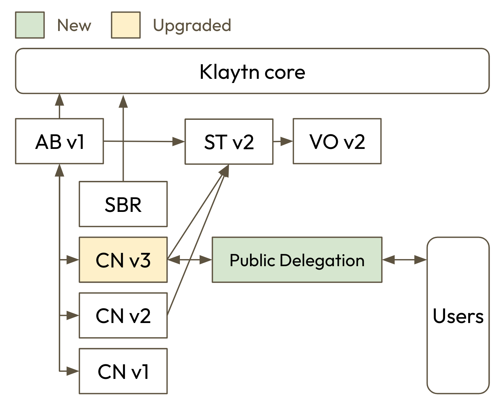
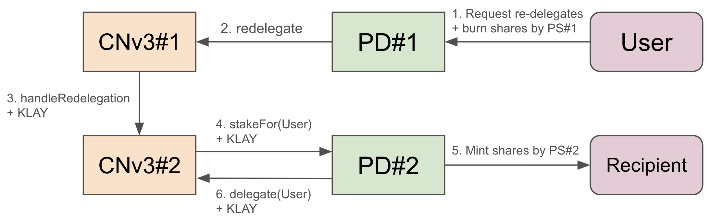

## Simple Summary

Introducing a new CnStakingV3 with public delegation.

## Abstract

The new CnStakingV3 will be compatible with public delegation. The public delegation will support `delegation` and `redelegation` for general users. Also, the staking information interval will be changed to 1 block, which is currently 86,400 blocks.

## Motivation

In KIP-81, Klaytn introduced CnStakingV2. However, it’s difficult for general users to delegate their KLAY if a validator doesn’t provide public delegation services. For example, users can delegate to `SwapScanner` and `KommuneDAO` since they provide their own public delegation services. This narrowed the delegation options to a small number of GC members. In addition, Klaytn expects various GC members to join in the merged chain; there is a strong need to introduce a new CnStakingV3 with public delegation.

The `redelegation` can make massive staking changes in a short period, which can lead to non-negligible errors in the validator set and reward distribution with current 86,400 blocks interval. To prevent this, the staking information intervl will be changed to 1 block.

## Specification

The key words “MUST”, “MUST NOT”, “REQUIRED”, “SHALL”, “SHALL NOT”, “SHOULD”, “SHOULD NOT”, “RECOMMENDED”, “MAY”, and “OPTIONAL” in this document are to be interpreted as described in RFC 2119.

### Overview

CnStakingV3 is basically an upgraded version of CnStakingV2, so it must be compatible with the existing core contracts like `AddressBook`, `StakingTracker` and so on. The notifying changes include the followings:

- CnStakingV3 supports public delegation natively, allowing it to receive delegations and re-delegation from general users.

- Re-delegation is supported between CnStakingV3 enabling public delegation and re-delegation.

A GC member can enable public delegation from CnStakingV3. If it is enabled, all staking functionalities must be proxied via a public delegation contract defined in this proposal, namely `PublicDelegation`. When users want to delegate their KLAY, they stake KLAY to `PublicDelegation` and receive `shares` in return, which represent users' assets.

`PublicDelegation` shall be implemented based on an interest-bearing token model, especially ERC-4626. However, `shares` must not be transferable.

Staking information for block `N` will come from block `N-1` instead of `CalcStakingBlockNumber(N)` from `FORK_BLOCK`.

### Smart Contracts Overview

This KIP contains upgraded and newly implemented smart contracts. The overall structure is shown in below diagram.

- CnStakingV3: an upgraded version of CnStakingV2. It can enable public delegation and use re-delegation between CNs enable public delegation.

- IKIP163: an interface that a public delegation must implement to be compatible with CnStakingV3.

- PublicDelegation: a public delegation contract provided by Klaytn. Note that it will be only compatible with CnStakingV3.

Henceforth, CnStakingV3 shall be denoted as CNv3, and Public Delegation as PD.



#### CnStakingV3

CNv3 can use either initial lockup or PD; the two features must be mutually exclusive. If CNv3 uses initial lockup, there’s no difference from CNv2. Henceforth, all CNv3s are considered to be using PD to focus on the newly added features.

##### Interface

Note that it only addresses changes compared to CNv2. The function `delegate` renames from `stakeKlay` to clarify its meaning.

```solidity
pragma solidity 0.8.25;

interface ICnStakingV3 {
    event SetPublicDelegation(address indexed from, address publicStaking, address rewardAddress);

    event ToggleRedelegation();
    event UpdatePublicStaking(address indexed publicStaking);
    event Redelegation(address indexed targetCnStakingV3, address indexed from, address indexed to, uint256 value);
    event HandleRedelegation(address indexed prevCnStakingV3, address indexed targetCnStakingV3, address indexed recipient, uint256 value);

    // Setup public delegation
    function setPublicDelegation(address _pdFactory, bytes memory _pdArgs) external;

    // Toggle redelegation
    function submitToggleRedelegation() external;
    function toggleRedelegation() external;

    // Delegation/Redelegation functions.
    function delegate() external payable;
    function redelegate(address _targetCnV3, address _from, address _to, uint256 _value) external;
    function handleRedelegation(address _recipient) external payable;

    // Record _account's last redelegation to prevent redelegation hopping.
    function lastRedelegation(address _account) external view returns (uint256);
}
```

##### Methods

The features added in CNv3 are only active when PD is enabled; without PD, existing features behave exactly as they did in CNv2. If PD is enabled, some staking functions only callable through PD. This ensures that users' assets staked via PD are safe even if control of CNv3 is compromised.

|                                         | PD disabled (Same as CNv2) | PD enabled |
| --------------------------------------- | -------------------------- | ---------- |
| `delegate/receive`                      | No condition               | Only PD    |
| `submitApproveStakingWithdrawal`        | Only Admin                 | N.A.       |
| `submitCancelApprovedStakingWithdrawal` | Only Admin                 | N.A.       |
| `approveStakingWithdrawal`              | Only Admin                 | Only PD    |
| `cancelApprovedStakingWithdrawal`       | Only Multi-sig             | Only PD    |
| `withdrawApprovedStaking`               | Only Multi-sig             | Only PD    |

The CNv3 must call `setPublicDelegation` to set public delegation. In `setPublicDelegation`, it deploys a new public delegation contract and connect to CNv3.

The redelegation is a togglable feature, and both current CNv3 and target CNv3 must enable PD and redelegation to use it. Users can redelegate their staking to another CNv3 without waiting for lockup period. But to prevent redelegation hopping, which makes Klaytn's consensus be unstable, users who have been redelegated must wait a lockup period before they can redelegate again. For example, if a user redelegates from [`A` → `B`], then user must wait for a lockup period to redelegate from B to another CNv3. The last redelegation records will be stored in each CNv3s. The below diagram shows how redelegation is processed between CNv3 and PD. The action of PD is discussed in more detail in Public Delegation.



```solidity
function setPublicDelegation(address _pdFactory, bytes memory _pdArgs);
```

Deploys and sets a PD to CnV3. The `PublicDelegation` will be deployed via `_pdFactory` with `_pdArgs`. The `_pdFactor` is a simple factory contract that deploys `PublicDelegation`, which will be singleton contract deployed by Klaytn. The `_pdArgs` will be encoded `struct PDConstructorArgs` to deploy PD. The reward address must be set to the PD address.

The function validates the following requirement(s):

- The function MUST revert if PD is not enabled.
- The function MUST revert if CnV3 already initialized.
- The function MUST revert if `_pdArgs` isn’t encoded correctly.
- The function MUST revert if PD deployment fails.

The function emits `SetPublicDelegation` event.

```solidity
function redelegate(address _targetCnV3, address _user, uint256 _value);
```

Requests CNv3 to redelegate `_user`’s `_value` of KLAY to `_targetCnV3`. CNv3 calls `handleRedelegation` with `_value` to `_targetCnV3` internally.

The function validates the following requirement(s):

- The function MUST revert if CNv3 does not allow PD, or if the caller is not PD.
- The function MUST revert if CNv3 does not allow redelegation.
- The function MUST revert if `_targetCnV3` is itself.
- The function MUST revert if `_targetCnV3` isn’t a valid CNv3 staking contract registered in AddressBook.
- The function MUST revert if `_value` is larger than total staking amount.
- The function MUST revert if `lastRedelegation[_user] != 0 && lastRedelegation[_user] + lockup <= block.timestamp`.

The function emits `Redelegation` event.

```solidity
function handleRedelegation(address _user) payable
```

Handles redelegation request from departure CNv3. This CNv3 will stake msg.value on behalf of `_user` using `stakeFor(_user)` in PD. It allows existing code to be reused without additional implementation for redelegation. It records `lastRedelegation[_user]` to prevent redelegation hopping.

The function validates the following requirement(s):

- The function MUST revert if CNv3 does not allow PD.
- The function MUST revert if CNv3 does not allow redelegation.
- The function MUST revert if departure CNv3 isn’t a valid CNv3 staking contract registered in AddressBook.
- The function MUST revert if balance after calling `stakeFor` is lower than expected.
  - In `stakeFor`, PD will stake `msg.value` back to CNv3. It means CNv3 can compute deterministic balance changes.

The function emits `HandleRedelegation` event.

#### IKIP163

IKIP163 must be implemented in `PublicDelegation` to be fully compatible with CnStakingV3:

##### Interface

```solidity
pragma solidity 0.8.25;

/// @title KIP-163 Public Delegation Interface
/// @dev See https://github.com/klaytn/kips/issues/163
interface IKIP163 {
    /// @dev Stake KLAY for the _recipient.
    /// It is used in CnStakingV3.handleRedelegation to stake KLAY for the _recipient when handling redelegation.
    /// It must stake KLAY to the CnStakingV3 in the same transaction.
    /// See CnStakingV3.handleRedelegation for more details.
    /// @param _recipient The address to stake for
    function stakeFor(address _recipient) external payable;

    /// @dev Returns the current rewards to be automatically compounded during the `stakeFor` function.
    /// It is used in CnStakingV3.handleRedelegation to calculate the expected balance after calling `stakeFor`.
    /// If implemented public delegation doesn't support auto-compounding during the `stakeFor`, it should return 0.
    /// See CnStakingV3.handleRedelegation for more details.
    function reward() external view returns (uint256);
}
```

Also, all staking operations in CNv3 must be done through public delegation, so there is no fixed interface, but it should call CNv3 appropriately.

##### Methods

```solidity
function stakeFor(address _recipient) payable;
```

It is used in `CnStakingV3.handleRedelegation` to stake KLAY for the `_recipient` when handling redelegation. The `stakeFor` MUST not revert `handleRedelegation`.

```solidity
function reward() view returns (uint256);
```

It returns the current rewards to be automatically compounded during the `stakeFor` function. It is used in `CnStakingV3.handleRedelegation` to calculate the expected balance after calling `stakeFor` function. If the public delegation doesn’t support auto-compounding during the `stakeFor`, it must return 0, otherwise exact rewards to be compounded. The `reward` MUST not revert `handleRedelegation`.

#### PublicDelegation

PD is a public delegation contract based on ERC4626. It must be set up through `setPublicDelegation` in CNv3. Since PD must receive and calculate block rewards, the reward address of the CNv3 must be set to PD. If validator deploys multiple CNv3s to use both initial lockup and PD, the reward address for all CNv3s must be PD (i.e., the reward for initial lockup is also sent to PD).

When block reward is auto-compounding, the commission is calculated and paid automatically.

Since PD is a type of token contract, its name and symbol will be determined as follows:

- Name: `{gcName} Public Delegated KLAY` (ex. `KF Public Delegated KLAY`)
- Symbol: `{gcName}-pdKLAY` (ex. `KF-pdKLAY`)

##### Interface

```solidity
pragma solidity 0.8.25;

import "../CnV3/ICnStakingV3.sol";
import "./IKIP163.sol";

interface IPublicDelegation is IKIP163 {
    /* ========== STRUCT ========== */

    struct PDConstructorArgs {
        address owner;
        address commissionTo;
        uint256 commissionRate;
        string gcName;
    }

    /* ========== ENUM ========== */

    /// @dev Current state of the withdrawal request
    enum WithdrawalRequestState {
        Undefined,
        Requested,
        Withdrawable,
        Withdrawn,
        PendingCancel,
        Canceled
    }

    /* ========== EVENTS ========== */

    // Initialization
    event DeployContract(string _contractType, address _baseCnStakingV3, PDConstructorArgs _pdArgs);

    // Operations
    event UpdateCommissionTo(address indexed _prevCommissionTo, address indexed _commissionTo);
    event UpdateCommissionRate(uint256 indexed _prevCommissionRate, uint256 indexed _commissionRate);
    event SendCommission(address indexed _commissionTo, uint256 _commission);

    // Staking
    event Staked(address indexed _user, uint256 _assets, uint256 _shares);
    event Redeemed(address indexed _user, address indexed _recipient, uint256 _assets, uint256 _shares);
    event Redelegated(address indexed _user, address indexed _targetCnV3, uint256 _assets);
    event RequestWithdrawal(
        address indexed _user,
        address indexed _recipient,
        uint256 indexed _requestId,
        uint256 _assets
    );
    event RequestCancelWithdrawal(address indexed _user, uint256 indexed _requestId);
    event Claimed(address indexed _user, uint256 indexed _requestId);

    /* ========== CONSTANT/IMMUTABLE GETTERS ========== */

    function MAX_COMMISSION_RATE() external pure returns (uint256);

    function COMMISSION_DENOMINATOR() external pure returns (uint256);

    function CONTRACT_TYPE() external pure returns (string memory);

    function VERSION() external pure returns (uint256);

    function baseCnStakingV3() external view returns (ICnStakingV3);

    /* ========== OPERATION FUNCTIONS ========== */

    function updateCommissionTo(address _commissionTo) external;

    function updateCommissionRate(uint256 _commissionRate) external;

    /* ========== PUBLIC FUNCTIONS ========== */

    // Staking
    function stake() external payable;

    function stakeFor(address _recipient) external payable; // Defined in IKIP163

    receive() external payable;

    // Withdrawal
    function withdraw(address _recipient, uint256 _assets) external;

    function redeem(address _recipient, uint256 _shares) external;

    function cancelApprovedStakingWithdrawal(uint256 _requestId) external;

    function claim(uint256 _requestId) external;

    // Redelegation
    function redelegateByAssets(address _targetCnV3, uint256 _assets) external;

    function redelegateByShares(address _targetCnV3, uint256 _shares) external;

    // Sweep
    function sweep() external;

    /* ========== PUBLIC VIEWS ========== */

    function commissionTo() external view returns (address);

    function commissionRate() external view returns (uint256);

    function userRequestIds(address _owner, uint256 _index) external view returns (uint256);

    function requestIdToOwner(uint256 _requestId) external view returns (address);

    function getCurrentWithdrawalRequestState(uint256 _requestId) external view returns (WithdrawalRequestState);

    function getUserRequestCount(address _owner) external view returns (uint256);

    function getUserRequestIdsWithState(
        address _owner,
        WithdrawalRequestState _state
    ) external view returns (uint256[] memory);

    function getUserRequestIds(address _owner) external view returns (uint256[] memory);

    function maxRedeem(address _owner) external view returns (uint256);

    function maxWithdraw(address _owner) external view returns (uint256);

    function reward() external view returns (uint256); // Defined in IKIP163

    function totalAssets() external view returns (uint256);

    function convertToShares(uint256 _assets) external view returns (uint256);

    function convertToAssets(uint256 _shares) external view returns (uint256);

    function previewDeposit(uint256 _assets) external view returns (uint256);

    function previewWithdraw(uint256 _assets) external view returns (uint256);

    function previewRedeem(uint256 _shares) external view returns (uint256);
}
```

##### Constants

The PublicDelegation has constants related to commission.

- `MAX_COMMISSION_RATE`: Max commission rate. It will be 3,000. (= 30%)
- `COMMISSION_DENOMINATOR`: Commission denominator. It will be 10,000.

##### Methods

All math for managing a user's staking follows ERC4626 standard. Note that PD isn’t based on ERC20 assets, but native KLAY.

- `totalAssets()`: Total assets managed by PD. It contains reward.
- `maxRedeem(address owner)`: Max reedeemable shares of owner.
- `maxWithdraw(address owner)`: Max withdrawable KLAY of owner.
- `convertToAssets(uint256 shares)`: Expected KLAY when convert shares.
- `previewDeposit(uint256 assets)`: Expected shares when deposit assets of KLAY.
- `previewWithdraw(uint256 assets)`: Expected shares to withdraw assets of KLAY.
- `previewRedeem(uint256 shares)`: Expected KLAY when redeem shares.

To enable auto-compounding, PD stakes cumulative KLAY rewards to CNv3 automatically when the below functions are called or call `sweep` function explicitly.

```solidity
function updateCommissionTo(address _commissionTo);
```

It updates commission receiver address of PD. Previously accumulated commission must go to previous commission receiver.

The function validates the following requirement(s):

- The function MUST revert if caller is not an owner.

The function emits `UpdateCommissionTo` event.

```solidity
function updateCommissionRate(uint256 _commissionRate);
```

It updates commission rate of PD. Previously accumulated rewards must follow previous commission rate.

The function validates the following requirement(s):

- The function MUST revert if caller is not an owner.
- The function MUST revert if `_commissionRate` is higher than `MAX_COMMISSION_RATE`.

The function emits `UpdateCommissionRate` event.

```solidity
function stake() payable;
function stakeFor(address _recipient) payable;
```

Call `delegate` with `msg.value` to CNv3 internally. It must mint corresponding shares to user. `stakeFor` is used when `msg.sender != _recipient`.

| User gives | User receives                                                 |
| ---------- | ------------------------------------------------------------- |
| `KLAY`     | `previewDeposit(KLAY)`: Floored amount of `shares` (`pdKLAY`) |

The function validates the following requirement(s):

- The function MUST revert if user would receive 0 shares.
- The function MUST revert if delegate call reverts.

The function emits `Staked` event.

```solidity
function withdraw(address _recipient, uint256 _assets);
function redeem(address _recipient, uint256 _shares)
```

Call `approveStakingWithdrawal` to CNv3 internally. It must burn corresponding shares of user. User will use `withdraw` to withdraw the `exact amount of KLAY`, otherwise use `redeem` to withdraw the `exact amount of shares`. Note that user must use `redeem` to withdraw all the KLAY because total withdrawable KLAY is changed every block (1 second).

|                             | User gives (`pdKLAY`)                                             | User will receive (7-day lockup)                |
| --------------------------- | ----------------------------------------------------------------- | ----------------------------------------------- |
| `withdraw(recipient, KLAY)` | `previewWithdraw(KLAY)`: Ceiled amount of shares to withdraw KLAY | `KLAY`                                          |
| `redeem(recipient, shares)` | `shares`                                                          | `previewRedeem(shares)`: Floored amount of KLAY |

The function validates the following requirement(s):

- The function MUST revert if user requests to withdraw 0 KLAY.
- The function MUST revert if user withdraws more than staked.
- The function MUST revert if `approveStakingWithdrawal` call reverts.

The functions emit `RequestWithdrawal` event.

```solidity
function cancelApprovedStakingWithdrawal(uint256 _requestId);
```

Call `cancelApprovedStakingWithdrawal` to CNv3 internally. User’s shares must be revived accordingly. Note that KLAY in withdrawal requests didn’t receive any rewards.

| User gives | User receives                                                          |
| ---------- | ---------------------------------------------------------------------- |
| -          | `previewDeposit(KLAY in withdrawal request)`: Floored amount of shares |

The function validates the following requirement(s):

- The function MUST revert if a user attempts to withdraw another user’s request.
- The function MUST revert if `cancelApprovedStakingWithdrawal` call reverts.

The function emits `RequestCancelWithdrawal` event.

```solidity
function claim(uint256 _requestId);
```

Calls `withdrawApprovedStaking` to CNv3 internally. If the withdrawal was canceled, it must revive user’s shares accordingly. Note that KLAY in withdrawal requests didn’t receive any rewards.

|               | User gives | User receives                                                          |
| ------------- | ---------- | ---------------------------------------------------------------------- |
| Claim success | -          | `KLAY` in withdrawal request                                           |
| Claim failure | -          | `previewDeposit(KLAY in withdrawal request)`: Floored amount of shares |

The function validates the following requirement(s):

- The function MUST revert if a user attempts to claim another user’s request.
- The function MUST revert if `withdrawApprovedStaking` call reverts.

The function emits `Claimed` if withdrew successfully.

```solidity
function redelegateByAssets(address _targetCnV3, uint256 _assets);
function redelegateByShares(address _targetCnV3, uint256 _shares);
```

Call `redelegate` to CNv3 internally. It must burn corresponding shares of users. User will use `byAssets` to redelegate the `exact amount of KLAY`, otherwise use `byShares` to redelegate the `exact amount of shares`. Note that user must use `byShares` to redelegate all the KLAY same reason as `redeem`. User must receive the corresponding shares by PD connected to targetCNv3. In below tables, $\color{blue}{blue}$ is for target, while $\color{red}{red}$ is from.

|                                      | User gives                                                                       | User receives                                                                                                        |
| ------------------------------------ | -------------------------------------------------------------------------------- | -------------------------------------------------------------------------------------------------------------------- |
| `redelegateByAssets(target, KLAY)`   | $\color{red}{previewWithdraw(KLAY)}$: Ceiled amount of shares to redelegate KLAY | $\color{blue}{previewDeposit(KLAY)}$: Floored amount of shares                                                       |
| `redelegateByShares(target, shares)` | `shares`                                                                         | $\color{blue}{previewDeposit(KLAY)}$: Floored amount of shares, where `KLAY` is $\color{red}{previewRedeem(shares)}$ |

The function validates the following requirement(s):

- The function MUST revert if `_targetCnV3` isn’t a valid CNv3 staking contract.
- The function MUST revert if current CNv3 doesn’t allow redelegation.
- The function MUST revert if a user redelegates more KLAY than staked.
- The function MUST revert is a user redelegates 0 KLAY.
- The function MUST revert if `redelegate` call reverts.

The functions emit `Redelegated` event.

### Core Logic

From `FORK_BLOCK`, the staking information for block `N` will be recorded in block `N-1` instead of `CalcStakingBlockNumber(N)`.

#### Parameters

| Constant     | Value |
| ------------ | ----- |
| `FORK_BLOCK` | TBD   |

```go
// In staking_manager.go
func GetStakingInfo(blockNum uint64) *StakingInfo {
	stakingBlockNumber := blockNum
	var stakingInfo *StakingInfo
	if isForkBlockEnabled(blockNum) {
        // After `FORK_BLOCK`, staking information for block `N` will be recorded in block `N-1`.
	    if blockNum > 0 {
			stakingBlockNumber--
		}
		stakingInfo = GetStakingInfoForForkBlock(stakingBlockNumber)
	} else {
        // Before `FORK_BLOCK`, staking information for block `N` will be recorded in `CalcStakingBlockNumber(N)`.
		stakingBlockNumber = params.CalcStakingBlockNumber(blockNum)
		stakingInfo = GetStakingInfoOnStakingBlock(stakingBlockNumber)
	}
	return stakingInfo
}
```

| Function                                 | Description                                                                                                                                |
| ---------------------------------------- | ------------------------------------------------------------------------------------------------------------------------------------------ |
| `GetStakingInfo(blockNum)`               | Returns staking information needed to handle block `blockNum`.                                                                             |
| `GetStakingInfoForForkBlock(blockNum)`   | Returns staking information at block `blockNum`. If `blockNum` is before `FORK_BLOCK - 1`, return nil.                                     |
| `GetStakingInfoOnStakingBlock(blockNum)` | Returns staking information at staking block `blockNum`. If `blockNum` is not a staking interval block nor after `FORK_BLOCK`, return nil. |

## Rationale

### Non-transferable shares in PublicDelegation

Originally, the shares minted by PublicDelegation is based on ERC4626, one of ERC20 extensions. It means shares will be utilized as a ERC20 token (e.g., Liquidity Pool, Collaterals). This is of course a common use cases on many blockchains; LST. However, since different LSTs are issued by each GC, which causes significant liquidity fragmentation. Therefore, although `shares` are not transferable in this KIP, Klaytn will keep considering ways to activate staked KLAY while preventing liquidity fragmentation.

### Initial lockup and public delegation are mutually exclusive

All delegations must be through `PublicDelegation` if enabled. However, it conflicts with the existing initial lockup feature from CnStakingV2 because the initial lockup is staked directly into CnStakingV3 without `PublicDelegation`. To solve this issue, public delegation and initial lockup must be set to mutually exclusive. However, if both features must be used, there are alternative ways to achieve it:

1. Deposit initial lockup through `PublicDelegation` and implement additional logic for initial lockup (setup unlock time and amounts)
2. Maintain current initial lockup implementation. In `PublicDelegation`, calculate the shares considering the initial lockup of CnStakingV3.

First approach needs additional implementation in PD only for initial lockup. This raises the question of whether it's reasonable for PD to consider initial lockup. Developing an independent lockup contract for initial lockup is possible, but this causes additional security and maintenance issues.

The second approach makes PD logic more complicated. PD has to read the state of the initial lockup every time and make calculations, which is a permanent cost increase.

Overall, it’s determined that initial lockup and PD are best used in CNv3 where they are mutually exclusive and independent.

## Backward Compatibility

The existing CNv1 and CNv2 and previous custom public delegation services will still be available. However, it is strongly recommended to deploy CNv3 for new GCs and gradually move to CNv3 for original GCs.

## Security Considerations

### ERC4626 Inflation Attack

This is fundamentally due to that when using ERC20 as a base asset, contract cannot prevent tokens from being deposited directly into it. This only increases the underlying asset without issuing any shares, and can result in zero shares for other users to receive. However, since the PD in this is based on the KLAY, we can control all KLAY inflows by fallback.

## Implementation

TBA

## References

- [ERC4626](https://eips.ethereum.org/EIPS/eip-4626)
- [Inflation Attack](https://blog.openzeppelin.com/a-novel-defense-against-erc4626-inflation-attacks)
- [Cosmos Staking Module](https://docs.cosmos.network/v0.46/modules/staking/)

## Copyright

Copyright and related rights waived via [CC0](https://creativecommons.org/publicdomain/zero/1.0/).
