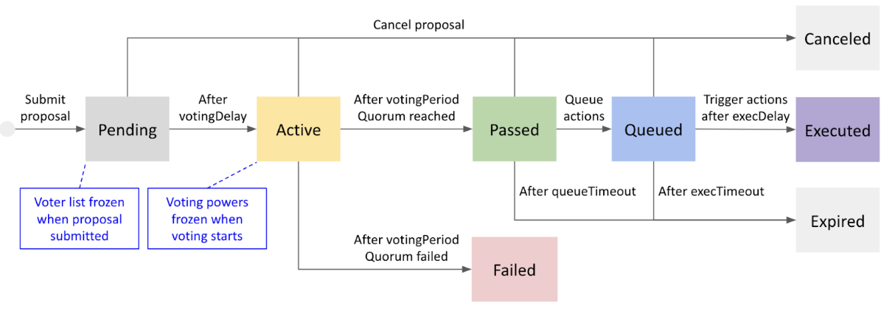

## Simple Summary
Introducing a new governance voting method based on the staking amount and implementation of the Klaytn Square, a governance portal
 
## Abstract
Klaytn introduces a stake-based governance model that provides voting power to governance participants. Currently, one vote per Governance Council(GC) member was cast. The new method will introduce the voting right that will be exercised based on the staking amount with the maximum cap to prevent an entity from making an arbitrary decision. The voting agenda is determined through discussion on the Klaytn Governance Forum, and the topic will be presented and voted on at the newly launched Governance Portal, Klaytn Square. This voting mechanism aims to provide responsibility and obligation of voting to Governance Councils.  

## Motivation
The new on-chain voting mechanism discloses GC’s opinion transparently through the portal, allowing anyone to view the result. The governance agenda discussed in Klaytn Governance Forum will be voted on the governance portal, Klaytn Square. Since the voting power is calculated based on the staking amount, this voting process provides more power to GC members who share the same interest as Klaytn by staking and locking up more KLAYs.

## Specification
Klaytn Governance Forum is to freely propose and discuss Klaytn governance items. Once Klaytn Square, the governance portal, opens, the on-chain voting will be executed based on the discussion held in this forum.

Klaytn Square includes the following functions: 
- Ability to vote on a governance agenda and view the voting process 
- Information about Governance Councils: description, contract address, notice, and staking status, staking and reward history
- View the history of governance agenda and Governance Councils


The foundation will provide 7 days of preparation period for voting, providing a time for GC to adjust the staking amount. With the start of the voting, the foundation will announce the list of GC members and their voting power. GC will have 7 days of the voting period. 

The Klaytn governance voting system is designed based on the following fundamental premises. 
- Klaytn’s major decision-making process should reflect the opinions of as many participants as possible from the ecosystem. 
- Participants will be more likely to make a decision that is beneficial to the Klaytn ecosystem if they hold more KLAY. This is based on the premise that the growth of Klaytn’s ecosystem is correlated to the rise in the value of KLAY.
- The governance system should be able to manage the situations in which a particular entity makes an arbitrary decision. This is because the entity may weaken the sustainability of the entire network. 
- The act of voting and the gain of voting power is different.

The Governance Council can exercise the right to vote based on the staking amount. Currently, each GC member receives at least 1 voting right regardless of the number of KLAY they hold. Recognizing a tendency that the member with more KLAY makes a decision that benefits the Klaytn ecosystem in the long run, we are granting a higher voting power to members with more KLAY. Yet, to prevent a particular subject from making an arbitrary decision, we are placing a cap on the voting power one can receive.

Therefore, the GC will receive 1 vote per a certain amount of staked KLAY (initial configuration: 5 million KLAY). The maximum number of votes a governance council can own is one less than the total number of governance council members. In other words, [Maximum Voting Power =  Total number of GC members - 1]. For example, if there are 35 GC members, one can own a maximum of 34 voting power. The 5 M KLAY: 1 vote with cap structure prevents potential monopolies by limiting the maximum number of votes cast.

### Smart Contract Specification

The Klaytn on-chain governance voting will be conducted on smart contracts. There are several contracts involved in on-chain governance.

- **AddressBook**: An [existing contract](https://github.com/klaytn/klaytn/blob/v1.9.1/contracts/reward/contract/AddressBook.sol) that holds the list of GC nodes, their staking contract and reward recipient addresses.
- **CnStakingV2**: An updated version of the [existing CnStakingContract](https://github.com/klaytn/klaytn/blob/v1.9.1/contracts/cnstaking/CnStakingContract.sol). V2 adds the balance notification and voter account appointing features.
- **StakingTracker**: A new contract that tracks voting-related information from AddressBook and CnStakingV2 contracts. Accumulated information is served to Voting contract.
- **Voting**: A new contract that oversees the on-chain voting process. Voting contract stores proposals, records votes, and sends transactions.

Below digram shows relationships between contracts and accounts.


From here, the contracts and accounts are explained.

#### Voting contract

The Voting contract is where voting happens. In the Voting contract, governance proposals are stored, casted votes are accumulated, and on-chain transactions are sent. The accounts interacting with the Voting contract are classified into proposer, voter, or executor roles. Its design is influenced by [Compound Finance](https://github.com/compound-finance/compound-protocol) and [OpenZeppelin](https://docs.openzeppelin.com/contracts/4.x/api/governance).

The Voting contract revolves around proposals. A proposal describes the changes to be made on the Klaytn blockchain. A proposal not only contains textual descriptions of the change, but it may also include specifications of several on-chain transactions, or actions. The actions are executed on behalf of a voting contract after the proposal passes. The actions allow governance voting to enforce changes on the blockchain.

```solidity
abstract contract Voting {
  struct Proposal {
    string description;  // human readable description
    address[] targets;   // 0 or more transactions
    uint256[] values;
    bytes[] calldatas;
  }
}
```

A proposer can submit governance proposals by calling `propose()` function. The voting timeline starts with the submission of proposals to the voting contract. A proposer can also cancel a proposal she has submitted, if the proposal had not been executed yet.

A voter casts votes on behalf of one of the GCs. The vote choice is one of yes, no, or abstain.

An executor triggers the execution of attached transactions in passed proposals. The execution is subdivided into two steps. First, the executor queues the transactions. After a set amount of delay, the executor can send the transactions. Execution delay here gives enough time for the community to recognize the upcoming change and perform a final check about the transaction.

There will be a secretariat account stored in the Voting contract. The account is initially managed by the Klaytn Foundation, and later it can be replaced by governance voting. The secretariat has the proposer and executor role.

```solidity
abstract contract Voting {

  function propose(
    string description, address[] targets, uint256[] values, bytes[] calldatas)
    virtual returns (uint256 proposalId);
  function cancel(uint256 proposalId) virtual;

  enum VoteChoice{ Unknown, Yes, No, Abstain };
  function castVote(uint256 proposalId, uint32 choice) virtual;

  function queue(uint256 proposalId) virtual onlyExecutor;
  function execute(uint256 proposalId) virtual onlyExecutor;
}
```


Following timing parameters influence the Voting contract.

| Name              | Meaning                                                                                   | Value     |
|----------------   |----------------------------------------------------------------------------------------   |--------   |
| `votingDelay`     | Delay from proposal submission to voting start. Equals to the length of Pending state.    | 7 days    |
| `votingPeriod`    | Duration of the voting. Equals the length of Active state.                                | 7 days    |
| `queueTimeout`    | Grace period given to executors for queue() passed proposals.                             | 7 days    |
| `execDelay`       | A minimum delay before a queued transaction can be executed.                              | 2 days    |
| `execTimeout`     | Grace period given to executors for execute() queued proposals after `execDelay`.         | 7 days    |

For each proposal, several important block numbers are determined.

| Name              | Meaning                                                                                                                                                                   |
|-----------------  |-------------------------------------------------------------------------------------------------------------------------------------------------------------------------- |
| `proposedBlock`   | The block number where `propose()` was called.                                                                                                                            |
| `startBlock`      | Voting start block `proposedBlock + votingDelay`.                                                                                                                         |
| `endBlock`        | Voting end block `startBlock + votingPeriod`. An executor should queue transactions in the proposal before `endBlock + queueTimeout`, otherwise the proposal expires.     |
| `queuedBlock`     | The block number where `queue()` was called. An executor should trigger the transaction after `queuedBlock + execDelay`, before `queuedBlock + execDelay + execTimeout`.  |

The timings are illustrated in below diagram.


A proposal is in one of the following states.

- **Pending**: Proposer submitted the proposal but voting has not started. The pending state lasts for `votingDelay`. This state is also called the **notice period**.
- **Active**: Ongoing voting. Voters can cast their votes. The active state lasts for `votingPeriod`. This state is also called the **voting period**.
- **Canceled**: Proposer has canceled the proposal before execution. Any further interaction is prohibited.
- **Passed**: Voting finalized and quorum reached. An executor shall queue the actions before a set timeout of `queueTimeout`. If the proposal contains no actions, any further interaction is prohibited. Otherwise, the proposal can proceed to Queued and Executed states.
- **Failed**: Voting finalized but has not reached a quorum. Any further interaction is prohibited.
- **Queued**: An executor has queued the actions. An executor cannot trigger the actions while a certain duration of `execDelay`.
- **Executed**: An executor has triggered the actions after the execution delay. The executor shall trigger the actions before a set timeout of `execTimeout`. The `execTimeout` starts at the end of `execDelay`.
- **Expired**: Executor has not queued or executed within respective timeouts.



A proposal passes when a combination of the following conditions are met.
- *CountQuorum*: At least 1/3 of all eligible voters cast vote
- *PowerQuorum*: At least 1/3 of all eligible voting powers cast vote
- *SupportRate*: Yes votes is more than half of casted votes
- **Pass** = (CountQuorum **or** PowerQuorum) **and** SupportRate

#### AddressBook contract

This contract has been deployed on the Cypress mainnet and Baobab testnet since their genesis at address `0x0000000000000000000000000000000000000400`. This contract will be used as-is.

#### CnStakingV2

Originally CnStakingContract served as a KLAY storing account with withdrawal lockup. For the purpose of governance voting, two new features are added on top of [existing code](https://github.com/klaytn/klaytn/blob/v1.9.1/contracts/cnstaking/CnStakingContract.sol).

Whenever its balance changes, the change shall be notified to the StakingTracker contract. To implement the notification, CnStakingV2 must call StakingTracker contract at functions related to staking and withdrawing. The StakingTracker is described in later section.

```solidity
contract CnStakingV2 {
  IStakingTracker stakingTracker;

  function depositLockupStakingAndInit() payable beforeInit() {
    // ...
    stakingTracker.notifyStake();
    // ...
  }
  function stakeKlay() payable {
    // ...
    stakingTracker.notifyStake();
    // ...
  }
  function () payable { // fallback
    // ...
    stakingTracker.notifyStake();
    // ...
  }

  function withdrawLockupStaking(address _to, uint256 _value) {
    // ...
    _to.transfer(_value);
    stakingTracker.notifyStake();
    // ...
  }
  function withdrawApprovedStaking(uint256 _approvedWithdrawalId) {
    // ...
    _to.transfer(_value);
    stakingTracker.notifyStake();
    // ...
  }
}
```

In addition to balance notification, CnStakingV2 can appoint an address as the GC's voter account. The voter account can vote on behalf of this GC's all voting powers. The appointing happens through the existing multisig facility.

```solidity
contract CnStakingV2 {

  function submitAppointVoter(address _voter) external
  afterInit()
  onlyAdmin(msg.sender) {
    uint256 id = requestCount;
    submitRequest(id, Functions.AppointVoter, bytes32(_voter), 0, 0);
    confirmRequest(id, Functions.AppointVoter, bytes32(_voter), 0, 0);
  }
  function appointVoter(address _voter) external
  onlyMultisigTx() {
    stakingTracker.appointVoter(_voter);
  }
}
```
The new CnStakingV2 contract will have version number 2 so other contracts can distinguish from the old version.
```solidity
contract CnStakingV2 {
  uint256 constant public VERSION = 2;
}
```

#### StakingTracker contract

Each GC stake its KLAYs in its own contracts. Even one GC is allowed to have multiple CnStaking contracts, in which case its stake amount must be added up. Because stake amounts are scattered across multiple contract accounts, it is not trivial to calculate their voting powers.

The StakingTracker contract is introduced to record GC stake amounts at a central location. To host a voting, following data are needed.

- Number of eligible GCs: to calculate the maximum votes, and the turnout quorum condition.
- Total eligible votes: to calculate the turnout quorum.
- Per-GC votes: to process voting requests (i.e. calls to Voting contract).
- Per-GC voting accounts: to process voting requests (i.e. calls to Voting contract).

The data are collected on a per-proposal basis. For each proposal, a Tracker data structure is created and updated until a specified block.

```solidity
interface IStakingTracker {
  struct Tracker {
    // this struct is updated only if trackStart <= block.number < trackEnd.
    uint64 trackStart; // when this Tracker is created
    uint64 trackEnd;   // specified by createTracker(), voting startBlock.

    // List of eligible nodes and their staking contracts.
    // Determined at createTracker() and won’t change.
    address[] nodeIds;
    mapping(address => address) stakingToNodeId;

    // Balances and voting powers of each nodes.
    // Updated by notifyStake().
    mapping(address => uint256) stakingBalances;
    mapping(address => uint256) nodeBalances;
    mapping(address => uint256) votingPowers;
    uint256 totalVotes;

    // Appointed voters list
    // Updated by appointVoter().
    mapping(address => address) nodeIdToVoter;
    mapping(address => address) voterToNodeId;
  }
```

When a proposal is submitted to the Voting contract, the Voting contract shall call the `createTracker()` to crate a tracker that lasts until the proposal's voting start block. Until the voting start block, CnStakingV2 can call `notifyStake()` and  `appointVoter()` to update relevant trackers. Below is an exmaple StakingTracker implementation.

```solidity
abstract contract StakingTracker {
  mapping(uint64 => Tracker) trackers; // trackerId => Tracker
  uint64[] allTrackers;  // all trackers
  uint64[] liveTrackers; // un-expired (block.number < trackEnd) trackers
  const uint256 MIN_STAKE = 5000000e18;

  // Called by Voting at proposal(), to finalize eligible GCs list.
  function createTracker(uint256 _trackEnd) public returns (uint trackerId) {
    // - Create a Tracker struct
    // - Populate nodeIds and stakingToNodeId from the AddressBook.
    //   Only those who staked at least MIN_STAKE are recorded. 
    // - Populate nodeBalances, votingPowers, and totalVotes from
    //   the KLAY balances of CnStakingV2 contracts
    // - Populate nodeIdToVoter and voterToNodeId from
    //   the last Tracker (last element of allTrackers), if any.
  }

  // Called by CnStakingV2 whenever its balance changes.
  function notifyStake() public {
    for (uint i=0; i < liveTrackers.length; i++) {
      if (block.number >= trackers[i].trackEnd) {
        deleteArrayElem(liveTrackers, i);
        continue;
      }
      address nodeId = trackers[i].stakingToNodeId[msg.sender];
      if (nodeId == address(0)) {
        continue;
      }
      uint256 oldStakingBalance = trackers[i].stakingBalances[msg.sender];
      uint256 newStakingBalance = msg.sender.balance;
      trackers[i].stakingBalances[msg.sender] = newStakingBalance;
      trackers[i].nodeBalances[nodeId] += (newStakingBalance - oldStakingBalance);

      uint256 numGCs = trackers[i].nodeIds.length;
      uint256 balance = trackers[i].nodeBalances[nodeId];
      uint256 oldVotes = trackers[i].votingPowers[nodeId];
      uint256 newVotes = min(numGCs - 1, balance / MIN_STAKE);
      trackers[i].votingPowers[nodeId] = newVotes;
      trackers[i].totalVotes += (newVotes - oldVotes);
    }
  }

  // Called by CnStakingV2 to change voter account.
  function appointVoter(address _voter) public {
    for (uint i=0; i < liveTrackers.length; i++) {
      if (block.number >= trackers[i].trackEnd) {
        deleteArrayElem(liveTrackers, i);
        continue;
      }
      address nodeId = trackers[i].stakingToNodeId[msg.sender];
      if (nodeId == address(0)) {
        continue;
      }
      uint256 oldVoter = trackers[i].nodeIdToVoter[nodeId];
      uint256 newVoter = _voter;
      trackers[i].voterToNodeId[oldVoter] = address(0);
      trackers[i].voterToNodeId[newVoter] = nodeId;
      trackers[i].nodeIdToVoter[nodeId] = newvoter;
    }
  }
}
```

## Expected Effect
The proposed GC Voting method is expected to produce the following changes:
- All members in Klaytn ecosystem grow together with credibility 
- Providing obligation and authority to GC motivates active participation in governance voting activities and the KLAY staking 
- Anyone can easily view the proposals and voting status through the governance portal. It encourages holders to participate and give responsibility and authority to GCs.
- The Klaytn network can take a step closer to transparency and decentralized networks.
 
## Backward Compatibility
- GCs must deploy new CnStakingV2 contracts and move their staked KLAYs. Existing CnStaking contract balances are excluded from voting power calculation.
- However, proposer selection is not affected by the change, so GCs can still participate in consensus until migrating to CnStakingV2.

  
## Reference
n/a 
  
## Copyright 
n/a
