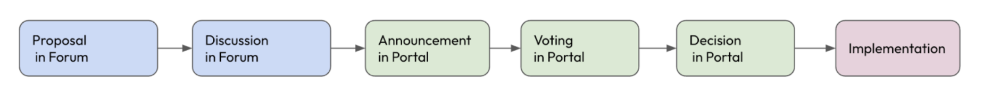
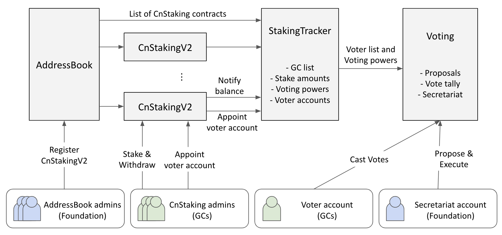

## Simple Summary
Introducing a new governance voting method based on the staking amount and implementation of the Klaytn Square, a governance portal
 
## Abstract
Klaytn introduces a stake-based governance model that provides voting power to governance participants. Currently, one vote per Governance Council(GC) member was cast. The new method will introduce the voting right that will be exercised based on the staking amount with the maximum cap to prevent an entity from making an arbitrary decision. The voting agenda is determined through discussion on the Klaytn Governance Forum, and the topic will be presented and voted on at the newly launched Governance Portal, Klaytn Square. This voting mechanism aims to provide responsibility and obligation of voting to Governance Councils.  

## Motivation
The new on-chain voting mechanism discloses GC’s opinion transparently through the portal, allowing anyone to view the result. The governance agenda discussed in Klaytn Governance Forum will be voted on the governance portal, Klaytn Square. Since the voting power is calculated based on the staking amount, this voting process provides more power to GC members who share the same interest as Klaytn by staking and locking up more KLAYs.

## Specification
Klaytn Governance Forum is to freely propose and discuss Klaytn governance items. Once Klaytn Square, the governance portal, opens, the on-chain voting will be executed based on the discussion held in this forum.

Klaytn Square includes the following functions: 
- Ability to vote on a governance agenda and view the voting process 
- Information about Governance Councils: description, contract address, notice, and staking status, staking and reward history
- View the history of governance agenda and Governance Councils



The foundation will provide 7 days of preparation period for voting, providing a time for GC to adjust the staking amount. With the start of the voting, the foundation will announce the list of GC members and their voting power. GC will have 7 days of the voting period. 

The Klaytn governance voting system is designed based on the following fundamental premises. 
- Klaytn’s major decision-making process should reflect the opinions of as many participants as possible from the ecosystem. 
- Participants will be more likely to make a decision that is beneficial to the Klaytn ecosystem if they hold more KLAY. This is based on the premise that the growth of Klaytn’s ecosystem is correlated to the rise in the value of KLAY.
- The governance system should be able to manage the situations in which a particular entity makes an arbitrary decision. This is because the entity may weaken the sustainability of the entire network. 
- The act of voting and the gain of voting power is different.

The Governance Council can exercise the right to vote based on the staking amount. Currently, each GC member receives at least 1 voting right regardless of the number of KLAY they hold. Recognizing a tendency that the member with more KLAY makes a decision that benefits the Klaytn ecosystem in the long run, we are granting a higher voting power to members with more KLAY. Yet, to prevent a particular subject from making an arbitrary decision, we are placing a cap on the voting power one can receive.

Therefore, the GC will receive 1 vote per a certain amount of staked KLAY (initial configuration: 5 million KLAY). The maximum number of votes a governance council can own is one less than the total number of governance council members. In other words, [Maximum Voting Power =  Total number of GC members - 1]. For example, if there are 35 GC members, one can own a maximum of 34 voting power. The 5 M KLAY: 1 vote with cap structure prevents potential monopolies by limiting the maximum number of votes cast.

### Smart Contracts Overview

The Klaytn on-chain governance voting will be conducted on smart contracts. Several contracts and accounts interact together in the process. Below diagram shows the relationship between contracts and acounts.

- Contracts
  - **AddressBook**: An existing contract that stores the list of GC nodes, their staking contracts, and their reward recipient addresses.
  - **CnStakingV2**: An updated version of existing CnStakingContract. GCs stake their KLAYs to earn rights to validate blocks and cast on-chain votes.
  - **StakingTracker**: A new contract that tracks voting related data from AddressBook and CnStakingV2 contracts.
  - **Voting**: A new contract that processes the on-chain voting. It stores governance proposals, count votes, and send approved transactions.
- Accounts
  - **AddressBook admins**: A set of accounts controlled by the Foundation which can manage list of GCs in the AddressBook.
  - **CnStaking admins**: A set of accounts controlled by each GC which can manage the staked KLAYs and its voter account. Every CnStakingV2 contract can have different set of admins.
  - **Voter account**: An account controlled by each GC which can cast on-chain votes. But this account cannot withdraw KLAYs from CnStakingV2 contracts.
  - **Secretariat account**: An account controlled by the Foundation which can propose and execute on-chain governance proposals.



### AdressBook

In Cypress mainnet and Baobab testnet, an [AddressBook contract](https://github.com/klaytn/klaytn/blob/v1.9.1/contracts/reward/contract/AddressBook.sol) is deployed at address `0x0000000000000000000000000000000000000400`. For the purpose of Voting, following function of the AddressBook is used.

```solidity
interface IAddressBook {
    /// @dev Returns all addresses in the AddressBook.
    ///
    /// Each GC's addresses are stored in the same index of the three arrays.
    /// i.e. GC[i] is described in (nodeIds[i], stakingContracts[i], rewardAddresses[i])
    /// However, a GC may operate multiple staking contracts. In this case,
    /// the GC occupies multiple indices with the same reward address.
    ///
    /// @return nodeIds           GC consensus node address list
    /// @return stakingContracts  GC staking contract address list
    /// @return rewardAddresses   GC reward recipient address list
    /// @return pocAddress        PoC(KGF) recipient address
    /// @return kirAddress        KIR recepient address
    function getAllAddressInfo() external view returns(
        address[] memory nodeIds,
        address[] memory stakingContracts,
        address[] memory rewardAddresses,
        address pocAddress,
        address kirAddress);
}
```

### CnStakingV2

CnStakingV2 is an upgraded version of CnStakingContract. The CnStakingContract has been serving the purpose of locking GC stakes. V2 will add two new features related to StakingTracker, which will be described later.

- Whenever its KLAY balance changes, V2 notifies the StakingTracker.
- V2 stores a voter account address, and notifies the StakingTracker whenever it changes. The voter account can be changed by its admins.

To support the new features, following functions are added.

```solidity
abstract contract CnStakingV2 {
    event UpdateStakingTracker(address stakingTracker);
    event UpdateVoterAddress(address voterAddress);

    IStakingTracker public stakingTracker;
    address public voterAddress;

    /// @dev Set the initial stakingTracker address
    /// Emits an UpdateStakingTracker event.
    /// This function only works before contract initialization
    function setStakingTracker(address _tracker) external beforeInit;

    /// @dev Update the StakingTracker address this contract points to
    function submitUpdateStakingTracker(address _tracker) external;
    function updateStakingTracker(address _tracker) external onlyMultisigTx;

    /// @dev Update the voter address of this GC
    function submitUpdateVoterAddress(address _addr) external;
    function updateVoterAddress(address _addr) external onlyMultisigTx;
}
```

#### Notifying changes to StakingTracker

To notify balance and voter account changes to StakingTracker contract, CnStakingV2 contract shall call the StakingTracker whenever after every change. For example,

```solidity
abstract contract CnStakingV2 {
    function depositLockupStakingAndInit() payable beforeInit() {
        // ...
        stakingTracker.refreshStake(address(this));
    }
    function stakeKlay() payable {
        // ...
        stakingTracker.refreshStake(address(this));
    }
    function withdrawLockupStaking(address _to, uint256 _value) {
        // ...
        _to.transfer(_value);
        stakingTracker.refreshStake(address(this));
    }
    function withdrawApprovedStaking(uint256 _approvedWithdrawalId) {
        // ...
        _to.transfer(_value);
        stakingTracker.refreshStake(address(this));
    }
    function updateVoterAddress(address _addr) {
        // ...
        voterAddress = _addr;
        stakingTracker.refreshVoter(address(this));
    }
}

interface IStakingTracker {
    /// @dev Re-evaluate Tracker contents related to the staking contract
    /// @param staking  The CnStaking contract address
    function refreshStake(address staking) external;

    /// @dev Update a GC's voter address from given address
    /// @param staking  The CnStaking contract address
    function refreshVoter(address staking) external;
}
```

#### Version identifier

To distinguish the CnStakingContract and CnStakingV2 contracts, V2 will have VERSION value 2.

```solidity
abstract contract CnStakingV2 {
    uint256 constant public VERSION = 2;
}
```

### StakingTracker

StakingTracker collects voting related data of each GC.

- Staking amounts and voting powers \
Stored separately in Tracker struct for each tracking period. During the tracking period voting powers can change, but becomes immutable after the period ends. The tracker struct is first created in `createTracker()`, and updated by `refreshStake()`

- Each GC’s voter accounts \
Stored in global mappings, and can be updated any time. Voter account mappings are updated by `refreshVoter()`

#### Contract interface

```solidity
abstract contract StakingTracker {
    struct Tracker {
        // Tracker is only updated if trackStart <= block.number < trackEnd.
        uint256 trackStart;
        uint256 trackEnd;

        // List of eligible nodes and their staking addresses.
        // Initialized by createTracker().
        address[] nodeIds;
        mapping(address => address) rewardToNodeId;
        mapping(address => address) stakingToNodeId;

        // Balances and voting powers.
        // Initialized by createTracker() and updated by refreshStake().
        mapping(address => uint256) stakingBalances;
        mapping(address => uint256) nodeBalances;
        mapping(address => uint256) nodeVotes;
        uint256 totalVotes;
        uint256 eligibleNodes;
    }

    // Tracker objects. Added by createTracker().
    mapping(uint256 => Tracker) private trackers; // trackerId => Tracker
    uint256[] private allTrackerIds;

    // 1-to-1 mapping between nodeId and voter account.
    // Updated by refreshVoter().
    mapping(address => address) private nodeIdToVoter; // nodeId => voterAddr
    mapping(address => address) private voterToNodeId; // voterAddr => nodeId

    /// @dev Creates a new Tracker and populate initial values from AddressBook
    function createTracker(uint256 trackStart, uint256 trackEnd)
        external returns(uint256 trackerId);

    /// @dev Re-evaluate Tracker contents related to the staking contract
    /// Anyone can call this function, but `staking` must be a staking contract
    /// registered to the AddressBook.
    function refreshStake(address staking) external;

    /// @dev Re-evaluate voter account mapping related to the staking contract
    /// Anyone can call this function, but `staking` must be a staking contract
    /// registered to the AddressBook.
    function refreshVoter(address staking) external;

    /// @dev Return integer fields of a tracker
    function getTrackerSummary(uint256 trackerId) external view returns(
        uint256 trackStart,
        uint256 trackEnd,
        uint256 numNodes,
        uint256 totalVotes,
        uint256 eligibleNodes);

    /// @dev Return balances and votes of all nodes stored in a tracker
    function getAllTrackedNodes(uint256 trackerId) external view returns(
        address[] memory nodeIds,
        uint256[] memory nodeBalances,
        uint256[] memory nodeVotes);

    /// @dev Return the balance and votes of a specified node
    function getTrackedNode(uint256 trackerId, address nodeId) external view returns(
        uint256 nodeBalance,
        uint256 nodeVotes);

    /// @dev Find the node who owns the given voter account
    function getNodeFromVoter(address voter) external view returns(address nodeId);

    /// @dev Find the voter account of the given node
    function getVoterFromNode(address nodeId) external view returns(address voter);
}
```

#### Usage

A voting contract can utilize StakingTracker as follows.

1. When a governance proposal is submitted, the voting contract calls `createTracker()` to finalize eligible GC nodes list and evaluate voting powers.
2. During the tracking period, GCs stake or unstake their KLAYs from their CnStakingV2 contracts. The CnStakingV2 contracts will then call `refreshStake()` to notify balance change.
3. GCs may change their voter account in their CnStakingV2 contracts. The CnStakingV2 contracts will then call `refreshVoter()` to notify voter account change.
4. After the tracking period, the voting powers are frozen. The voting contract use StakingTracker getters to process votes casted by voter accounts.

#### Example implementation

Below is an example implementation of `createTracker()`, `refreshStake()`, and `refreshVoter()` functions.

```solidity
abstract contract StakingTracker {
    function createTracker(uint256 trackStart, uint256 trackEnd)
        external override returns(uint256 trackerId)
    {
        trackerId = allTrackerIds.length + 1;
        allTrackerIds.push(trackerId);

        Tracker storage tracker = trackers[trackerId];
        tracker.trackStart = trackStart;
        tracker.trackEnd = trackEnd;
        populateFromAddressBook(tracker);
        calcAllVotes(tracker);
        return trackerId;
    }

    function populateFromAddressBook(Tracker storage tracker) private {
        (address[] memory nodeIds,
         address[] memory stakingContracts,
         address[] memory rewardAddrs, , ) = IAddressBook(ADDRESS_BOOK_ADDRESS()).getAllAddressInfo();

        // Group staking contracts by common reward address
        for (uint256 i = 0; i < nodeIds.length; i++) {
            address n = nodeIds[i];
            address s = stakingContracts[i];
            address r = rewardAddrs[i];
            if (tracker.rewardToNodeId[r] == address(0)) { // fresh rewardAddr
                tracker.nodeIds.push(n);
                tracker.rewardToNodeId[r] = n;
            } else { // previously appeared rewardAddr
                n = tracker.rewardToNodeId[r];
            }
            tracker.stakingToNodeId[s] = n;
            tracker.stakingBalances[s] = s.balance;
            tracker.nodeBalances[n] += s.balance;
        }
    }

    function calcAllVotes(Tracker storage tracker) private {
        tracker.totalVotes = 0;
        tracker.eligibleNodes = 0;
        for (uint256 i = 0; i < tracker.nodeIds.length; i++) {
            if (isNodeEligible(trackerId, tracker.nodeIds[i])) {
                tracker.eligibleNodes ++;
            }
        }
        for (uint256 i = 0; i < tracker.nodeIds.length; i++) {
            address nodeId = tracker.nodeIds[i];
            uint256 votes = calcVotes(tracker.eligibleNodes, tracker.nodeBalances[nodeId]);
            tracker.nodeVotes[nodeId] = votes;
            tracker.totalVotes += votes;
        }
    }

    function calcVotes(uint256 eligibleNodes, uint256 balance) private view returns(uint256) {
        uint256 voteCap = 1;
        if (eligibleNodes > 1) {
            voteCap = eligibleNodes - 1;
        }
        uint256 votes = balance / MIN_STAKE();
        if (votes > voteCap) {
            votes = voteCap;
        }
        return votes;
    }

    function refreshStake(address staking) external override {
        for (uint256 i = 0; i < allTrackerIds.length; i++) {
            uint256 trackerId = liveTrackerIds[i];
            Tracker storage tracker = trackers[trackerId];
            if (tracker.trackStart <= block.number && block.number < tracker.trackEnd) {
                updateTracker(tracker, staking);
            }
        }
    }

    function updateTracker(Tracker storage tracker, address staking) private {
        // Check that `staking` is valid GC contract
        address nodeId = tracker.stakingToNodeId[staking];
        if (nodeId == address(0)) {
            return;
        }

        // Update balance
        uint256 oldBalance = tracker.stakingBalances[staking];
        uint256 newBalance = msg.sender.balance;
        tracker.stakingBalances[staking] = newBalance;
        tracker.nodeBalances[nodeId] -= oldBalance;
        tracker.nodeBalances[nodeId] += newBalance;
        uint256 nodeBalance = tracker.nodeBalances[nodeId];

        // Update votes
        uint256 oldVotes = tracker.nodeVotes[nodeId];
        uint256 newVotes = calcVotes(tracker.eligibleNodes, nodeBalance);
        tracker.nodeVotes[nodeId] = newVotes;
        tracker.totalVotes -= oldVotes;
        tracker.totalVotes += newVotes;
    }

    function refreshVoter(address staking) external {
        address nodeId = resolveStakingFromAddressBook(staking);
        require(nodeId != address(0), "not a staking contract");

        // Unlink existing two-way mapping
        address oldVoter = nodeIdToVoter[nodeId];
        if (oldVoter != address(0)) {
            voterToNodeId[oldVoter] = address(0);
            nodeIdToVoter[nodeId] = address(0);
        }
        // Create new mapping
        address newVoter = ICnStakingV2(staking).getVoterAddress();
        if (newVoter != address(0)) {
            require(voterToNodeId[newVoter] == address(0),
                    "Voter address already taken");
            voterToNodeId[newVoter] = nodeId;
            nodeIdToVoter[nodeId] = newVoter;
        }
    }

    function resolveStakingFromAddressBook(address staking)
        private view returns(address)
    {
        (address[] memory nodeIds,
         address[] memory stakingContracts,
         address[] memory rewardAddrs, , ) = IAddressBook(ADDRESS_BOOK_ADDRESS()).getAllAddressInfo();

        address rewardAddr;
        for (uint256 i = 0; i < nodeIds.length; i++) {
            if (stakingContracts[i] == staking) {
                rewardAddr = rewardAddrs[i];
                break;
            }
        }
        if (rewardAddr != address(0)) {
            return address(0);
        }
        for (uint256 i = 0; i < nodeIds.length; i++) {
            if (rewardAddrs[i] == rewardAddr) {
                return nodeIds[i];
            }
        }
        return address(0);
    }
```

### Voting

The Voting contract operates the on-chain governance votes. Voting contract, stores governance proposals, counts casted votes, and send on-chain transactions. Its design is influenced by [Compound Finance](https://docs.compound.finance/v2/governance/) and [OpenZeppelin](https://docs.openzeppelin.com/contracts/4.x/api/governance).

A proposal contains textual descriptions and optionally on-chain transactions. The transactions are executed on behalf of the voting contract if the proposal receives enough votes.

While GCs hold their voting rights from staked KLAYs, a special secretariat account manages the overall on-chain governance process. Governance proposals can be submitted by the secretariat account, or any GC if the secretariat account is not set. The secretariat account can be updated by on-chain governance.

#### Voting steps

Under the default timing settings, a typical governance proposal is handeled as follows.

1. When a governance proposal is submitted, it enters a 7 days of preparation period where GCs can adjust their voting powers by staking or unstaking KLAYs. Voter lists (i.e. GCs) are finalized at the moment of proposal submission. However, voting powers are finalized at the end of preparation period.
2. A 7 days of voting period immediately follows after preparation period.
3. If there are enough Yes votes, the transactions can be queued within 7 days after voting ends.
4. The transaction is delayed by 2 days to be executable. This delay gives the ecosystem enough time to adjust to then change and perform final review about transactions.
5. After the delay, the transaction can be executed within 7 days.

The proposer of a proposal can cancel it any time prior to execution. If a passed transaction is not queued or executed within the timeout, the proposal automatically expires.


#### Timing settings

Proposal timeline is dictated by several timing settings below. The settings are expressed in
block numbers. The number of days in below table is calculated based on 1 block/sec assumption.

| Name           | Meaning                                                      | Default Value   |
|----------------|--------------------------------------------------------------|-----------------|
| `votingDelay`  | Delay from proposal submission to voting start               | 604800 (7 days) |
| `votingPeriod` | Duration of the voting                                       | 604800 (7 days) |
| `queueTimeout` | Grace period to queue() passed proposals                     | 604800 (7 days) |
| `execDelay`    | A minimum delay before a queued transaction can be executed  | 172800 (2 days) |
| `execTimeout`  | Grace period to execute() queued proposals since `execDelay` | 604800 (7 days) |

#### Quorum

A proposal passes when a combination of the following conditions are met.

- `CountQuorum` = At least 1/3 of all eligible voters cast vote
- `PowerQuorum` = At least 1/3 of all eligible voting powers cast vote
- `MajorityYes` = Yes votes is more than half of casted votes
- `Pass = (CountQuorum or PowerQuorum) and MajorityYes`

#### Contract interface

```solidity
interface Voting {
    enum ProposalState { Pending, Active, Canceled, Failed, Passed,
                         Queued, Expired, Executed }
    enum VoteChoice { No, Yes, Abstain }

    struct Receipt {
        bool hasVoted;
        uint8 choice;
        uint256 votes;
    }

    // events

    /// @dev Emitted when a proposal is created
    /// @param signatures  Array of empty strings; for compatibility with OpenZeppelin
    event ProposalCreated(
        uint256 proposalId, address proposer,
        address[] targets, uint256[] values, string[] signatures, bytes[] calldatas,
        uint256 voteStart, uint256 voteEnd, string description);

    /// @dev Emitted when a proposal is canceled
    event ProposalCanceled(uint256 proposalId);

    /// @dev Emitted when a proposal is queued
    /// @param eta  The block number where transaction becomes executable.
    event ProposalQueued(uint256 proposalId, uint256 eta);

    /// @dev Emitted when a proposal is executed
    event ProposalExecuted(uint256 proposalId);

    /// @dev Emitted when a vote is cast
    /// @param reason  An empty string; for compatibility with OpenZeppelin
    event VoteCast(address indexed voter, uint256 proposalId,
                   uint8 choice, uint256 votes, string reason);

    // mutator functions

    /// @dev Create a Proposal
    /// If secretariat is null, any GC with at least 1 vote can propose.
    /// Otherwise only secretariat can propose.
    /// Default timing parameters are used.
    function propose(
        string description,
        address[] targets,
        uint256[] values,
        bytes[] calldatas) external returns (uint256 proposalId);

    /// @dev Cancel a proposal
    /// The proposal must be in one of Pending, Active, Passed, Failed, Queued
    /// states. Only the proposer of the proposal can cancel the proposal.
    function cancel(uint256 proposalId) external;

    /// @dev Cast a vote to a proposal
    /// The proposal must be in Active state
    /// A same voter can call this function again to change choice.
    /// choice must be one of VoteChoice.
    function castVote(uint256 proposalId, uint8 choice) external;

    /// @dev Queue a passed proposal
    /// The proposal must be in Passed state
    /// Current block must be before `queueDeadline` of this proposal
    /// If secretariat is null, any GC with at least 1 vote can queue.
    /// Otherwise only secretariat can queue.
    function queue(uint256 proposalId) external;

    /// @dev Execute a queued proposal
	/// The proposal must be in Queued state
    /// Current block must be after `eta` and before `execDeadline` of this proposal
    /// If secretariat is null, any GC with at least 1 vote can execute.
    /// Otherwise only secretariat can execute.
    function execute(uint256 proposalId) external;

    /// @dev Set secretariat account
    /// Must be called by address(this), i.e. via governance proposal.
    function updateSecretariat(address _new) external;

    // getter functions

    /// @dev The secretariat account
    function secretariat() external view returns(address);

    /// @dev Delay from proposal submission to voting start in block numbers
    function votingDelay() external view returns(uint256);

    /// @dev Duration of the voting in block numbers
    function votingPeriod() external view returns(uint256);

    /// @dev Grace period to queue() passed proposals in block numbers
    function queueTimeout() external view returns(uint256);

    /// @dev A minimum delay before a queued transaction can be executed in block numbers
    function execDelay() external view returns(uint256);

    /// @dev Grace period to execute() queued proposals since `execDelay` in block numbers
    function execTimeout() external view returns(uint256);

    /// @dev State of a proposal
    function state(uint256 proposalId) external view returns (ProposalState);

    /// @dev Check if a proposal is passed
    function checkQuorum(uint256 proposalId) external view returns(bool);

    /// @dev General contents of a proposal
    function getProposalContent(uint256 proposalId) external view returns(
        uint256 id,
        address proposer,
        string memory description
    );

    /// @dev Transactions in a proposal
    /// @return signatures  Array of empty strings; for compatibility with OpenZeppelin
    function function getActions(uint256 proposalId) external view returns(
        address[] memory targets,
        uint256[] memory values,
        string[] memory signatures,
        bytes[] memory calldatas
    );

    /// @dev Timing and state related properties of a proposal
    function getProposalSchedule(uint256 proposalId) external view returns(
        uint256 voteStart,      // propose()d block + votingDelay
        uint256 voteEnd,        // voteStart + votingPeriod
        uint256 queueDeadline,  // voteEnd + queueTimeout
        uint256 eta,            // queue()d block + execDelay
        uint256 execDeadline,   // queue()d block + execDelay + execTimeout
        bool canceled,          // true if successfully cancel()ed
        bool queued,            // true if successfully queue()d
        bool executed           // true if successfully execute()d
    );

    /// @dev Vote counting related properties of a proposal
    function getProposalTally(uint256 proposalId) external view returns(
        uint256 totalYes,
        uint256 totalNo,
        uint256 totalAbstain,
        uint256 quorumCount,      // required number of voters
        uint256 quorumPower,      // required number of voting powers
        address[] memory voters,  // list of nodeIds who voted
    )

    /// @dev Individual vote receipt
    function getReceipt(uint256 proposalId, address voter)
        external view returns(Receipt memory);
}
```

#### Fetching votes from StakingTracker

Calculating votes require information from StakingTracker contract. The Voting contract shall utilize the getters to find voting powers of each voters as well as quorum conditions. Below is an example implementation of `castVote()` and `checkQuorum()` functions.

```solidity
abstract contract Voting {
    struct Proposal {
        uint256 trackerId;  // StakingTracker trackerId created in propose()
        uint256 totalYes;
        uint256 totalNo;
        uint256 totalAbstain;
        address[] voters;
        mapping(address => Receipt) receipts;
    }
    mapping(uint256 => Proposal) proposals;
    IStakingTracker stakingTracker;

    function castVote(uint256 proposalId, uint8 choice) external {
        Proposal storage p = proposals[proposalId];

        address nodeId = stakingTracker.getNodeFromVoter(msg.sender);
        ( , uint256 votes) = stakingTracker.getTrackedNode(p.trackerId, nodeId);

        // Revoke vote if exists
        if (p.receipts[nodeId].hasVoted) {
            uint8 oldChoice = p.receipts[nodeId].choice;
            if (oldChoice == VoteChoice.Yes) { p.totalYes -= votes; }
            if (oldChoice == VoteChoice.No) { p.totalNo -= votes; }
            if (oldChoice == VoteChoice.Abstain) { p.totalAbstain -= votes; }
        }
        // Record new vote
        p.receipts[nodeId].hasVoted = true;
        p.receipts[nodeId].choice = choice;
        p.receipts[nodeId].votes = votes;
        if (choice == VoteChoice.Yes) { p.totalYes += votes; }
        if (choice == VoteChoice.No) { p.totalNo += votes; }
        if (choice == VoteChoice.Abstain) { p.totalAbstain += votes; }
        if (!p.receipts[nodeId].hasVoted) { p.voters.push(nodeId); }
    }

    function checkQuorum(uint256 proposalId) external view returns(bool) {
        Proposal storage p = proposals[proposalId];

        ( , , , uint256 totalVotes, uint256 eligibleNodes) =
            stakingTracker.getTrackerSummary(p.trackerId);

        bool countQuorum = (p.voters.length >= (eligibleNodes / 3));
        bool powerQuorum = ((p.totalYes + p.totalNo + p.totalAbstain) > (totalVotes / 3));
        bool majorityYes = (p.totalYes > (p.totalNo + p.totalAbstain));
        return ((countQuorum || powerQuorum) && majorityYes);
    }
}
```

#### Determining state

The state of a proposal can be determined from stored variables, vote counts and current block number. Below is an example implementation of `state()` function.

```solidity
abstract contract Voting {
    struct Proposal {
        uint256 voteStart;      // propose()d block + votingDelay
        uint256 voteEnd;        // voteStart + votingPeriod
        uint256 queueDeadline;  // voteEnd + queueTimeout
        uint256 eta;            // queue()d block + execDelay
        uint256 execDeadline;   // queue()d block + execDelay + execTimeout
        bool canceled;          // true if successfully cancel()ed
        bool queued;            // true if successfully queue()d
        bool executed;          // true if successfully execute()d
    }
    mapping(uint256 => Proposal) proposals;

    function state(uint256 proposalId) external view returns (ProposalState) {
        Proposal storage p = proposals[proposalId];

        if (p.executed) {
            return ProposalState.Executed;
        } else if (p.canceled) {
            return ProposalState.Canceled;
        } else if (block.number < p.voteStart) {
            return ProposalState.Pending;
        } else if (block.number <= p.voteEnd) {
            return ProposalState.Active;
        } else if (!checkQuorum(proposalId)) {
            return ProposalState.Failed;
        }

        if (!p.queued) {
            if (block.number <= p.queueDeadline) {
                return ProposalState.Passed;
            } else {
                return ProposalState.Expired;
            }
        } else {
            if (block.number <= p.execDeadline) {
                return ProposalState.Queued;
            } else {
                return ProposalState.Expired;
            }
        }
    }
}
```

#### Executing transactions

The transactions in a passed proposal are executed in a order they appear in the `propose()` function arguments.  Each transaction is sent to `targets[i]`, carrying `values[i]` of KLAYs, with `calldatas[i]` as input data. Below is an example of `execute()` function.

```
abstract contract Voting {
    struct Proposal {
        address[] targets;
        uint256[] values;
        bytes[] calldatas;

    }
    mapping(uint256 => Proposal) proposals;

    function execute(uint256 proposalId) external {
        Proposal storage p = proposals[proposalId];

        for (uint256 i = 0; i < p.targets.length; i++) {
            (bool success, bytes memory result) =
                    p.targets[i].call{value: p.values[i]}(p.calldatas[i]);
            require(success, "Transaction failed");
        }
    }
}
```

## Rationale

#### CnStakingV2 and StakingTracker instead of standard ERC20Votes

It is common for DAOs to manage their governance tokens in a [ERC20Votes](https://docs.openzeppelin.com/contracts/4.x/api/token/erc20#ERC20Votes) contract. However new contracts CnStakingV2 and StakingTracker were used to manage staked KLAYs. Using the new contracts provides better compatibility with ecosystem Dapps like public staking services. It also does not break the existing block validator selection algorithm that depends on AddressBook.

#### StakingTracker refreshStake and refreshVoting has no access control

Another desion options was to restrict those funtions to only CnStakingV2 contracts. But those functions are publicly open to allow GCs to gradually migrate from CnStakingContract to CnStakingV2 contracts. Old CnStakingContract does not notify StakingTracker about its balance change, in which case manually calling `refreshStake()` can notify the change.

#### Separate voter account

In security standpoint, it is safer to have separate accounts for different roles. Existing CnStakingV2 admins take financial roles - withdrawing staked KLAYs - and the voter account take voting role only.

#### Proposals have expired state

Proposal transactions expires if they are not queued or executed within deadline. This guarantees the timeliness of the transactions. If a proposal was left unexecuted for a long time, the proposal might be irrelevant anymore and require a fresh proposal.

## Expected Effect

The proposed GC Voting method is expected to produce the following changes:
- All members in Klaytn ecosystem grow together with credibility 
- Providing obligation and authority to GC motivates active participation in governance voting activities and the KLAY staking 
- Anyone can easily view the proposals and voting status through the governance portal. It encourages holders to participate and give responsibility and authority to GCs.
- The Klaytn network can take a step closer to transparency and decentralized networks.
 
## Backward Compatibility

- GCs should deploy new CnStakingV2 contracts and move their staked KLAYs. Existing CnStaking contract balances are excluded from voting power calculation.
- However, block validator selection is not affected by the change, so GCs can still participate in consensus before migrating to CnStakingV2.

## Reference
n/a 
  
## Copyright 
n/a
