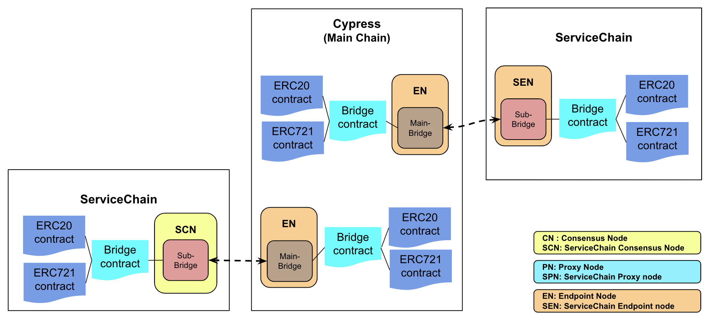
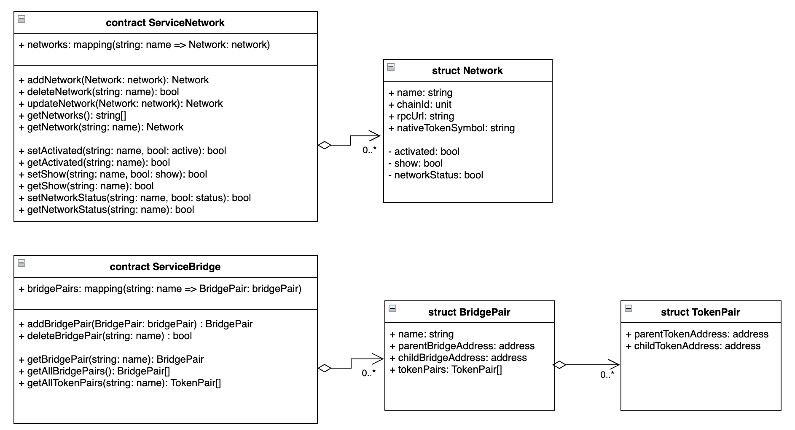
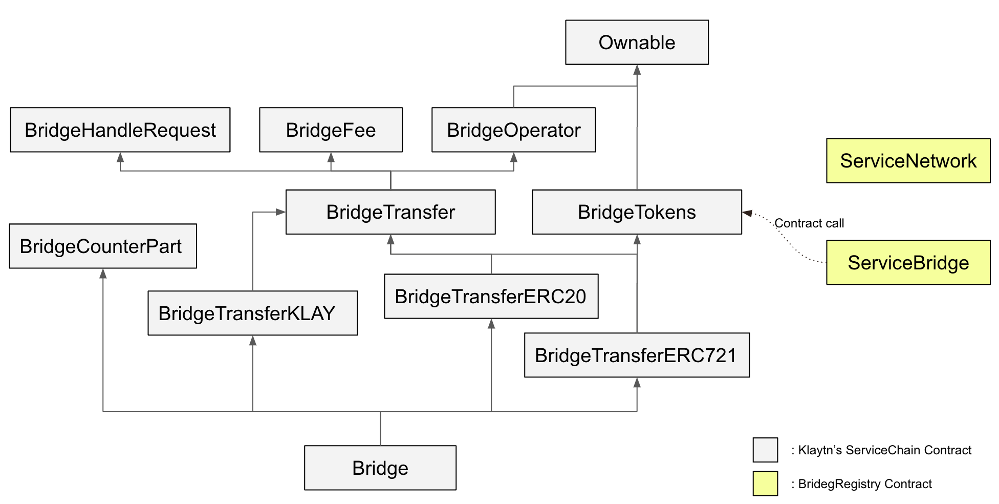
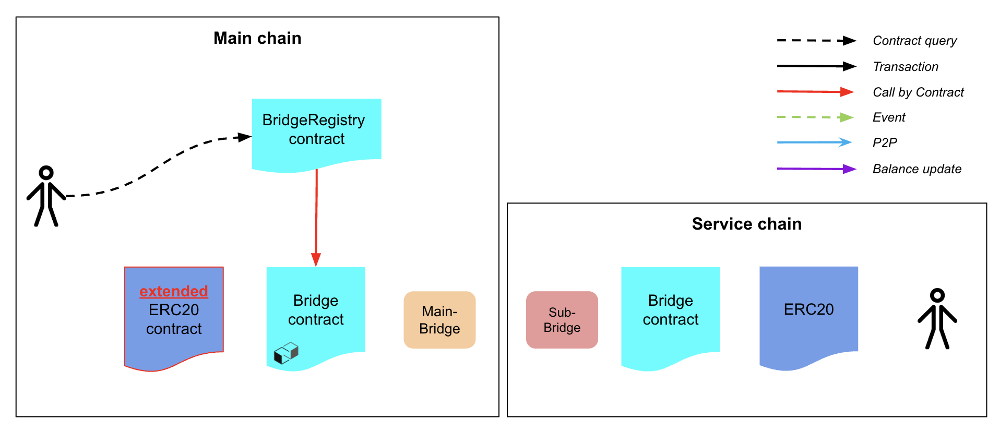
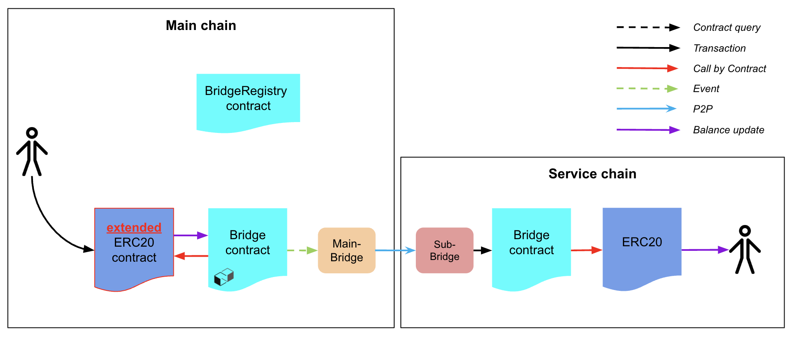

## Simple Summary
<!--"If you can't explain it simply, you don't understand it well enough." Provide a simplified and layman-accessible explanation of the KIP.-->
BridgeRegistry is a smart contract that manages information to facilitate value transfer of the ServiceChain. 

## Abstract
<!--A short (~200 word) description of the technical issue being addressed.-->
[Klaytn’s ServiceChain](https://docs.klaytn.foundation/content/installation-guide/deployment/service-chain) is an enterprise blockchain that meets the needs of companies such as data anchoring, value transfer, security, performance, and customization. This proposal is to propose a useful registry to provide value transfer with ServiceChain. For [value transfer](https://docs.klaytn.foundation/content/installation-guide/deployment/service-chain/getting-started/value-transfer), information about ServiceChain's network, bridges, and deployed tokens is required. The BridgeRegistry proposed here is a smart contract for managing information about networks, bridges, and distributed tokens of multiple ServiceChains. Information required for value transfer can be easily obtained by querying the BridgeRegistry contract. Therefore, services such as wallets can easily query the status of assets stored in ServiceChain and transfer those assets.

## Motivation
<!--The motivation is critical for KIPs that want to change the Klaytn protocol. It should clearly explain why the existing protocol specification is inadequate to address the problem that the KIP solves. KIP submissions without sufficient motivation may be rejected outright.-->
As shown in the figure below, multiple ServiceChains can be connected to the main chain, and various tokens can be deployed in each ServiceChain. ServiceChain provides value transfer of each token to another chain. As the number of ServiceChains and Tokens increases, the more meta data is required to be managed effectively. For example, the services such as wallets in the main chain, need to manage the network, bridge, and token information of ServiceChain to provide value transfer. Whenever the network, bridge and token information is updated, the related information must be also updated in each service. It will cost a lot of effort and users are uncomfortable with inconsistent information. To solve this problem, BridgeRegistry manages the network, bridge, and token information for value transfer as a smart contract. Services such as wallets can inquire to the BridgeRegistry contract to retrieve token information deployed in ServiceChain and easily obtain information for value transfer. 



## Specification
<!--The technical specification should describe the syntax and semantics of any new feature. The specification should be detailed enough to allow competing, interoperable implementations for any of the current Klaytn platforms (klaytn). -->
BridgeRegistry manages the network, bridge, and token information. BridgeRegistry consists of the following structs and contracts. 



### Structure

#### Network

`Network` includes network information such as network name, rpcUrl, chainID, and nativeTokenSymbol, and management network information such as `verified`.
`verified` is a member variable for managing ServiceChain in services such as wallets, and multiple ServiceChain statuses can be displayed by querying BridgeRegistry in the wallet. For example, when a ServiceChain is newly registered in the BridgeRegistry, the administrator checks whether the ServiceChain has no problem and changes the `verified` variable to true. This proposal only mentions the need for network management information such as `verified`, and if there are variables necessary for the service, it is recommended to add them at the implementation level.

```
struct Network {
    string name;
    string chainId;
    string rpcUrl;
    string nativeTokenSymbol;
    bool verified;
}
```

#### BridgePair

`BridgePair` includes name, bridgeAddress, and token information of parentBridge and childBridge. This stores the list of token pairs deployed in the parent chain and child chain. 

```
struct BridgePair {
    string name;
    address parentBridgeAddress;
    address childBridgeAddress;
    TokenPair[] tokenPairs;
}
```

#### TokenPair

In ServiceChain, tokens are paired in both parent chain and child chain. `TokenPair` represents such a pair.

```
struct TokenPair {
    address parentTokenAddress;
    Address childTokenAddress;
}
```

### Contract

#### ServiceBridge

`ServiceBridge` is a smart contract that provides an interface including the structs explained above. This contract must be deployed on the main chain, and the addBridgePair function has to be called with the parameter of bridge information whenever a ServiceChain is connected. Then the token information is automatically updated in the addBridgePair function. A unique identifier is needed to register and retrieve each bridgePair, so a member variable called name is useded as unique identifier. 

```
interface ServiceBridge 
{
    function addBridgePair(string memory name, address parentBridgeAddress, address childBridgeAddress ) public; 

    function deleteBridgePair(string memory name) public ;

    function getBridgePair(string memory name) public view returns (BridgePair memory);

    function getAllBridgePairs() public view returns (BridgePair[] memory bridgePairs); 

    function getAllTokenPairs() external view returns (TokenPair[] memory);
}

```

To automatically query the token type, the existing token contract needs to be updated, which will be explained in the BridgeToken contract which exists in the contracts of Klaytn's ServiceChain. 

#### ServiceNetwork

`ServiceNetwork` is also a smart contract that provides the final interface, including the structs mentioned above. This contract manages the network information of the main chain and ServiceChain.

```
interface ServiceNetwork 
{
    function addNetwork(string memory name, string memory chainId, string memory rpcUrl, string memory nativeTokenSymbol) public returns (bool);

    function deleteNetwork(string memory key) public;

    function updateNetwork(string memory name, string memory chainId, string memory rpcUrl, string memory nativeTokenSymbol) public; 

    function getNetwork(string name) public view returns (Network memory);

    function getAllNetworks() public view returns (Network[] memory);

    function setVerified(string name, bool _verified): bool

    function getVerified(string: name): bool
}
```



The figure above is a diagram of the deployment of BridgeRegistry and Klaytn's ServiceChain contracts. The ServiceBridge contract makes a contract call to the Bridge contract, which is inherited from BridgeTokens, to retrieve token list information distributed in ServiceChain. For this, the BridgeTokens contract needs to add an API. The description of the API is as follows.

### Update Requirements

#### BridgeTokens

`BridgeTokens` is a smart contract that registers tokens that are deployed in Klaytn's ServiceChain and allows value transfer. This contract has registeredTokens as a member variable which stores Token information deployed in the counterpart chain, but there is no function to retrieve this information. Therefore, the getRegisteredCounterpartTokenList() function must be added in BridgeTokens so that registeredTokens can be retrieved. The wallet service can query the registeredTokens information and display the list of tokens deployed on ServiceChain. The code below is an example of implementing the function.

```
contract BridgeTokens 
{
    mapping(address => address) public registeredTokens; // <token, counterpart token>
    mapping(address => uint) public indexOfTokens; // <token, index>
    address[] public registeredTokenList;
    mapping(address => bool) public lockedTokens;

    ...

    function getRegisteredTokenList() external view returns(address[] memory) {
        return registeredTokenList;
    }

    // have to be implemented
    function getRegisteredCounterpartTokenList() external returns(address[] memory) {
        address[] memory registeredCounterpartTokenList = new address[](registeredTokenList.length);
        address temp;

        for (uint256 i = 0; i < registeredTokenList.length; i++) {
            temp = registeredTokenList[i]; 
            registeredCounterpartTokenList[i] = registeredTokens[temp];
        }

        return registeredCounterpartTokenList;
    }

    ...
}
```

#### Tokens to be deployed 

In order to find out the token type with only the contract address, the `supportsInterface()` function of [EIP-165](https://eips.ethereum.org/EIPS/eip-165) must be supported. Because the solidity version of Klaytn ServiceChain is below 0.8.0, `interfaceId` is not supported, for example `type(IERC721).interfaceId`. we implemented as a fallback function, but in Solidity 0.8.0 or higher, you can implement `supportInterface()` by referring to the annotation.

```
contract ServiceChainToken is ERC20, ERC20Mintable, ERC20Burnable, ERC20ServiceChain 
{
    string public constant NAME = "ServiceChainToken";
    string public constant SYMBOL = "SCT";
    uint8 public constant DECIMALS = 18;
    string public constant TokenTYPE = "TokenType.ERC20";

    uint256 public constant INITIAL_SUPPLY = 1000000000 * (10 ** uint256(DECIMALS));

    function supportsInterface(bytes4 interfaceId) public view returns (bool) {
        return interfaceId == 0x7b6bbd84;

        // interface IERC20Token {
        //    function NAME() external view returns (string memory);
        //    function SYMBOL() external view returns (string memory);
        //    function DECIMALS() external view returns (uint8);
        //    function supportsInterface(bytes4 interfaceId) external view returns (bool);
        // }
        // type(IERC20Token).interfaceId == 0x7b6bbd84
    }

    constructor(address _bridge) ERC20ServiceChain(_bridge) public {
        _mint(msg.sender, INITIAL_SUPPLY);
    }
}
```

## Expected Effect

BridgeRegistry is expected to produce the following changes:

- You can easily manage the information on the multiple ServiceChains and various tokens deployed in the ServiceChain.
- Services such as wallets consistently refer to ServiceChain information to provide value transfer, which can improve user experience.


## Backwards Compatibility
<!-- All KIPs that introduce backwards incompatibilities must include a section describing these incompatibilities and their severity. The KIP must explain how the author proposes to deal with these incompatibilities. KIP submissions without a sufficient backwards compatibility treatise may be rejected outright. The authors should answer the question: "Does this KIP require a hard fork?" -->
- If you apply BridgeRegistry according to this proposal, you must update the BridgeTokens contract with the function suggested in this document. 
- Also, to find out the token type with only the contract address, you need to upgrade the solidity version or implement a fallback function.

## Reference
https://github.com/klaytn/bridgeregistry 

The following is an example of deploying and using BridgeRegistry.

- Prerequisites: The main chain and service chain are connected by a bridge, tokens are distributed, and value transfer must be possible. (Please refer to the ServiceChain Document) You must know the main chain, ServiceChain, and distributed Token information in order to use these informations as an input value to BridgeRegistry. 
- The code below is part of the code that retrieves the TokenPair list and BridgePair list after distributing BridgeRegistry and registering ServiceChain information in BridgeRegistry. For details, please refer to our [Github repository](https://github.com/klaytn/bridgeregistry).

```
  ...

  // ServiceChain deployment info 
  conf = {
    "child": {
        "url":"http://127.0.0.1:8554",
        "operator":"0xfefa3bc164b7eba36a23d78dfc0bbf2d62de7ef3",
        "bridge":"0x6F00592E9339121D7773AF150EE0C4f1f77B8d1A"
    },
    "parent": {
        "url":"http://127.0.0.1:8553",
        "operator":"0x92a34307ed247f191858a8813a6dccf9f331fb52",
        "bridge":"0x3e2E28f4dc8DFa8E41B4BE8714A02F9500033DC0"
    }
  };

  ... 

  // deploy BridgeRegistry
  const ServiceBridge = await ethers.getContractFactory("ServiceBridge", {
      signer: owner
  });
  const serviceBridge = await ServiceBridge.deploy();
  await serviceBridge.deployed();

  // register ServiceChain bridge info to BridgeRegistry
  const tx1 = await serviceBridge.addBridgePair( "testBridge1", "1001", conf.parent.bridge, "2000", conf.child.bridge);

  // query all bridgePair list from BridgeRegistry 
  const allBridges = await serviceBridge.getAllBridgePairs();

  // query all tokenPair list from BridgeRegistry 
  const allTokenPairs = await serviceBridge.getAllTokenPairs();

  ...
```

- Through the above query, a service such as a wallet can show the bridge list and token list to the user. This proposal does not limit the specific UI that shows and selects a list of bridges or tokens in a wallet or service.



- Users can select the token of a bridge and request value transfer. The overall process is explained here, so please refer to the ServiceChain document for details of value transfer.



## Copyright
Copyright and related rights waived via [CC0](https://creativecommons.org/publicdomain/zero/1.0/).
