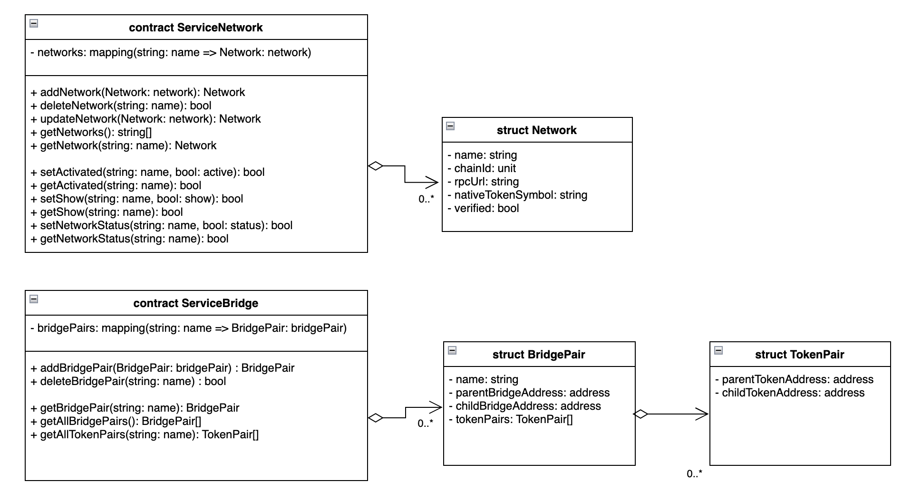

## Simple Summary
<!--"If you can't explain it simply, you don't understand it well enough." Provide a simplified and layman-accessible explanation of the KIP.-->
BridgeRegistry is a smart contract that manages information to facilitate value transfer of the ServiceChain. 

## Abstract
<!--A short (~200 word) description of the technical issue being addressed.-->
[Klaytn’s ServiceChain](https://docs.klaytn.foundation/content/installation-guide/deployment/service-chain) is an enterprise blockchain that meets the needs of companies such as data anchoring, value transfer, security, performance, and customization. This proposal is to propose a useful registry to provide value transfer with ServiceChain. For [value transfer](https://docs.klaytn.foundation/content/installation-guide/deployment/service-chain/getting-started/value-transfer), information about ServiceChain's network, bridges, and deployed tokens is required. The BridgeRegistry proposed here is a smart contract for managing information about networks, bridges, and distributed tokens of multiple ServiceChains. Information required for value transfer can be easily obtained by querying the BridgeRegistry contract. Therefore, services such as wallets can easily query the status of assets stored in ServiceChain and transfer those assets.

## Motivation
<!--The motivation is critical for KIPs that want to change the Klaytn protocol. It should clearly explain why the existing protocol specification is inadequate to address the problem that the KIP solves. KIP submissions without sufficient motivation may be rejected outright.-->
As shown in the figure below, multiple ServiceChains can be connected to the main chain, and various tokens can be deployed in each ServiceChain. ServiceChain provides value transfer of each token to another chain. As the number of ServiceChains and Tokens increases, the more meta data is required to be managed effectively. For example, the services such as wallets in the main chain, need to manage the network, bridge, and token information of ServiceChain to provide value transfer. Whenever the network, bridge and token information is updated, the related information must be also updated in each service. It will cost a lot of effort and users are uncomfortable with inconsistent information. To solve this problem, BridgeRegistry manages the network, bridge, and token information for value transfer as a smart contract. Services such as wallets can inquire to the BridgeRegistry contract to retrieve token information deployed in ServiceChain and easily obtain information for value transfer. 


## Specification
<!--The technical specification should describe the syntax and semantics of any new feature. The specification should be detailed enough to allow competing, interoperable implementations for any of the current Klaytn platforms (klaytn). -->
BridgeRegistry manages the network, bridge, and token information. BridgeRegistry consists of the following structs and contracts. 



### Structure

#### Network

`Network` includes network information such as network name, rpcUrl, chainID, and nativeTokenSymbol, and managementnetwork information such as `verified`.
`verified` is a member variable for managing ServiceChain in services such as wallets, and multiple ServiceChain statuses can be displayed by querying BridgeRegistry in the wallet. For example, when a ServiceChain is newly registered in the BridgeRegistry, the administrator checks whether the ServiceChain has no problem and changes the `verified variable to true. This proposal only mentions the need for network management information such as ‘verified’, and if there are variables necessary for the service, it is recommended to add them at the implementation level.


```
0x19 <0x4b (K)> <laytn Signed Message:\n" + len(message)> <data to sign>
```

The version `0x4b` (K) has `<laytn Signed Message:\n" + len(message)>` for the version-specific data. The data to sign can be any arbitrary data.

> NB: The `K` in `Klaytn Signed Message` refers to the version byte 0x4b. The character `K` is `0x4b` in hexadecimal which makes the remainder, `laytn Signed Message:\n + len(message)`, the version-specific data.

[kip-97]: ./kip-97.md

### Specification of the caver.js API

```JavaScript
caver.klay.accounts.sign('Some data', '0x{private key}');
```

### Returns

```shell
{
    message: 'Some data',
    messageHash: '0x8ed2036502ed7f485b81feaec1c581d236a8b711e55a24077724879c8a263c2a',
    v: '0x1b',
    r: '0x4a57bcff1637346a4323a67acd7a478514d9f00576f42942d50a5ca0e4b0342b',
    s: '0x5914e19a8ebc10ce1450b00a3b9c1bf0ce01909bca3ffdead1aa3a791a97b5ac',
    signature: '0x4a57bcff1637346a4323a67acd7a478514d9f00576f42942d50a5ca0e4b0342b5914e19a8ebc10ce1450b00a3b9c1bf0ce01909bca3ffdead1aa3a791a97b5ac1b'
}
```

## Backwards Compatibility
<!-- All KIPs that introduce backwards incompatibilities must include a section describing these incompatibilities and their severity. The KIP must explain how the author proposes to deal with these incompatibilities. KIP submissions without a sufficient backwards compatibility treatise may be rejected outright. The authors should answer the question: "Does this KIP require a hard fork?" -->
- [caver-js](https://docs.klaytn.foundation/content/dapp/sdk/caver-js/v1.4.1/api-references/caver.klay.accounts#sign) already sign in this format.
- [caver-java](https://javadoc.io/doc/com.klaytn.caver/core/1.10.0/com/klaytn/caver/wallet/keyring/PrivateKey.html) already sign in this format.


## Reference
[EIP-191](https://eips.ethereum.org/EIPS/eip-191)

## Copyright
Copyright and related rights waived via [CC0](https://creativecommons.org/publicdomain/zero/1.0/).
