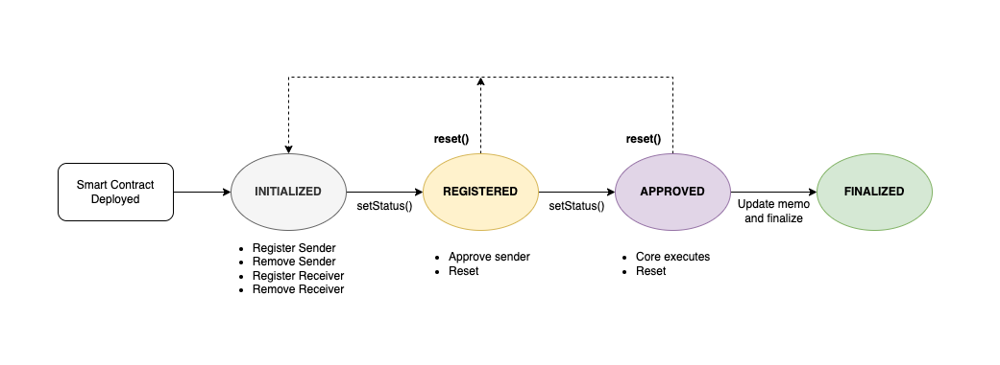

## Simple Summary

<!--"If you can't explain it simply, you don't understand it well enough." Provide a simplified and layman-accessible explanation of the KIP.-->

This proposal suggests a smart contract interface standard that records the rebalance of treasury funds. The main objective is to facilitate the approval and redistribution of treasury funds to new addresses while keeping record of the sender and receiver details.

## Abstract

<!--A short (~200 word) description of the technical issue being addressed.-->

Organizations need to manage treasury funds in a transparent and accountable manner. The proposed standard aims to make the management of treasury funds more transparent by recording the rebalance of treasury funds. The smart contract will keep records of the addresses which hold the treasury funds before and after rebalancing. It also facilates approval before execution.

## Motivation

<!--The motivation is critical for KIPs that want to change the Klaytn protocol. It should clearly explain why the existing protocol specification is inadequate to address the problem that the KIP solves. KIP submissions without sufficient motivation may be rejected outright.-->

Transparency is the one of most important aspect of blockchain. It is important to ensure that treasury funds are allocated and managed in a transparent and verifiable manner. The proposed smart contract aims to disclose the management of treasury funds in a transparent manner through smart contracts reducing the risk of errors and mismanagement. By providing transparency and accountability in the allocation and management of funds, the smart contract can help to build trust and confidence among stakeholders.

## Specification

<!--The technical specification should describe the syntax and semantics of any new feature. The specification should be detailed enough to allow competing, interoperable implementations for any of the current Klaytn platforms (klaytn). -->

The proposed smart contract will be implemented in Solidity and will be compatible with the Ethereum Virtual Machine (EVM). The smart contract will use Ownable contract to restrict access to certain functions to the owner of the contract.

The smart contract will have the following features:

- Add/Remove fund addresses
- Approve fund addresses and fund allocation
- Reset the storage values at any unforeseen circumstances before Finalized
- Finalize the smart contract after execution

### Smart Contracts Overview

#### Enums

The smart contract will have the following enum to track the status of the contract:

- `Initialized - 0`: The initial state of the contract.
- `Registered - 1`: Senders and receivers registered.
- `Approved - 2`: Senders approved.
- `Finalized - 3`: Rebalance executed and finalized.

#### Life Cycle

The contract status should follow the ENUM order above during status change. The only way to go to previous state is by calling Reset() function.



Status transition

- Initialized → Registered → Approved → Finalized ✅
- Initialized → Registered → Finalized ❌
- Initialized → Approved ❌
- Initialized → Finalized ❌

#### Structs

The smart contract will have the following structs :

- `Retired`: to represent the details of retired and approver addresses.
- `Newbie`: to store newbie and amount.

#### Storage

The smart contract will have the following storage variables:

- `retirees`: array of retirees structs.
- `newbie`: array of newbies structs.
- `status`: current status of the contract.
- `rebalanceBlockNumber`: Block number of the execution of rebalancing.
- `memo`: result of the treasury fund rebalance.

#### Modifiers

The smart contract will have the following modifier:

- `atStatus`: to restrict access to certain functions based on the current status of the contract.

#### Constructor

The smart contract will have the following constructor:

- `constructor`: to initialize the contract with the block number of the execution of re balance.

#### State Changing Functions

The smart contract will have the following state changing functions:

- `registerRetired`: to register retired details. Retired stores the retired address and approvers
- `removeNewbie`: to remove retired details from the array.
- `registerRetired`: to register newbie address and its fund distribution.
- `removeNewbie`: to remove newbie details from the array.
- `finalizeRegistration`: sets the status to Registered only executed by owner. After this stage, registrations will be restricted.
- `approve`: to approve a retiredAddress by the admin.
- `finalizeApproval`: sets the status to Approved. After this stage, approvals will be restricted.
  </br>
  **Conditions**
  - every retired must be approved
  - min required admin’s approval is done for retired contract address.
  - sum of retired’s balance is greater than treasury amount
    </br>
- `reset`: resets all storage values to empty objects except rebalanceBlockNumber. It can only be called during Initialization, Registration and Approved status.
- `finalizeContract`: to record the execution result of the rebalance and finalize the contract. The storage data cannot be modified after this stage.

#### Fallback Function

The smart contract will have a fallback function to revert any payments. Since its a treasury contract it should not accept any payments nor it should allow any withdrawal.

### Core Logic Overview

TBU - describe how to read contract data and execute rebalancing in Klaytn node

## Rationale

<!--The rationale fleshes out the specification by describing what motivated the design and why particular design decisions were made. It should describe alternate designs that were considered and related work, e.g. how the feature is supported in other languages. The rationale may also provide evidence of consensus within the community, and should discuss important objections or concerns raised during discussion.-->

The smart contract is mainly for recording the details, and the Core will execute the fund re-distributions.

### Design decision

#### KLAY transfer is not allowed via smart contracts

As the balance of treasury funds keeps increasing for every block with the block reward its hard to keep track of the balances and rebalance token allocation. So smart contract will only record the rebalanced allocation and the core will execute the allocation reading from the contract.

#### Approval of retiredAddress

To record the addresses in a verifiable manner the addresses are verified in the contract by calling approve method. The retiredAddress can be a Contract address or a Externally Owned Account. If the retired address is a

- EOA : EOA address can be verified when the account holder directly calls the approve function. `msg.sender == retiredAddress`
- Contract : Contract address can be verified when the admin of the contract calls approve function. The smart contract calls the `getState()` function implemented in the retiredAddress contract to get the admin details. `msg.sender == admin`
  - `getState()` funtion is implemented in Klaytn treasury contracts. It returns the adminList and quorom (min required admins to approve).
  - Condition: Min required admins should approve the senderAddress contract.

#### No Withdrawal

Smart contract is not allowed to receive KLAY due to security reasons. So any funds send the contract will be reverted and withdraw function is not implemented.

#### Finalize Contract

Once the re-distribution a.k.a rebalance is executed by the Core, the status of the smart contract will be finalized and any modifications to the storage data will be restricted.

## Backwards Compatibility

<!-- All KIPs that introduce backwards incompatibilities must include a section describing these incompatibilities and their severity. The KIP must explain how the author proposes to deal with these incompatibilities. KIP submissions without a sufficient backwards compatibility treatise may be rejected outright. The authors should answer the question: "Does this KIP require a hard fork?" -->

- The foundation should deploy new TreasuryRebalance contract to record the token redistribution.
- To rebalance the funds and redistribute in a consistent manner the foundation should burn the designated funds before re-distribution.
- This does not affect the backward compatibility as this a newly dpeloyed contract

## Implementation

<!--The implementations must be completed before any KIP is given status "Final", but it need not be completed before the KIP is accepted. While there is merit to the approach of reaching consensus on the specification and rationale before writing code, the principle of "rough consensus and running code" is still useful when it comes to resolving many discussions of API details.-->

#### Example implementation

```solidity
// SPDX-License-Identifier: GPL-3.0

pragma solidity ^0.8.0;

import "./Ownable.sol";

/**
 * @title Smart contract to record the rebalance of treasury funds.
 * This contract is to mainly record the addresses which holds the treasury funds
 * before and after rebalancing. It facilates approval and redistributing to new addresses.
 * Core will execute the re-distribution reading from this contract.
 */
contract TreasuryRebalance is Ownable {
    /**
     *  Enums to track the status of the contract
     */
    enum Status {
        Initialized,
        Registered,
        Approved,
        Finalized
    }

    /**
     * Retired struct to store the details of retired and approver addresses
     */
    struct Retired {
        address retired;
        address[] approvers;
    }

    /**
     * Newbie struct to store reciever and amount
     */
    struct Newbie {
        address newbie;
        uint256 amount;
    }

    /**
     * Storage
     */
    Retired[] public retirees; //array of retired structs
    Newbie[] public newbies; //array of newbie structs
    Status public status; //current status of the contract
    uint256 public rebalanceBlockNumber; //Block number of the execution of rebalancing
    string public memo; //result of the treasury fund rebalance

    /**
     * Events logs
     */
    event DeployContract(
        Status status,
        uint256 rebalanceBlockNumber,
        uint256 deployedBlockNumber
    );
    event RegisterRetired(address retired, address[] approvers);
    event RemoveRetired(address retired, uint256 retiredCount);
    event RegisterNewbie(address newbie, uint256 fundAllocation);
    event RemoveNewbie(address newbie, uint256 newbieCount);
    event GetState(bool success, bytes result);
    event Approve(address retired, address approver, uint256 approversCount);
    event SetStatus(Status status);
    event Finalized(string memo, Status status);

    /**
     * Modifiers
     */
    modifier atStatus(Status _status) {
        require(status == _status, "function not allowed at this stage");
        _;
    }

    /**
     *  Constructor
     * @param _rebalanceBlockNumber is the target block number to execute the redistribution in Core
     */
    constructor(uint256 _rebalanceBlockNumber) {
        rebalanceBlockNumber = _rebalanceBlockNumber;
        status = Status.Initialized;
        emit DeployContract(status, _rebalanceBlockNumber, block.timestamp);
    }

    //State changing Functions
    /**
     * @dev registers retired details
     * @param _retiredAddress is the address of the retired
     */
    function registerRetired(
        address _retiredAddress
    ) public onlyOwner atStatus(Status.Initialized) {
        require(!retiredExists(_retiredAddress), "Retired address is already registered");
        Retired storage retired = retirees.push();
        retired.retired = _retiredAddress;
        emit RegisterRetired(retired.retired, retired.approvers);
    }

    /**
     * @dev remove the retired details from the array
     * @param _retiredAddress is the address of the retired
     */
    function removeRetired(
        address _retiredAddress
    ) public onlyOwner atStatus(Status.Initialized) {
        uint256 retiredIndex = getRetiredIndex(_retiredAddress);
        retirees[retiredIndex] = retirees[retirees.length - 1];
        retirees.pop();

        emit RemoveRetired(_retiredAddress, retirees.length);
    }

    /**
     * @dev registers newbie address and its fund distribution
     * @param _newbieAddress is the address of the newbie
     * @param _amount is the fund to be allocated to the newbie
     */
    function registerNewbie(
        address _newbieAddress,
        uint256 _amount
    ) public onlyOwner atStatus(Status.Initialized) {
        require(
            !newbieExists(_newbieAddress),
            "Newbie address is already registered"
        );
        require(_amount != 0, "Amount cannot be set to 0");

        Newbie memory newbie = Newbie(_newbieAddress, _amount);
        newbies.push(newbie);

        emit RegisterNewbie(_newbieAddress, _amount);
    }

    /**
     * @dev remove the newbie details from the array
     * @param _newbieAddress is the address of the newbie
     */
    function removeNewbie(
        address _newbieAddress
    ) public onlyOwner atStatus(Status.Initialized) {
        uint256 newbieIndex = getNewbieIndex(_newbieAddress);
        newbies[newbieIndex] = newbies[newbies.length - 1];
        newbies.pop();

        emit RemoveNewbie(_newbieAddress, newbies.length);
    }

    /**
     * @dev retiredAddress can be a EOA or a contract address. To approve:
     *      If the retiredAddress is a EOA, the msg.sender should be the EOA address
     *      If the retiredAddress is a Contract, the msg.sender should be one of the contract `admin`.
     *      It uses the getState() function in the retiredAddress contract to get the admin details.
     * @param _retiredAddress is the address of the retired
     */
    function approve(
        address _retiredAddress
    ) public atStatus(Status.Registered) {
        require(
            retiredExists(_retiredAddress),
            "retired needs to be registered before approval"
        );

        //Check whether the retired address is EOA or contract address
        bool isContract = isContractAddr(_retiredAddress);
        if (!isContract) {
            //check whether the msg.sender is the retired if its a EOA
            require(
                msg.sender == _retiredAddress,
                "retiredAddress is not the msg.sender"
            );
            _updateApprover(_retiredAddress, msg.sender);
        } else {
            //check if the msg.sender is one of the admin of the retiredAddress contract
            require(
                _validateAdmin(_retiredAddress, msg.sender),
                "msg.sender is not the admin"
            );
            _updateApprover(_retiredAddress, msg.sender);
        }
    }

    /**
     * @dev validate if the msg.sender is admin if the retiredAddress is a contract
     * @param _retiredAddress is the address of the contract
     * @param _approver is the msg.sender
     * @return isAdmin is true if the msg.sender is one of the admin
     */
    function _validateAdmin(
        address _retiredAddress,
        address _approver
    ) private returns (bool isAdmin) {
        (address[] memory adminList, ) = _getState(_retiredAddress);
        require(adminList.length != 0, "admin list cannot be empty");
        for (uint8 i = 0; i < adminList.length; i++) {
            if (_approver == adminList[i]) {
                isAdmin = true;
            }
        }
    }

    /**
     * @dev gets the adminList and quorom by calling `getState()` method in retiredAddress contract
     * @param _retiredAddress is the address of the contract
     * @return adminList list of the retiredAddress contract admins
     * @return req min required number of approvals
     */
    function _getState(
        address _retiredAddress
    ) private returns (address[] memory adminList, uint256 req) {
        //call getState() function in retiredAddress contract to get the adminList
        bytes memory payload = abi.encodeWithSignature("getState()");
        (bool success, bytes memory result) = _retiredAddress.staticcall(
            payload
        );
        emit GetState(success, result);
        require(success, "call failed");

        (adminList, req) = abi.decode(result, (address[], uint256));
    }

    /**
     * @dev Internal function to update the approver details of a retired
     * _retiredAddress is the address of the retired
     * _approver is the admin of the retiredAddress
     */
    function _updateApprover(
        address _retiredAddress,
        address _approver
    ) private {
        uint256 index = getRetiredIndex(_retiredAddress);
        address[] memory approvers = retirees[index].approvers;
        for (uint256 i = 0; i < approvers.length; i++) {
            require(
                approvers[i] != _approver,
                "Duplicate approvers cannot be allowed"
            );
        }
        retirees[index].approvers.push(_approver);
        emit Approve(
            _retiredAddress,
            _approver,
            retirees[index].approvers.length
        );
    }

    /**
     * @dev finalizeRegistration sets the status to Registered,
     *      After this stage, registrations will be restricted.
     */
    function finalizeRegistration()
        public
        onlyOwner
        atStatus(Status.Initialized)
    {
        status = Status.Registered;
        emit SetStatus(status);
    }

    /**
     * @dev finalizeApproval sets the status to Approved,
     *      After this stage, approvals will be restricted.
     */
    function finalizeApproval() public onlyOwner atStatus(Status.Registered) {
        require(
            getTreasuryAmount() < sumOfRetiredBalance(),
            "treasury amount should be less than the sum of all retired address balances"
        );
        _isRetiredsApproved();
        status = Status.Approved;
        emit SetStatus(status);
    }

    /**
     * @dev verify if quorom reached for the retired approvals
     */
    function _isRetiredsApproved() private {
        for (uint256 i = 0; i < retirees.length; i++) {
            Retired memory retired = retirees[i];
            (, uint256 req) = _getState(retired.retired);
            if (retired.approvers.length >= req) {
                //if min quorom reached, make sure all approvers are still valid
                address[] memory approvers = retired.approvers;
                uint256 minApprovals = 0;
                for (uint256 j = 0; j < approvers.length; j++) {
                    _validateAdmin(retirees[i].retired, approvers[j]);
                    minApprovals++;
                }
                require(
                    minApprovals >= req,
                    "min required admins should approve"
                );
            } else {
                revert("min required admins should approve");
            }
        }
    }

    /**
     * @dev sets the status of the contract to Finalize. Once finalized the storage data
     * of the contract cannot be modified
     * @param _memo is the result of the rebalance after executing successfully in the core.
     */
    function finalizeContract(
        string memory _memo
    ) public onlyOwner atStatus(Status.Approved) {
        memo = _memo;
        status = Status.Finalized;
        emit Finalized(memo, status);
    }

    /**
     * @dev resets all storage values to empty objects except targetBlockNumber
     */
    function reset() public onlyOwner {
        //reset cannot be called at Finalized status or after target block.number
        require(
            ((status != Status.Finalized) &&
                (block.number < rebalanceBlockNumber)),
            "Contract is finalized, cannot reset values"
        );

        //`delete` keyword is used to set a storage variable or a dynamic array to its default value.
        delete retirees;
        delete newbies;
        delete memo;
        status = Status.Initialized;
    }

    //Getters
    /**
     * @dev to get retired details by retiredAddress
     * @param _retiredAddress is the address of the retired
     */
    function getRetired(
        address _retiredAddress
    ) public view returns (address, address[] memory) {
        require(retiredExists(_retiredAddress), "Retired does not exist");
        uint256 index = getRetiredIndex(_retiredAddress);
        Retired memory retired = retirees[index];
        return (retired.retired, retired.approvers);
    }

    /**
     * @dev check whether retiredAddress is registered
     * @param _retiredAddress is the address of the retired
     */
    function retiredExists(address _retiredAddress) public view returns (bool) {
        require(_retiredAddress != address(0), "Invalid address");
        for (uint8 i = 0; i < retirees.length; i++) {
            if (retirees[i].retired == _retiredAddress) {
                return true;
            }
        }
    }

    /**
     * @dev get index of the retired in the retirees array
     * @param _retiredAddress is the address of the retired
     */
    function getRetiredIndex(
        address _retiredAddress
    ) public view returns (uint256) {
        for (uint256 i = 0; i < retirees.length; i++) {
            if (retirees[i].retired == _retiredAddress) {
                return i;
            }
        }
        revert("Retired does not exist");
    }

    /**
     * @dev to calculate the sum of retirees balances
     * @return retireesBalance the sum of balances of retireds
     */
    function sumOfRetiredBalance() public view returns (uint256 retireesBalance) {
        for (uint8 i = 0; i < retirees.length; i++) {
            address retiredAddress = retirees[i].retired;
            retireesBalance += retiredAddress.balance;
        }
        return retireesBalance;
    }

    /**
     * @dev to get newbie details by newbieAddress
     * @param _newbieAddress is the address of the newbie
     * @return newbie is the address of the newbie
     * @return amount is the fund allocated to the newbie

     */
    function getNewbie(
        address _newbieAddress
    ) public view returns (address, uint256) {
        require(newbieExists(_newbieAddress), "Newbie does not exist");
        uint256 index = getNewbieIndex(_newbieAddress);
        Newbie memory newbie = newbies[index];
        return (newbie.newbie, newbie.amount);
    }

    /**
     * @dev check whether _newbieAddress is registered
     * @param _newbieAddress is the address of the newbie
     */
    function newbieExists(
        address _newbieAddress
    ) public view returns (bool) {
        require(_newbieAddress != address(0), "Invalid address");
        for (uint8 i = 0; i < newbies.length; i++) {
            if (newbies[i].newbie == _newbieAddress) {
                return true;
            }
        }
    }

    /**
     * @dev get index of the newbie in the newbies array
     * @param _newbieAddress is the address of the newbie
     */
    function getNewbieIndex(
        address _newbieAddress
    ) public view returns (uint256) {
        for (uint256 i = 0; i < newbies.length; i++) {
            if (newbies[i].newbie == _newbieAddress) {
                return i;
            }
        }
        revert("Newbie does not exist");
    }

    /**
     * @dev to calculate the sum of newbie funds
     * @return treasuryAmount the sum of funds allocated to newbies
     */
    function getTreasuryAmount() public view returns (uint256 treasuryAmount) {
        for (uint8 i = 0; i < newbies.length; i++) {
            treasuryAmount += newbies[i].amount;
        }
        return treasuryAmount;
    }

    /**
     * @dev gets the length of retirees list
     */
    function getRetiredCount() public view returns (uint256) {
        return retirees.length;
    }

    /**
     * @dev gets the length of newbies list
     */
    function getNewbieCount() public view returns (uint256) {
        return newbies.length;
    }

    /**
     * @dev allback function to revert any payments
     */
    fallback() external payable {
        revert("This contract does not accept any payments");
    }

    /**
     * @dev Helper function to check the address is contract addr or EOA
     */
    function isContractAddr(address _addr) public view returns (bool) {
        uint256 size;
        assembly {
            size := extcodesize(_addr)
        }
        return size > 0;
    }
}
```

## Test Cases

<!--Test cases for an implementation are mandatory for KIPs that are affecting consensus changes. Other KIPs can choose to include links to test cases if applicable.-->

https://github.com/Krustuniverse-Klaytn-Group/treasury-rebalance/blob/dev/test/TreasuryRebalance.js

## Reference

n/a

## Copyright

Copyright and related rights waived via [CC0](https://creativecommons.org/publicdomain/zero/1.0/).
